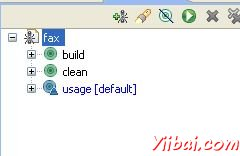
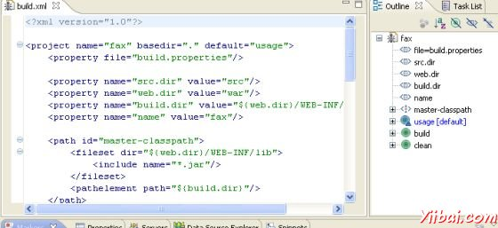

# Ant和Eclipse集成 - ANT

如果您已经下载并已经安装了Eclipse，你很少做上手。 Eclipse中预装捆绑在一起的Ant的插件，随时供您使用。

按照简单的步骤，到Ant集成到Eclipse中。

*   确保build.xml文件就是java项目的一部分，并没有生活在一个位置，是外部的项目。

*   通过将启用Ant视图 Window &gt; Show View &gt; Other &gt; Ant &gt; Ant

*   打开项目资源管理器中，拖动的build.xml到Ant视图

Ant视图中显示现在看起来类似于：

点击目标，build / clean / usage将运行Ant你的目标。 

点击"fax" ，将执行默认的目标 -  usage

Ant的Eclipse插件还附带了一个很好的编辑器来编辑的build.xml文件。该编辑器是知道的build.xml架构，可以帮助您提供代码完成。

要使用Ant编辑器，右键单击您的build.xml（从项目资源管理器），然后选择打开方式&gt;Ant Editor。 Ant Editor应该loook类似于：

Ant 编辑器列出了右手边的目标，该目标列表作为一个书签，让你直接跳到编辑特定的目标。
