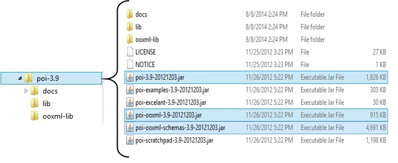
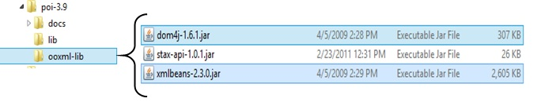

# Apache POI环境设置 - POI教程

本章将指导完成Apache POI在Windows和Linux系统为基础的设置过程。 Apache POI可以轻松地安装和集成,下面没有任何复杂的设置过程,通过几个简单步骤，目前Java环境，用户管理是必需安装的。

## 系统要求

| JDK | Java SE 2 JDK 1.5 或以上 |
| 内存 | 1 GB RAM (推荐) |
| 磁盘空间 | 没有最小要求 |
| 操作系统版本 | Windows XP 或以上, Linux |

现在让我们继续安装Apache POI 的步骤。

## 第1步：验证Java安装

首先，需要在系统上安装Java软件开发工具包(SDK)。为了验证这一点，执行任何根据使用的平台上的以下两个命令。

如果Java安装已完成正确，那么它会显示Java安装的当前版本和规范。样本输出给下表中。

| 平台 | 命令 | 样本输出 |
| --- | --- | --- |
| Windows | 打开命令控制台然后键入: `\&gt;java –version` | Java version "1.7.0_60" Java (TM) SE Run Time Environment (build 1.7.0_60-b19) Java Hotspot (TM) 64-bit Server VM (build 24.60-b09,mixed mode) |
| Linux | 打开命令终端，输入： $java –version | java version "1.7.0_25" Open JDK Runtime Environment (rhel-2.3.10.4.el6_4-x86_64) Open JDK 64-Bit Server VM (build 23.7-b01, mixed mode) |

*   我们假设本教程的读者安装的是Java SDK版本1.7.0_60安装在他们的系统中。

*   如果没有Java SDK，从[http://www.oracle.com/technetwork/java/javase/downloads/index.html](http://www.oracle.com/technetwork/java/javase/downloads/index.html) 下载其当前版本并安装它。

## 第2步：设置Java环境

设置环境变量JAVA_HOME指向安装了机器上Java的基本目录位置。例如，

| 平台 | 描述 |
| --- | --- |
| Windows | Set JAVA_HOME to C:\ProgramFiles\java\jdk1.7.0_60 |
| Linux | Export JAVA_HOME=/usr/local/java-current |

添加Java编译器位置的完整路径到系统路径。

| 平台 | 描述 |
| --- | --- |
| Windows | Linux |
| 添加字符串 "C:\Program Files\Java\jdk1.7.0_60\bin" 到系统环境变量PATH 的尾部。 | Export PATH=$PATH:$JAVA_HOME/bin/ |

从命令提示符下执行命令java-version如上所述。

## 第3步：安装Apache POI库

从 http://poi.apache.org/download.htmll 下载Apache POI的最新版本，并解压缩所需要的库，可以链接到Java程序的文件夹。我们假设该文件在C盘的文件夹中。

下面的图像显示所下载的文件夹内的目录和文件结构。



添加的五个jar文件的完整路径，在上面的图片路径到CLASSPATH。


Windows: 添加以下字符串到用户变量的末尾

```
CLASSPATH:
“C:\poi-3.9\poi-3.9-20121203.jar;”
“C:\poi-3.9\poi-ooxml-3.9-20121203.jar;”
“C:\poi-3.9\poi-ooxml-schemas-3.9-20121203.jar;”
“C:\poi-3.9\ooxml-lib\dom4j-1.6.1.jar;”
“C:\poi-3.9\ooxml-lib\xmlbeans-2.3.0.jar;.;”
```

Linux:

```
Export CLASSPATH=$CLASSPATH:
/usr/share/poi-3.9/poi-3.9-20121203.tar:
/usr/share/poi-3.9/poi-ooxml-schemas-3.9-20121203.tar:
/usr/share/poi-3.9/poi-ooxml-3.9-20121203.tar:
/usr/share/poi-3.9/ooxml-lib/dom4j-1.6.1.tar:
/usr/share/poi-3.9/ooxml-lib/xmlbeans-2.3.0.tar
```

到这里，整个POI环境设置已经完成，下一节我们来学习如何使用。
