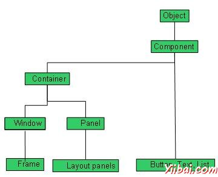

# AWT控件(Controls) - AWT

每一个用户界面参考主要有以下三个方面：

*   UI 元素: 有核心可视化元素最终用户看到并与之交互。 GWT提供了一个巨大的名单变化复杂，我们将在本教程从基本的广泛使用和常见的元素。

*   布局: 他们定义的UI元素如何应安排在屏幕上，并提供一个最终的外观和感觉的GUI（图形用户界面）。在“布局”一章，这部分将被覆盖。

*   行为: 这些事件发生时，与用户交互的UI元素。这部分将被覆盖在"事件处理"一章。

每个AWT控件继承组件类的属性。

| Sr. No. | 控件与描述 |
| --- | --- |
| 1 | [Component](/awt/awt_component.htm) 组件是一个抽象的超类的GUI控件，并用图形表示，它代表了一个对象。 |

## AWT的UI元素：

以下是常用的控件列表而设计的图形用户界面使用AWT。

| Sr.No. | 控件与描述 |
| --- | --- |
| 1 | [Label](http://www.yiibai.com/html/awt/awt_label.html?1379551206) 标签对象是在容器中放置文本的一个组成部分。 |
| 2 | [Button](http://www.yiibai.com/html/awt/awt_button.html?1379551231) 该类创建标记的按钮。 |
| 3 | [Check Box](http://www.yiibai.com/html/awt/awt_checkbox.html?1379551245) 复选框是一个图形化的组件，它可以在一个（真）或关闭（假）的状态。 |
| 4 | [Check Box Group](http://www.yiibai.com/html/awt/awt_checkboxgroup.html?1379551263) CheckboxGroup 类用于分组组复选框。 |
| 5 | [List](http://www.yiibai.com/html/awt/awt_list.html?1379551288) List组件为用户提供了一个滚动的文本项列表。 |
| 6 | [Text Field](http://www.yiibai.com/html/awt/awt_textfield.html?1379551306) TextField对象是一个文本组件，它允许编辑的单行文本。 |
| 7 | [Text Area](http://www.yiibai.com/html/awt/awt_textarea.html?1379551322) 一个textarea对象是一个文本组件，它允许编辑的多行文本。 |
| 8 | [Choice](http://www.yiibai.com/html/awt/20130918325.html?1379551334) 一个选择控制用于显示弹出菜单选择。所选选项将显示在顶部的菜单。 |
| 9 | [Canvas](http://www.yiibai.com/html/awt/awt_canvas.html?1379551346) Canvas控件代表一个矩形区域，应用程序可以画的东西，或者可以由用户创建的接收输入。 |
| 10 | [Image](http://www.yiibai.com/html/awt/awt_image.html?1379551359) 图像控制是表示图形图像的所有图像类的超类。 |
| 11 | [Scroll Bar](http://www.yiibai.com/html/awt/awt_scrollbar.html?1379551370) 代表一个滚动条的滚动条控制组件以让用户选择的值来自范围。 |
| 12 | [Dialog](http://www.yiibai.com/html/awt/awt_dialog.html?1379551379) 一个对话框控制是一个顶层窗口，采取某种形式的用户输入的标题和边框。 |
| 13 | [File Dialog](http://www.yiibai.com/html/awt/awt_filedialog.html?1379551390) 一个FileDialog的控制代表一个对话框窗口，用户可以选择一个文件。 |

