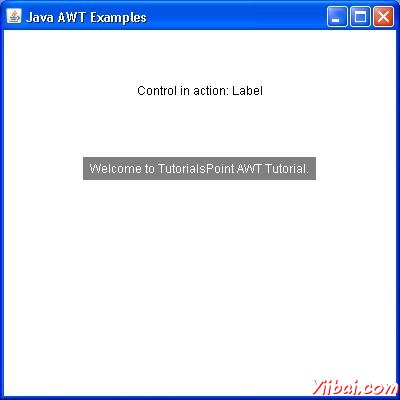

# AWT Label类 - AWT

## 介绍

标签是一种被动的控制，因为它不会由用户访问产生任何事件。 Label控件是一个对象标签。一个标签显示一行只读文本。然而，文本可以由应用程序改变，但不能由最终用户以任何方式改变。

## 类的声明

以下是声明的java.awt.Label类：

```
public class Label
   extends Component
      implements Accessible
```

## 字段域

以下是java.awt.Component 类的字段：

*   static int CENTER -- 表示标签应为中心对齐。

*   static int LEFT -- 表示应左对齐标签。

*   static int RIGHT -- 表示应右对齐标签。

## 类的构造函数

| S.N. | 构造函数与说明 |
| --- | --- |
| 1 | **Label() ** Constructs an empty label. |
| 2 | **Label(String text) ** Constructs a new label with the specified string of text, left justified. |
| 3 | **Label(String text, int alignment) ** Constructs a new label that presents the specified string of text with the specified alignment. |

## 类方法

| S.N. | 方法和说明 |
| --- | --- |
| 1 | **void addNotify() ** Creates the peer for this label. |
| 2 | **AccessibleContext getAccessibleContext() ** Gets the AccessibleContext associated with this Label. |
| 3 | **int getAlignment() ** Gets the current alignment of this label. |
| 4 | **String getText() ** Gets the text of this label. |
| 5 | **protected String paramString() ** Returns a string representing the state of this Label. |
| 6 | **void setAlignment(int alignment) ** Sets the alignment for this label to the specified alignment. |
| 7 | **void setText(String text) ** Sets the text for this label to the specified text. |

## 继承的方法

这个类继承的方法从以下类：

*   java.awt.Component

*   java.lang.Object

## 标签示例

说在您选择使用编辑器创建以下java程序 D:/ &gt; AWT &gt; com &gt; yiibai.com &gt; gui &gt;

AwtControlDemo

```
package com.yiibai.gui;

import java.awt.*;
import java.awt.event.*;

public class AwtControlDemo {

   private Frame mainFrame;
   private Label headerLabel;
   private Label statusLabel;
   private Panel controlPanel;

   public AwtControlDemo(){
      prepareGUI();
   }

   public static void main(String[] args){
      AwtControlDemo  awtControlDemo = new AwtControlDemo();
      awtControlDemo.showLabelDemo();
   }

   private void prepareGUI(){
      mainFrame = new Frame("Java AWT Examples");
      mainFrame.setSize(400,400);
      mainFrame.setLayout(new GridLayout(3, 1));
      mainFrame.addWindowListener(new WindowAdapter() {
         public void windowClosing(WindowEvent windowEvent){
            System.exit(0);
         }        
      });    
      headerLabel = new Label();
      headerLabel.setAlignment(Label.CENTER);
      statusLabel = new Label();        
      statusLabel.setAlignment(Label.CENTER);
      statusLabel.setSize(350,100);

      controlPanel = new Panel();
      controlPanel.setLayout(new FlowLayout());

      mainFrame.add(headerLabel);
      mainFrame.add(controlPanel);
      mainFrame.add(statusLabel);
      mainFrame.setVisible(true);  
   }

   private void showLabelDemo(){
      headerLabel.setText("Control in action: Label");      

      Label label = new Label();
      label.setText("Welcome to TutorialsPoint AWT Tutorial.");
      label.setAlignment(Label.CENTER);
      label.setBackground(Color.GRAY);
      label.setForeground(Color.WHITE);
      controlPanel.add(label);

      mainFrame.setVisible(true);  
   }
}
```

编译程序，使用命令提示符。到 **D:/ &gt; AWT **然后键入以下命令。

```
D:AWT>javac comyiibaiguiAwtControlDemo.java

```

如果没有错误出现，这意味着编译成功。使用下面的命令来运行程序。

```
D:AWT>java com.yiibai.gui.AwtControlDemo

```

验证下面的输出



