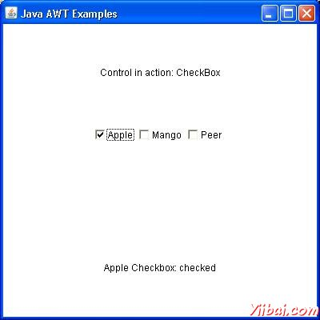

# AWT CheckBox类 - AWT

## 介绍

CheckBox控件是用来开启选项（true）或关闭（false）。每个复选框标签代表的复选框做什么。通过点击它可以改变一个复选框的状态。

## 类的声明

以下是声明的java.awt.Checkbox类：

```
public class Checkbox
   extends Component
      implements ItemSelectable,Accessible
```

## 类的构造函数

| S.N. | 构造函数与说明 |
| --- | --- |
| 1 | **Checkbox() ** Creates a check box with an empty string for its label. |
| 2 | **Checkbox(String label) ** Creates a check box with the specified label. |
| 3 | **Checkbox(String label, boolean state) ** Creates a check box with the specified label and sets the specified state. |
| 4 | **Checkbox(String label, boolean state, CheckboxGroup group) ** Constructs a Checkbox with the specified label, set to the specified state, and in the specified check box group. |
| 5 | **Checkbox(String label, CheckboxGroup group, boolean state) ** Creates a check box with the specified label, in the specified check box group, and set to the specified state. |

## 类方法

| S.N. | 方法和说明 |
| --- | --- |
| 1 | **void addItemListener(ItemListener l) ** Adds the specified item listener to receive item events from this check box. |
| 2 | **void addNotify() ** Creates the peer of the Checkbox. |
| 3 | **AccessibleContext getAccessibleContext() ** Gets the AccessibleContext associated with this Checkbox. |
| 4 | **CheckboxGroup getCheckboxGroup() ** Determines this check box's group. |
| 5 | **ItemListener[] getItemListeners() ** Returns an array of all the item listeners registered on this checkbox. |
| 6 | **String getLabel() ** Gets the label of this check box. |
| 7 | **&lt;T extends EventListener&gt;T[] getListeners(Class&lt;T&gt; listenerType) ** Returns an array of all the objects currently registered as FooListeners upon this Checkbox. |
| 8 | **Object[] getSelectedObjects() ** Returns an array (length 1) containing the checkbox label or null if the checkbox is not selected. |
| 9 | **boolean getState() ** Determines whether this check box is in the **on** or **off** state. |
| 10 | **protected String paramString() ** Returns a string representing the state of this Checkbox. |
| 11 | **protected void processEvent(AWTEvent e) ** Processes events on this check box. |
| 12 | **protected void processItemEvent(ItemEvent e) ** Processes item events occurring on this check box by dispatching them to any registered ItemListener objects. |
| 13 | **void removeItemListener(ItemListener l) ** Removes the specified item listener so that the item listener no longer receives item events from this check box. |
| 14 | **void setCheckboxGroup(CheckboxGroup g) ** Sets this check box's group to the specified check box group. |
| 15 | **void setLabel(String label) ** Sets this check box's label to be the string argument. |
| 16 | **void setState(boolean state) ** Sets the state of this check box to the specified state. |

## 继承的方法

这个类继承的方法从以下类：

*   java.awt.Component

*   java.lang.Object

## CheckBox的示例

说在您选择使用的编辑器创建以下java程序 D:/ &gt; AWT &gt; com &gt; yiibai.com &gt; gui &gt;

AwtControlDemo.java

```
package com.yiibai.gui;

import java.awt.*;
import java.awt.event.*;

public class AwtControlDemo {

   private Frame mainFrame;
   private Label headerLabel;
   private Label statusLabel;
   private Panel controlPanel;

   public AwtControlDemo(){
      prepareGUI();
   }

   public static void main(String[] args){
      AwtControlDemo  awtControlDemo = new AwtControlDemo();
      awtControlDemo.showCheckBoxDemo();
   }

   private void prepareGUI(){
      mainFrame = new Frame("Java AWT Examples");
      mainFrame.setSize(400,400);
      mainFrame.setLayout(new GridLayout(3, 1));
      mainFrame.addWindowListener(new WindowAdapter() {
         public void windowClosing(WindowEvent windowEvent){
            System.exit(0);
         }        
      });    
      headerLabel = new Label();
      headerLabel.setAlignment(Label.CENTER);
      statusLabel = new Label();        
      statusLabel.setAlignment(Label.CENTER);
      statusLabel.setSize(350,100);

      controlPanel = new Panel();
      controlPanel.setLayout(new FlowLayout());

      mainFrame.add(headerLabel);
      mainFrame.add(controlPanel);
      mainFrame.add(statusLabel);
      mainFrame.setVisible(true);  
   }

   private void showCheckBoxDemo(){

      headerLabel.setText("Control in action: CheckBox"); 

      Checkbox chkApple = new Checkbox("Apple");
      Checkbox chkMango = new Checkbox("Mango");
      Checkbox chkPeer = new Checkbox("Peer");

      chkApple.addItemListener(new ItemListener() {
         public void itemStateChanged(ItemEvent e) {             
            statusLabel.setText("Apple Checkbox: " 
            + (e.getStateChange()==1?"checked":"unchecked"));
         }
      });

      chkMango.addItemListener(new ItemListener() {
         public void itemStateChanged(ItemEvent e) {
            statusLabel.setText("Mango Checkbox: " 
            + (e.getStateChange()==1?"checked":"unchecked"));
         }
      });

      chkPeer.addItemListener(new ItemListener() {
         public void itemStateChanged(ItemEvent e) {
            statusLabel.setText("Peer Checkbox: " 
            + (e.getStateChange()==1?"checked":"unchecked"));
         }
      });

      controlPanel.add(chkApple);
      controlPanel.add(chkMango);
      controlPanel.add(chkPeer);       

      mainFrame.setVisible(true);  
   }
}
```

编译程序，使用命令提示符。到 **D:/ &gt; AWT **然后键入以下命令。

```
D:AWT>javac comyiibaiguiAwtControlDemo.java

```

如果没有错误出现，这意味着编译成功。使用下面的命令来运行程序。

```
D:AWT>java com.yiibai.gui.AwtControlDemo

```

验证下面的输出



