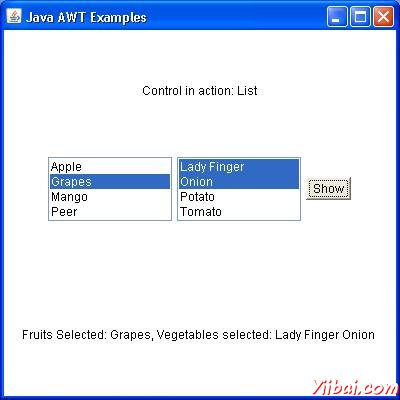

# AWT List类 - AWT

## 介绍

List是一个文本项列表。该列表可以被​​配置给该用户可以选择一个或多个项目。

## 类的声明

以下是的声明类java.awt.List：

```
public class List
   extends Component
      implements ItemSelectable, Accessible
```

## 类的构造函数

| S.N. | 构造函数与说明 |
| --- | --- |
| 1 | **List() ** Creates a new scrolling list. |
| 2 | **List(int rows) ** Creates a new scrolling list initialized with the specified number of visible lines. |
| 3 | **List(int rows, boolean multipleMode) ** Creates a new scrolling list initialized to display the specified number of rows. |

## 类方法

<T extends EventListener> T[] getListeners(Class<T> listenerType) 
目前注册的所有对象作为FooListeners名单后返回一个数组。

| S.N. | Method & Description |
| --- | --- |
| 1 | **void add(String item) ** Adds the specified item to the end of scrolling list. |
| 2 | **void add(String item, int index) ** Adds the specified item to the the scrolling list at the position indicated by the index. |
| 3 | **void addActionListener(ActionListener l) ** Adds the specified action listener to receive action events from this list. |
| 4 | **void addItem(String item) ** Deprecated. replaced by add(String). |
| 5 | **void addItem(String item, int index) ** Deprecated. replaced by add(String, int). |
| 6 | **void addItemListener(ItemListener l) ** Adds the specified item listener to receive item events from this list. |
| 7 | **void addNotify() ** Creates the peer for the list. |
| 8 | **boolean allowsMultipleSelections() ** Deprecated. As of JDK version 1.1, replaced by isMultipleMode(). |
| 9 | **void clear() ** Deprecated. As of JDK version 1.1, replaced by removeAll(). |
| 10 | **int countItems() ** Deprecated. As of JDK version 1.1, replaced by getItemCount(). |
| 11 | **void delItem(int position)** Deprecated. replaced by remove(String) and remove(int). |
| 12 | **void delItems(int start, int end) ** Deprecated. As of JDK version 1.1, Not for public use in the future. This method is expected to be retained only as a package private method. |
| 13 | **void deselect(int index) ** Deselects the item at the specified index. |
| 14 | **AccessibleContext getAccessibleContext() ** Gets the AccessibleContext associated with this List. |
| 15 | **ActionListener[] getActionListeners() ** Returns an array of all the action listeners registered on this list. |
| 16 | **String getItem(int index) ** Gets the item associated with the specified index. |
| 17 | **int getItemCount() ** Gets the number of items in the list. |
| 18 | **ItemListener[] getItemListeners() ** Returns an array of all the item listeners registered on this list. |
| 19 | **String[] getItems() ** Gets the items in the list. |
| 20 | **Dimension getMinimumSize() ** Determines the minimum size of this scrolling list. |
| 21 | **Dimension getMinimumSize(int rows) ** Gets the minumum dimensions for a list with the specified number of rows. |
| 22 | **Dimension getPreferredSize() ** Gets the preferred size of this scrolling list. |
| 23 | **Dimension getPreferredSize(int rows) ** Gets the preferred dimensions for a list with the specified number of rows. |
| 24 | **int getRows() ** Gets the number of visible lines in this list. |
| 25 | **int getSelectedIndex() ** Gets the index of the selected item on the list, |
| 26 | **int[] getSelectedIndexes() ** Gets the selected indexes on the list. |
| 27 | **String getSelectedItem() ** Gets the selected item on this scrolling list. |
| 28 | **String[] getSelectedItems() ** Gets the selected items on this scrolling list. |
| 29 | **Object[] getSelectedObjects() ** Gets the selected items on this scrolling list in an array of Objects. |
| 30 | **int getVisibleIndex() ** Gets the index of the item that was last made visible by the method makeVisible. |
| 31 | **boolean isIndexSelected(int index) ** Determines if the specified item in this scrolling list is selected. |
| 32 | **boolean isMultipleMode() ** Determines whether this list allows multiple selections. |
| 33 | **boolean isSelected(int index) ** Deprecated. As of JDK version 1.1, replaced by isIndexSelected(int). |
| 34 | **void makeVisible(int index) ** Makes the item at the specified index visible. |
| 35 | **Dimension minimumSize() ** Deprecated. As of JDK version 1.1, replaced by getMinimumSize(). |
| 36 | **Dimension minimumSize(int rows) ** Deprecated. As of JDK version 1.1, replaced by getMinimumSize(int). |
| 37 | **protected String paramString() ** Returns the parameter string representing the state of this scrolling list. |
| 38 | **Dimension preferredSize() ** Deprecated. As of JDK version 1.1, replaced by getPreferredSize(). |
| 39 | **Dimension preferredSize(int rows) ** Deprecated. As of JDK version 1.1, replaced by getPreferredSize(int). |
| 40 | **protected void processActionEvent(ActionEvent e) ** Processes action events occurring on this component by dispatching them to any registered ActionListener objects. |
| 41 | **protected void processEvent(AWTEvent e) ** Processes events on this scrolling list. |
| 42 | **protected void processItemEvent(ItemEvent e) ** Processes item events occurring on this list by dispatching them to any registered ItemListener objects. |
| 43 | **void remove(int position) ** Removes the item at the specified position from this scrolling list. |
| 44 | **void remove(String item) ** Removes the first occurrence of an item from the list. |
| 45 | **void removeActionListener(ActionListener l) ** Removes the specified action listener so that it no longer receives action events from this list. |
| 46 | **void removeAll() ** Removes all items from this list. |
| 47 | **void removeItemListener(ItemListener l) ** Removes the specified item listener so that it no longer receives item events from this list. |
| 48 | **void removeNotify() ** Removes the peer for this list. |
| 49 | **void replaceItem(String newValue, int index) ** Replaces the item at the specified index in the scrolling list with the new string. |
| 50 | **void select(int index) ** Selects the item at the specified index in the scrolling list. |
| 51 | **void setMultipleMode(boolean b) ** Sets the flag that determines whether this list allows multiple selections. |
| 52 | **void setMultipleSelections(boolean b) ** Deprecated. As of JDK version 1.1, replaced by setMultipleMode(boolean). |

## 继承的方法

这个类从以下类继承的方法：

*   java.awt.Component

*   java.lang.Object

## List 示例

选择使用任何编辑器创建以下java程序 D:/ &gt; AWT &gt; com &gt; yiibai.com &gt; gui &gt;

AwtControlDemo

```
package com.yiibai.gui;

import java.awt.*;
import java.awt.event.*;

public class AwtControlDemo {

   private Frame mainFrame;
   private Label headerLabel;
   private Label statusLabel;
   private Panel controlPanel;

   public AwtControlDemo(){
      prepareGUI();
   }

   public static void main(String[] args){
      AwtControlDemo  awtControlDemo = new AwtControlDemo();
      awtControlDemo.showListDemo();
   }

   private void prepareGUI(){
      mainFrame = new Frame("Java AWT Examples");
      mainFrame.setSize(400,400);
      mainFrame.setLayout(new GridLayout(3, 1));
      mainFrame.addWindowListener(new WindowAdapter() {
         public void windowClosing(WindowEvent windowEvent){
            System.exit(0);
         }        
      });    
      headerLabel = new Label();
      headerLabel.setAlignment(Label.CENTER);
      statusLabel = new Label();        
      statusLabel.setAlignment(Label.CENTER);
      statusLabel.setSize(350,100);

      controlPanel = new Panel();
      controlPanel.setLayout(new FlowLayout());

      mainFrame.add(headerLabel);
      mainFrame.add(controlPanel);
      mainFrame.add(statusLabel);
      mainFrame.setVisible(true);  
   }

   private void showListDemo(){                                       

      headerLabel.setText("Control in action: List"); 
      final List fruitList = new List(4,false);

      fruitList.add("Apple");
      fruitList.add("Grapes");
      fruitList.add("Mango");
      fruitList.add("Peer");

      final List vegetableList = new List(4,true);

      vegetableList.add("Lady Finger");
      vegetableList.add("Onion");
      vegetableList.add("Potato");
      vegetableList.add("Tomato");

      Button showButton = new Button("Show");

      showButton.addActionListener(new ActionListener() {

         public void actionPerformed(ActionEvent e) {     
            String data = "Fruits Selected: " 
               + fruitList.getItem(fruitList.getSelectedIndex());
            data += ", Vegetables selected: ";
            for(String vegetable:vegetableList.getSelectedItems()){
               data += vegetable + " ";
            }
            statusLabel.setText(data);
         }
      }); 

      controlPanel.add(fruitList);
      controlPanel.add(vegetableList);
      controlPanel.add(showButton);

      mainFrame.setVisible(true);  
   }
}
```

编译程序，使用命令提示符。到 D:/ &gt; AWT 然后键入以下命令。

```
D:AWT>javac comyiibai.comguiAwtControlDemo.java

```

如果没有错误出现，这意味着编译成功。使用下面的命令来运行程序。

```
D:AWT>java com.yiibai.gui.AwtControlDemo

```

验证下面的输出



