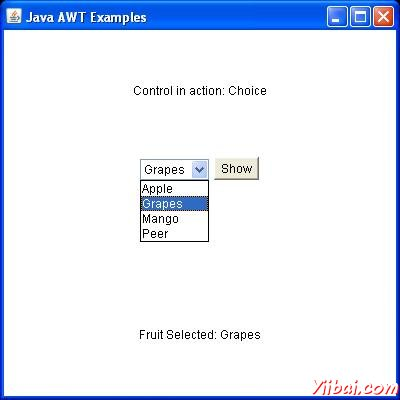

# AWT Choice类 - AWT

## 介绍

选择用于控制显示弹出菜单选择。所选选项将显示在顶部的菜单。

## 类的声明

以下是声明的java.awt.Choice类​​：

```
public class Choice
   extends Component
      implements ItemSelectable, Accessible
```

## 类的构造函数

| S.N. | 构造函数& 描述 |
| --- | --- |
| 1 | **Choice() () ** Creates a new choice menu. |

## 类方法

| S.N. | 方法 & 描述 |
| --- | --- |
| 1 | **void add(String item) ** Adds an item to this Choice menu. |
| 2 | **void addItem(String item) ** Obsolete as of Java 2 platform v1.1. |
| 3 | **void addItemListener(ItemListener l) ** Adds the specified item listener to receive item events from this Choice menu. |
| 4 | **void addNotify() ** Creates the Choice's peer. |
| 5 | **int countItems() ** Deprecated. As of JDK version 1.1, replaced by getItemCount(). |
| 6 | **AccessibleContext getAccessibleContext() ** Gets the AccessibleContext associated with this Choice. |
| 7 | **String getItem(int index) ** Gets the string at the specified index in this Choice menu. |
| 8 | **int getItemCount() ** Returns the number of items in this Choice menu. |
| 9 | **ItemListener[] getItemListeners() ** Returns an array of all the item listeners registered on this choice. |
| 10 | **&lt;T extends EventListener&gt; T[] getListeners(Class&lt;T&gt; listenerType) ** Returns an array of all the objects currently registered as FooListeners upon this Choice. |
| 11 | **int getSelectedIndex() ** Returns the index of the currently selected item. |
| 12 | **String getSelectedItem() ** Gets a representation of the current choice as a string. |
| 13 | **Object[] getSelectedObjects() ** Returns an array (length 1) containing the currently selected item. |
| 14 | **void insert(String item, int index) ** Inserts the item into this choice at the specified position. |
| 15 | **protected String paramString()** Returns a string representing the state of this Choice menu. |
| 16 | **protected void processEvent(AWTEvent e) ** Processes events on this choice. |
| 17 | **protected void processItemEvent(ItemEvent e) ** Processes item events occurring on this Choice menu by dispatching them to any registered ItemListener objects. |
| 18 | **void remove(int position) ** Removes an item from the choice menu at the specified position. |
| 19 | **void remove(String item) ** Removes the first occurrence of item from the Choice menu. |
| 20 | **void removeAll() ** Removes all items from the choice menu. |
| 21 | **void removeItemListener(ItemListener l) ** Removes the specified item listener so that it no longer receives item events from this Choice menu. |
| 22 | **void select(int pos) ** Sets the selected item in this Choice menu to be the item at the specified position. |
| 23 | **void select(String str) ** Sets the selected item in this Choice menu to be the item whose name is equal to the specified string. |

## 继承的方法

这个类继承的方法从以下类：

*   java.awt.Component

*   java.lang.Object

## Choice 实例

选择使用任何编辑器创建以下java程序 D:/ &gt; AWT &gt; com &gt; yiibai &gt; gui &gt;

AwtControlDemo.java

```
package com.yiibai.gui;

import java.awt.*;
import java.awt.event.*;

public class AwtControlDemo {

   private Frame mainFrame;
   private Label headerLabel;
   private Label statusLabel;
   private Panel controlPanel;

   public AwtControlDemo(){
      prepareGUI();
   }

   public static void main(String[] args){
      AwtControlDemo  awtControlDemo = new AwtControlDemo();
      awtControlDemo.showChoiceDemo();
   }

   private void prepareGUI(){
      mainFrame = new Frame("Java AWT Examples");
      mainFrame.setSize(400,400);
      mainFrame.setLayout(new GridLayout(3, 1));
      mainFrame.addWindowListener(new WindowAdapter() {
         public void windowClosing(WindowEvent windowEvent){
            System.exit(0);
         }        
      });    
      headerLabel = new Label();
      headerLabel.setAlignment(Label.CENTER);
      statusLabel = new Label();        
      statusLabel.setAlignment(Label.CENTER);
      statusLabel.setSize(350,100);

      controlPanel = new Panel();
      controlPanel.setLayout(new FlowLayout());

      mainFrame.add(headerLabel);
      mainFrame.add(controlPanel);
      mainFrame.add(statusLabel);
      mainFrame.setVisible(true);  
   }

   private void showChoiceDemo(){                                       

      headerLabel.setText("Control in action: Choice"); 
      final Choice fruitChoice = new Choice();

      fruitChoice.add("Apple");
      fruitChoice.add("Grapes");
      fruitChoice.add("Mango");
      fruitChoice.add("Peer");

      Button showButton = new Button("Show");

      showButton.addActionListener(new ActionListener() {
         public void actionPerformed(ActionEvent e) {     
            String data = "Fruit Selected: " 
            + fruitChoice.getItem(fruitChoice.getSelectedIndex());
            statusLabel.setText(data);
         }
      }); 

      controlPanel.add(fruitChoice);
      controlPanel.add(showButton);

      mainFrame.setVisible(true);  
   }
}
```

编译程序，使用命令提示符。到 **D:/ &gt; AWT **然后键入以下命令。

```
D:AWT>javac comyiibaiguiAwtControlDemo.java

```

如果没有错误出现，这意味着编译成功。使用下面的命令来运行程序。

```
D:AWT>java com.yiibai.gui.AwtControlDemo

```

验证下面的输出



