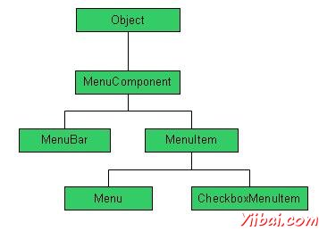

# AWT菜单控制 - AWT

正如我们所知道相关的每一个顶层窗口有一个菜单栏。此菜单栏包括提供给最终用户的各种菜单的选择。此外，每个选择包含这就是所谓的下拉菜单中的选项列表。菜单和菜单项的控件是的MenuComponent类的子类。

## 菜单层次结构

## 菜单控件

| Sr. No. | 控件与说明 |
| --- | --- |
| 1 | [MenuComponent](http://www.yiibai.com/html/awt/awt_menu_component.html?1379636262) 它是顶级类的所有菜单相关的控制。 |
| 2 | [MenuBar](http://www.yiibai.com/html/awt/awt_menubar_control.html?1379636267) MenuBar对象相关联的顶层窗口。 |
| 3 | [MenuItem](http://www.yiibai.com/html/awt/awt_menuitem_control.html?1379636270) 菜单中的项目必须属于MenuItem或任何其子类。 |
| 4 | [Menu](http://www.yiibai.com/html/awt/awt_menu_control.html) Menu对象是从菜单栏中显示一个下拉菜单组件。 |
| 5 | [CheckboxMenuItem](http://www.yiibai.com/html/awt/awt_checkboxmenuitem_control.html?1379636272) CheckboxMenuItem是菜单项的子类。 |
| 6 | [PopupMenu](http://www.yiibai.com/html/awt/awt_popupmenu_control.html?1379636275) PopupMenu 弹出式菜单，可以在一个组件内的指定位置动态弹出。 |

