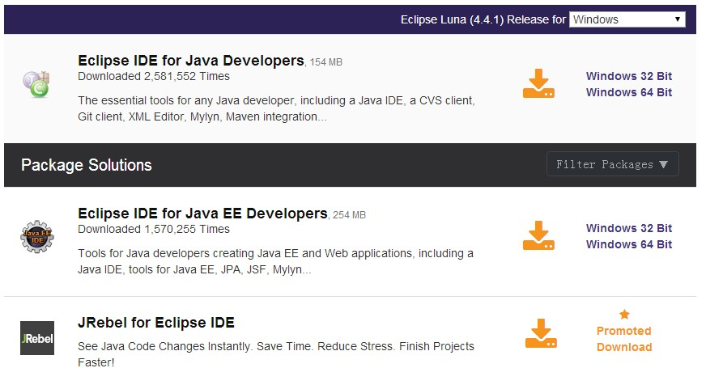
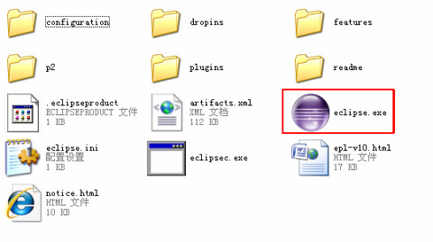

# Eclipse 安装

下载 Eclipse，下载地址为：[http://www.eclipse.org/downloads/](//www.eclipse.org/downloads/)。 下载页面列出了不同语言的Eclipse IDE，你可以根据自己需要下载。

Eclipse 的每个安装包都不同， Java 开发人员通常使用 Eclipse IDE for Java Developers 来开发 Java 应用。

列表右侧提供了Windows，Linux 和 Mac 操作系统及对应的32位与64位的安装包，你可以根据自己的系统情况选择合适的包下载。

## 安装 Eclipse

Eclipse 是基于 Java 的可扩展开发平台，所以安装 Eclipse 前你需要确保你的电脑已安装 JDK，JDK 安装可以查看我们的[Java开发环境配置](/java/java-environment-setup.html)。

Eclipse 的安装非常简单，你只需要下载压缩包，解压完毕后即可使用，进入文件夹，红框如图所示就是eclipse的启动程序

若你打开Eclipse的时候发现如下的对话框，则说明你的电脑未安装 JDK 环境。

第一次打开需要设置工作环境，你可以指定工作目录，或者使用默认的C盘工作目录，点击 ok 按钮。

创建一个项目：选择file--New--java Project，如图:

输入项目名称，比如我输入test，然后点击finish

完成项目的创建，点击红框里的小图标，如图：

然后在左侧菜单选择test项目，右键--new--class

键入类名，如输入 test，如图，然后点击finish

这样在代码框里面你就可以开始输入代码啦！

  
