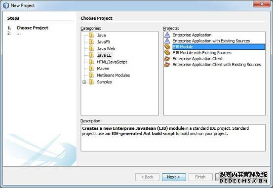
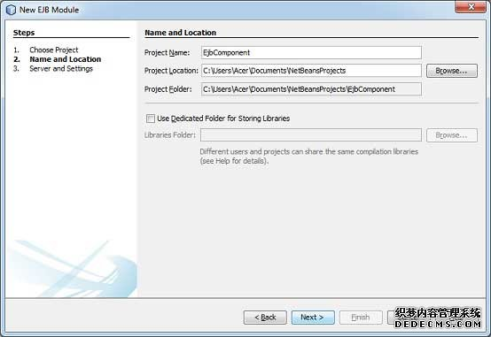
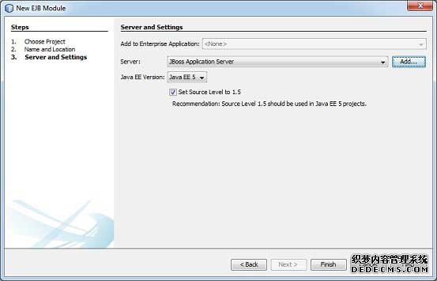
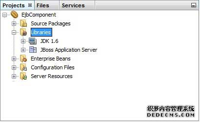
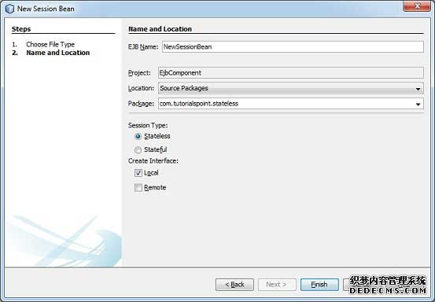

# EJB创建应用 - EJB

要创建一个简单的EJB模块，我们这里使用NetBeans“New project”向导。在下面的例子中，我们将创建一个名为“Component”的EJB模块项目。

## 创建项目

在NetBeans IDE中，选择**File &gt; New Project &gt;**. 可以看到如下图.



在类别中选择项目类型，Java EE的EJB模块项目类型。点击Next&gt;按钮，你会看到以下的画面。



输入项目的名称和位置。点击Next&gt;按钮。你会看到以下的画面。



选择服务器为JBoss应用服务器。单击“**Finish**”按钮。你会看到以下由NetBeans创建的项目。



## 创建一个简单的EJB

要创建一个简单的EJB，我们将使用NetBeans“**New**”向导。在下面的例子中，我们将在EjbComponent项目下创建一个无状态EJB类名为**librarySessionBean**。

在项目资源管理器窗口中选择项目EjbComponent，右键单击它。选择**New &gt; Session Bean**。您将看到新的会话Bean向导。



输入会话bean的名称和包名。单击“**Finish** ”按钮。你会看到以下由NetBeans创建的EJB类。

*   **LibrarySessionBean** - 无状态会话bean

*   **LibrarySessionBeanLocal** - 本地接口的会话bean

要改变本地接口，我们要一个基于控制台的应用程序访问我们的EJB远程接口。远程/本地接口用于公开一个EJB的业务方法实现。

LibrarySessionBeanLocal更名为LibrarySessionBeanRemote和LibrarySessionBean实现LibrarySessionBeanRemote接口。

_LibrarySessionBeanRemote_

```
package com.tutorialspoint.stateless;

import java.util.List;
import javax.ejb.Remote;

@Remote
public interface LibrarySessionBeanRemote {

    void addBook(String bookName);

    List getBooks();

}
```

_LibrarySessionBean_

```
package com.tutorialspoint.stateless;

import java.util.ArrayList;
import java.util.List;
import javax.ejb.Stateless;

@Stateless
public class LibrarySessionBean implements LibrarySessionBeanRemote {

    List<String> bookShelf;    

    public LibrarySessionBean(){
       bookShelf = new ArrayList<String>();
    }

    public void addBook(String bookName) {
        bookShelf.add(bookName);
    }    

    public List<String> getBooks() {
        return bookShelf;
    }
}
```

## 构建项目

*   在**Project Explorer**窗口中选择EjbComponent项目。

*   右键点击它来打开上下文菜单。

*   选择 **clean and build。**

在NetBeans控制台输出，你会看到以下的输出。

```
ant -f C:\EJB\EjbComponent clean dist
init:
undeploy-clean:
deps-clean:
Deleting directory C:EJBEjbComponentuild
Deleting directory C:EJBEjbComponentdist
clean:
init:
deps-jar:
Created dir: C:EJBEjbComponentuildclasses
Copying 3 files to C:EJBEjbComponentuildclassesMETA-INF
Created dir: C:EJBEjbComponentuildempty
Created dir: C:EJBEjbComponentuildgenerated-sourcesap-source-output
Compiling 2 source files to C:EJBEjbComponentuildclasses
warning: [options] bootstrap class path not set in conjunction with -source 1.6
Note: C:EJBEjbComponentsrcjavacom    utorialspointstateless
LibraryPersistentBean.java uses unchecked or unsafe operations.
Note: Recompile with -Xlint:unchecked for details.
1 warning
compile:
library-inclusion-in-archive:
Created dir: C:EJBEjbComponentdist
Building jar: C:EJBEjbComponentdistEjbComponent.jar
dist:
BUILD SUCCESSFUL (total time: 3 seconds)

```

## 启动应用程序服务器

*   服务器在服务窗口下选择JBoss应用服务器。

*   右键点击它来打开上下文菜单。

*   选择**start**。

你会看到下面的输出在NetBeans中JBoss应用服务器下的输出。

```
Calling C:jboss-5.1.0.GAin
un.conf.bat
=========================================================================

  JBoss Bootstrap Environment

  JBOSS_HOME: C:jboss-5.1.0.GA

  JAVA: C:Program Files (x86)Javajdk1.6.0_21injava

  JAVA_OPTS: -Dprogram.name=run.bat -Xms128m -Xmx512m -server

  CLASSPATH: C:jboss-5.1.0.GAin
un.jar

=========================================================================

16:25:50,062 INFO  [ServerImpl] Starting JBoss (Microcontainer)...
16:25:50,062 INFO  [ServerImpl] Release ID: JBoss [The Oracle] 5.1.0.GA (build: SVNTag=JBoss_5_1_0_GA date=200905221634)
...

16:26:40,420 INFO  [TomcatDeployment] deploy, ctxPath=/admin-console
16:26:40,485 INFO  [config] Initializing Mojarra (1.2_12-b01-FCS) for context '/admin-console'
16:26:42,362 INFO  [TomcatDeployment] deploy, ctxPath=/
16:26:42,406 INFO  [TomcatDeployment] deploy, ctxPath=/jmx-console
16:26:42,471 INFO  [Http11Protocol] Starting Coyote HTTP/1.1 on http-127.0.0.1-8080
16:26:42,487 INFO  [AjpProtocol] Starting Coyote AJP/1.3 on ajp-127.0.0.1-8009
16:26:42,493 INFO  [ServerImpl] JBoss (Microcontainer) [5.1.0.GA (build: SVNTag=JBoss_5_1_0_GA date=200905221634)] Started in 52s:427ms

```

## 部署项目

*   在**Project Explorer**窗口中选择EjbComponent项目。

*   右击它，打开上下文菜单。

*   选择 **Deploy**.

在NetBeans控制台输出，你会看到下面的输出。

```
ant -f C:\EJB\EjbComponent -DforceRedeploy=true -Ddirectory.deployment.supported=false -Dnb.wait.for.caches=true run
init:
deps-jar:
compile:
library-inclusion-in-archive:
Building jar: C:EJBEjbComponentdistEjbComponent.jar
dist-directory-deploy:
pre-run-deploy:
Checking data source definitions for missing JDBC drivers...
Distributing C:EJBEjbComponentdistEjbComponent.jar to [org.jboss.deployment.spi.LocalhostTarget@1e4f84ee]
Deploying C:EJBEjbComponentdistEjbComponent.jar
Applicaton Deployed
Operation start started
Operation start completed
post-run-deploy:
run-deploy:
run:
BUILD SUCCESSFUL (total time: 2 seconds)

```

JBoss应用服务器的日志输出

```
16:30:00,963 INFO  [DeployHandler] Begin start, [EjbComponent.jar]
...
16:30:01,233 INFO  [Ejb3DependenciesDeployer] Encountered deployment AbstractVFSDeploymentContext@12038795{vfszip:/C:/jboss-5.1.0.GA/server/default/deploy/EjbComponent.jar/}
...
16:30:01,281 INFO  [JBossASKernel]    jndi:LibrarySessionBean/remote-com.tutorialspoint.stateless.LibrarySessionBeanRemote
16:30:01,281 INFO  [JBossASKernel]    Class:com.tutorialspoint.stateless.LibrarySessionBeanRemote
16:30:01,281 INFO  [JBossASKernel]    jndi:LibrarySessionBean/remote
16:30:01,281 INFO  [JBossASKernel]  Added bean(jboss.j2ee:jar=EjbComponent.jar,name=
LibrarySessionBean,service=EJB3) to KernelDeployment of: EjbComponent.jar
16:30:01,282 INFO  [JBossASKernel] installing bean: jboss.j2ee:jar=EjbComponent.jar,name=BookMessageHandler,service=EJB3
16:30:01,282 INFO  [JBossASKernel]   with dependencies:
16:30:01,282 INFO  [JBossASKernel]   and demands:
16:30:01,282 INFO  [JBossASKernel]    jboss.ejb:service=EJBTimerService
...
16:30:01,283 INFO  [EJB3EndpointDeployer] Deploy AbstractBeanMetaData@5497cb{name=jboss.j2ee:jar=EjbComponent.jar, name=LibrarySessionBean, service=EJB3_endpoint bean=org.jboss.ejb3.endpoint.deployers.impl.EndpointImpl properties=[container] constructor=null autowireCandidate=true}
...
16:30:01,394 INFO  [SessionSpecContainer] Starting jboss.j2ee:jar=EjbComponent.jar,name=LibrarySessionBean,service=EJB3
16:30:01,395 INFO  [EJBContainer] STARTED EJB: com.tutorialspoint.stateless.LibrarySessionBean ejbName: LibrarySessionBean
16:30:01,401 INFO  [JndiSessionRegistrarBase] Binding the following Entries in Global JNDI:
   LibrarySessionBean/remote - EJB3.x Default Remote Business Interface
   LibrarySessionBean/remote-com.tutorialspoint.stateless.LibrarySessionBeanRemote - EJB3.x Remote Business Interface
16:30:02,723 INFO  [SessionSpecContainer] Starting jboss.j2ee:jar=EjbComponent.jar,name=LibrarySessionBean,service=EJB3
16:30:02,723 INFO  [EJBContainer] STARTED EJB: com.tutorialspoint.stateless.LibrarySessionBean ejbName: LibrarySessionBean
16:30:02,731 INFO  [JndiSessionRegistrarBase] Binding the following Entries in Global JNDI:

   LibrarySessionBean/remote - EJB3.x Default Remote Business Interface
   LibrarySessionBean/remote-com.tutorialspoint.stateless.LibrarySessionBeanRemote - EJB3.x Remote Business Interface

```

## 创建客户端访问EJB

*   在NetBeans IDE中选择 **File &gt; New Project &gt;**.

*   类别下选择项目类型为**Java**，项目类型为Java应用程序的Java。点击**Next&gt;**按钮。

*   输入项目的名称和位置。单击“**Finish &gt;**“按钮。我们选择名为EjbTester。

*   右键点击项目名称(在Project explore窗口中)。选择属性**properties**。

*   添加EJB组件项目的库使用“**Add Project** ”按钮，在**compile**选项卡下创建的。

*   添加JBoss库使用添加**Add jar/folder**按钮，在**compile**选项卡。 Jboss的库可以位于&lt;JBOSS安装文件夹&gt;客户端文件夹。

在工程中创建 jndi.properties说一个句话 EjbTester.

_jndi.properties_

```
java.naming.factory.initial=org.jnp.interfaces.NamingContextFactory
java.naming.factory.url.pkgs=org.jboss.naming:org.jnp.interfaces
java.naming.provider.url=localhost
```

创建包com.tutorialspoint.test和EJBTester.java类在下面。

_EJBTester.java_

```
package com.tutorialspoint.test;

import com.tutorialspoint.stateless.LibrarySessionBeanRemote;
import java.io.BufferedReader;
import java.io.FileInputStream;
import java.io.IOException;
import java.io.InputStreamReader;
import java.util.List;
import java.util.Properties;
import javax.naming.InitialContext;
import javax.naming.NamingException;

public class EJBTester {

   BufferedReader brConsoleReader = null; 
   Properties props;
   InitialContext ctx;
   {
      props = new Properties();
      try {
      props.load(new FileInputStream("jndi.properties"));
      } catch (IOException ex) {
      ex.printStackTrace();
      }
      try {
      ctx = new InitialContext(props);            
      } catch (NamingException ex) {
      ex.printStackTrace();
      }
      brConsoleReader = 
      new BufferedReader(new InputStreamReader(System.in));
   }
   public static void main(String[] args) {

      EJBTester ejbTester = new EJBTester();

      ejbTester.testStatelessEjb();
   }
   private void showGUI(){
      System.out.println("**********************");
      System.out.println("Welcome to Book Store");
      System.out.println("**********************");
      System.out.print("Options 
1\. Add Book
2\. Exit 
Enter Choice: ");
   }
   private void testStatelessEjb(){
      try {
         int choice = 1; 
         LibrarySessionBeanRemote libraryBean = 
         (LibrarySessionBeanRemote)ctx.lookup("LibrarySessionBean/remote");
         while (choice != 2) {
            String bookName;
            showGUI();
            String strChoice = brConsoleReader.readLine();
            choice = Integer.parseInt(strChoice);
            if (choice == 1) {
               System.out.print("Enter book name: ");
               bookName = brConsoleReader.readLine();                    
               libraryBean.addBook(bookName);          
            }else if (choice == 2) {
               break;
            }
         }
         List<String> booksList = libraryBean.getBooks();
         System.out.println("Book(s) entered so far: " + booksList.size());
         for (int i = 0; i < booksList.size(); ++i) {
         System.out.println((i+1)+". " + booksList.get(i));
         }
         LibrarySessionBeanRemote libraryBean1 = 
         (LibrarySessionBeanRemote)ctx.lookup("LibrarySessionBean/remote");
         List<String> booksList1 = libraryBean1.getBooks();
         System.out.println(
         "***Using second lookup to get library stateless object***");
         System.out.println(
         "Book(s) entered so far: " + booksList1.size());
         for (int i = 0; i < booksList1.size(); ++i) {
            System.out.println((i+1)+". " + booksList1.get(i));
         }
      } catch (Exception e) {
         System.out.println(e.getMessage());
         e.printStackTrace();
      }finally {
         try {
            if(brConsoleReader !=null){
               brConsoleReader.close();
            }
         } catch (IOException ex) {
            System.out.println(ex.getMessage());
         }
      }
   }  
}
```

## 运行客户端访问EJB

在**project explorer**中找到EJBTester.java。右键点击上EJBTester类，并选择“**run file**”。

在Netbeans控制台验证以下输出。

```
run:
**********************
Welcome to Book Store
**********************
Options 
1\. Add Book
2\. Exit 
Enter Choice: 1
Enter book name: Learn Java
**********************
Welcome to Book Store
**********************
Options 
1\. Add Book
2\. Exit 
Enter Choice: 2
Book(s) entered so far: 1
1\. Learn Java
***Using second lookup to get library stateless object***
Book(s) entered so far: 0
BUILD SUCCESSFUL (total time: 13 seconds)

```

在下面的章节中，我们将讨论这个完整的EJB的多个层面应用程序。

