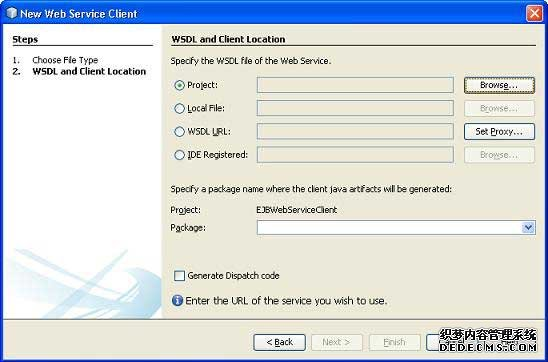
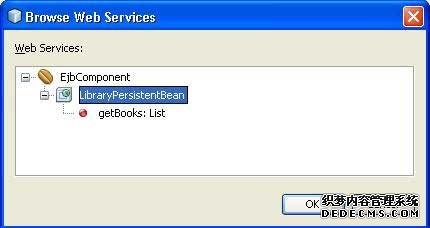
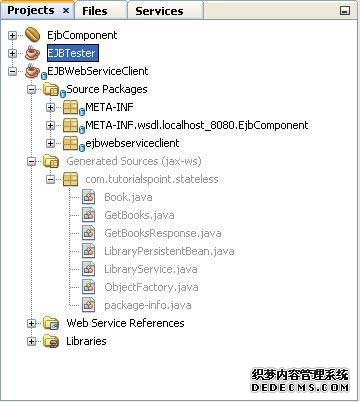
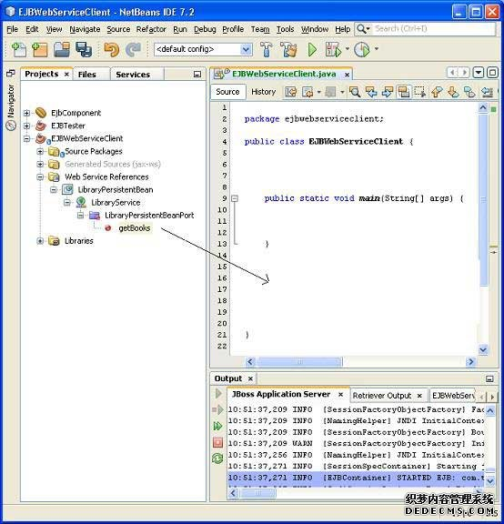
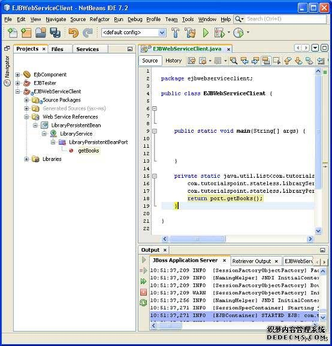

# EJB Web Services - EJB

EJB3.0暴露会话EJB作为Web服务提供选项。@WebService注释是用来标记一类作为一个Web服务端点，并使用@WebMethod是用来作为客户端的Web方法的公开方法。

```
@Stateless
@WebService(serviceName="LibraryService")
public class LibraryPersistentBean implements LibraryPersistentBeanRemote {

   ...
   @WebMethod(operationName="getBooks")
   public List<Book> getBooks()  {    
      return entityManager.createQuery("From Books").getResultList();
   }
   ...
}
```

## 示例应用程序

让我们创建一个测试[EJB](http://www.yiibai.com/html/ejb/)在EJB3.0应用程序来测试BLOB/CLOB支持。

| Step | Description |
| --- | --- |
| 1 | Create a project with a name _EjbComponent_ under a package _com.tutorialspoint.entity_ as explained in the _EJB - Create Application_ chapter. Please use the project created in _EJB - Persistence_ chapter as such for this chapter to understand clob/blob objects in ejb concepts. |
| 2 | Create _LibraryPersistentBean.java_ under package _com.tutorialspoint.stateless_. Use _EJB - Persistence_ chapter as reference. Keep rest of the files unchanged. |
| 3 | Clean and Build the application to make sure business logic is working as per the requirements. |
| 4 | Finally, deploy the application in the form of jar file on JBoss Application Server. JBoss Application server will get started automatically if it is not started yet. |

## LibraryPersistentBean.java

```
package com.tutorialspoint.stateless;

import com.tutorialspoint.entity.Book;
import java.util.List;
import javax.ejb.Stateless;
import javax.jws.WebMethod;
import javax.jws.WebService;
import javax.persistence.EntityManager;
import javax.persistence.PersistenceContext;

@Stateless
@WebService(serviceName="LibraryService")
public class LibraryPersistentBean implements LibraryPersistentBeanRemote {

   public LibraryPersistentBean(){
   }

   @PersistenceContext(unitName="EjbComponentPU")
   private EntityManager entityManager;         

   public void addBook(Book book) {
      entityManager.persist(book);
   }    

   @WebMethod(operationName="getBooks")
   public List<Book> getBooks() {
      return entityManager.createQuery("From Book").getResultList();
   }
}
```

JBoss应用服务器的日志输出

```
10:51:37,271 INFO  [EJBContainer] STARTED EJB: com.tutorialspoint.stateless.LibraryPersistentBean ejbName: LibraryPersistentBean
10:51:37,287 INFO  [JndiSessionRegistrarBase] Binding the following Entries in Global JNDI:

    LibraryPersistentBean/remote - EJB3.x Default Remote Business Interface
    LibraryPersistentBean/remote-com.tutorialspoint.stateless.LibraryPersistentBeanRemote - EJB3.x Remote Business Interface

10:51:37,349 INFO  [EJBContainer] STARTED EJB: com.tuturialspoint.messagebean.LibraryMessageBean ejbName: BookMessageHandler
10:51:37,443 INFO  [DefaultEndpointRegistry] register: jboss.ws:context=EjbComponent,endpoint=LibraryPersistentBean
10:51:38,191 INFO  [WSDLFilePublisher] WSDL published to: file:/D:/Jboss-5.0.1/server/default/data/wsdl/EjbComponent.jar/
LibraryService3853081455302946642.wsdl

```

## 创建客户端访问EJB作为Web服务

在NetBeansIDE中，选择**File&gt;NewProject&gt;**类别下选择项目类型，Java项目类型为Java应用。点击Next&gt;按钮。输入项目的名称和位置。单击“**Next&gt;**“按钮。我们选择名为EJBWebServiceClient。

右键点击项目名称在项目exporer窗口中。选择 **New &gt; WebService Client** .



添加EJB组件项目的LibraryPersistentBean早下创建WSDL和客户端位置使用在"编译"选项卡中添加项目“按钮。



单击“完成”按钮。在项目资源管理器验证以下结构。



Create EJBWebServiceClient.java

```
package ejbwebserviceclient;

public class EJBWebServiceClient {
   public static void main(String[] args) {   
   }
}
```

如下图所示，选择Web服务getBooks Web方法，将其拖动到代码窗口EJBWebServiceClient。



会看到类似的输出如下所示。



更新EJBWebServiceClient的代码使用此方法。

```
package ejbwebserviceclient;

public class EJBWebServiceClient {

   public static void main(String[] args) {
      for(com.tutorialspoint.stateless.Book book:getBooks()){
         System.out.println(book.getName());
      }       
   }

   private static java.util.List
   <com.tutorialspoint.stateless.Book> getBooks() {
      com.tutorialspoint.stateless.LibraryService service =
         new com.tutorialspoint.stateless.LibraryService();
      com.tutorialspoint.stateless.LibraryPersistentBean port =
         service.getLibraryPersistentBeanPort();
      return port.getBooks();
   }      
}
```

## 运行客户端

右键点击项目名称，项目资源管理器窗口。选择“**Run**”。 NetBeans将生成客户端并运行它。验证下面的输出。 

```
ant -f D:\SVN\EJBWebServiceClient run
init:
Deleting: D:SVNEJBWebServiceClientuilduilt-jar.properties
deps-jar:
Updating property file: D:SVNEJBWebServiceClientuilduilt-jar.properties
wsimport-init:
wsimport-client-LibraryPersistentBean:
files are up to date
classLoader = java.net.URLClassLoader@4ce46c
SharedSecrets.getJavaNetAccess()=java.net.URLClassLoader$7@182cdac
wsimport-client-generate:
Compiling 1 source file to D:SVNEJBWebServiceClientuildclasses
compile:
run:
learn java
Learn Spring
learn JSF
Learn HTML
Learn JBoss
Learn EJB
Learn Hibernate
Learn IBatis
Times Now
learn html5
Learn images
Learn Testing
Forbes
test1
BUILD SUCCESSFUL (total time: 1 second)
```
