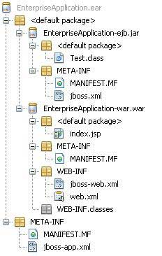
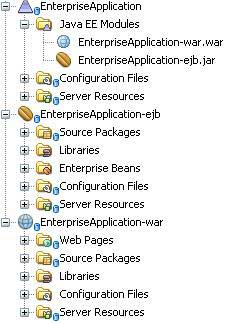

# EJB封装应用 - EJB

封装要求应用程序使用EJB 3.0是类似于J2EE平台。 EJB组件打包成jar文件的模块被打包成ear文件的应用企业归档。 主要的企业应用程序有三个组成部分。

*   **jar** - Java应用程序归档，包含EJB模块，EJB客户端模块和实用模块。

*   **war** - Web应用程序归档，包含Web模块。

*   **ear** - 企业应用程序归档包括 jars 和 war 模块.



在NetBeans它是很容易的创建，开发，打包和部署J2EE应用程序。

在NetBeans IDE中，选择**File&gt;New Project&gt;**选择项目类型为企业应用程序的**JavaEE**项目类型。
点击Next&gt;按钮。输入项目的名称和位置。单击“**Finish &gt;**“按钮。我们选择名为EnterpriseApplicaton。

选择服务器和设置。保持创建EJB模块“和”创建Web应用程序模块检查提供的默认名称。单击“完成”按钮。 NetBeans将创建下列结构在项目窗口。



项目企业在项目资源管理器中的应用上点击右键并选择“生成”。

```
ant -f D:\SVN\EnterpriseApplication dist
pre-init:
init-private:
init-userdir:
init-user:
init-project:
do-init:
post-init:
init-check:
init:
deps-jar:
deps-j2ee-archive:
EnterpriseApplication-ejb.init:
EnterpriseApplication-ejb.deps-jar:
EnterpriseApplication-ejb.compile:
EnterpriseApplication-ejb.library-inclusion-in-manifest:

Building jar: D:SVNEnterpriseApplicationEnterpriseApplication-ejbdistEnterpriseApplication-ejb.jar

EnterpriseApplication-ejb.dist-ear:
EnterpriseApplication-war.init:
EnterpriseApplication-war.deps-module-jar:
EnterpriseApplication-war.deps-ear-jar:
EnterpriseApplication-ejb.init:
EnterpriseApplication-ejb.deps-jar:
EnterpriseApplication-ejb.compile:
EnterpriseApplication-ejb.library-inclusion-in-manifest:
EnterpriseApplication-ejb.dist-ear:
EnterpriseApplication-war.deps-jar:
EnterpriseApplication-war.library-inclusion-in-archive:
EnterpriseApplication-war.library-inclusion-in-manifest:
EnterpriseApplication-war.compile:
EnterpriseApplication-war.compile-jsps:
EnterpriseApplication-war.do-ear-dist:

Building jar: D:SVNEnterpriseApplicationEnterpriseApplication-wardistEnterpriseApplication-war.war

EnterpriseApplication-war.dist-ear:
pre-pre-compile:
pre-compile:
Copying 1 file to D:SVNEnterpriseApplicationuild
Copying 1 file to D:SVNEnterpriseApplicationuild
do-compile:
post-compile:
compile:
pre-dist:
do-dist-without-manifest:
do-dist-with-manifest:

Building jar: D:SVNEnterpriseApplicationdistEnterpriseApplication.ear

post-dist:
dist:
BUILD SUCCESSFUL (total time: 1 second)
```

在这里，你可以看到每个jar，war和ear文件带有一个META-INF文件夹，按照J2EE规范的元数据。

