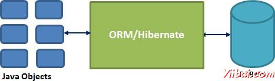

# Hibernate概述,Hibernate是什么？ - hibernate

Hibernate是对Java中的对象关系映射（ORM）解决方案，它由加文·金（Gavin King）在2001年提出并创建的一个开源持久框架。它是一个强大的，高性能的对象关系持久性和对任何Java应用程序的查询服务。

Hibernate映射Java类到数据库表和从Java数据类型到SQL数据类型和95％的通用数据持久化相关的编程任务，解放了开发者。

Hibernate位于传统的Java对象和数据库服务器来处理在持久化的基础上，适当的O/R机制和模式，这些对象在所有工作对象之间。

## Hibernate 优点:

*   Hibernate会处理映射的Java类来使用XML文件，数据库表和无需编写任何一行代码。

*   提供了简单的API，用于直接从数据库中存储和检索Java对象。

*   如果有变化，数据库或任何表中的那么只需要修改XML文件的属性。

*   抽象掉不熟悉的SQL类型，并提供我们解决熟悉的Java对象。

*   Hibernate不要求应用服务器进行操作。

*   操纵数据库对象的复杂关联。

*   尽量减少与智能读取策略数据库的访问。

*   提供数据的简单查询。

## 支持的数据库：

Hibernate支持几乎所有主要的RDBMS。以下是Hibernate支持的几个数据库引擎列表。

*   HSQL Database Engine

*   DB2/NT

*   MySQL

*   PostgreSQL

*   FrontBase

*   Oracle

*   Microsoft SQL Server Database

*   Sybase SQL Server

*   Informix Dynamic Server

## 支持的技术：

Hibernate支持各种各样的其他技术，包括以下内容：

*   XDoclet Spring

*   J2EE

*   Eclipse plug-ins

*   Maven

