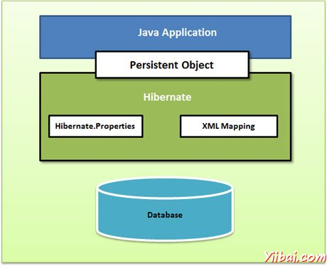
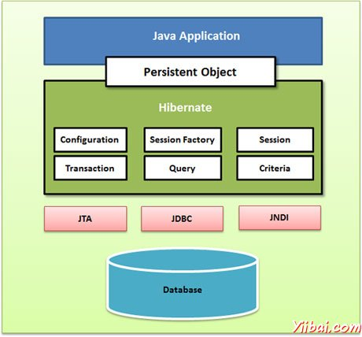

# Hibernate架构 - hibernate

Hibernate架构是分层的，隔离的不必知道底层API。 Hibernate中使用数据库和配置信息来为应用程序提供持久化服务（以及持久的对象）。

下面是Hibernate应用程序体系结构的一个非常高的水平视图。

下面是Hibernate的应用架构与一些重要的核心课程的详细视图。

Hibernate使用各种现有的Java API，如JDBC，Java事务API（JTA）和Java命名和目录接口（JNDI）。 JDBC提供了常见的关系数据库功能的抽象的一个基本水平，使具有JDBC驱动程序，Hibernate的支持几乎任何数据库。 JNDI和JTA允许Hibernate与J2EE应用服务器进行集成。

以下部分列出了每个参与Hibernate应用程序体系结构的类的对象的简要说明。

## Configuration 对象:

Configuration对象是你在任何Hibernate应用程序中创建并通常在应用程序初始化创建一次，第一个Hibernate的对象。它代表了Hibernate所需的配置或属性文件。 Configuration对象提供了两个按键组成部分：

*   数据库连接：这是通过Hibernate支持的一个或多个配置文件来处理。这些文件是：hibernate.properties和hibernate.cfg.xml。

*   类映射设置
    此组件创建Java类和数据库表之间的连接

## SessionFactory 对象:

Configuration对象用于创建一个SessionFactory对象，它反过来可以配置Hibernate的使用提供的配置文件的应用程序，并允许一个Session对象被实例化。通过SessionFactory是线程安全的对象和使用的应用程序的所有线程。

通过SessionFactory是重量级的对象，因此通常它被应用程序时创建的启动和保持以备后用。将使用一个单独的配置文件需要每个数据库都有一个SessionFactory对象。所以，如果正在使用多个数据库，那么就需要创建多个SessionFactory的对象。

## Session 对象:

Session对象用于获取与数据库的物理连接。 Session对象是重量轻，设计了一个互动是需要与数据库每次被实例化。持久化对象被保存，并通过一个Session对象中检索。

会话中的对象不应该保持开放很长一段时间，因为他们通常不被线程安全的，应该被创建并根据需要销毁他们。

## Transaction 对象:

事务代表一个工作单元与数据库和大部分RDBMS支持事务功能。在Hibernate事务是由一个基本的事务管理器和事务（从JDBC或JTA）来处理。

这是一个可选的对象和Hibernate应用程序可以选择不使用这个接口，而不是在他们自己的应用程序代码管理事务。

## Query 对象:

查询对象使用SQL或Hibernate查询语言（HQL）字符串从数据库中检索数据并创建对象。一个查询实例是用来绑定查询参数，限制查询返回的结果数量，并最终执行查询。

## Criteria 对象:

Criteria对象用于创建和执行面向对象的条件查询来检索对象。
