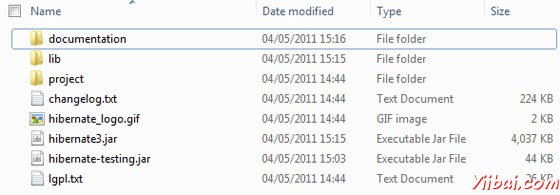

# Hibernate环境配置 - hibernate

本章将解释如何安装Hibernate和其他相关的包准备开发环境为Hibernate应用程序。我们将使用MySQL数据库的工作，尝试使用Hibernate的例子，所以一定要确保已经安装的MySQL数据库。有关MySQL的一个更详细信息，可以查看[MySQL教程](http://www.yiibai.com/mysql/index.html).

## 下载Hibernate:

假定你已经拥有Java的最新版本安装在机器上。以下是简单的步骤下载并安装Hibernate。

*   选择是否要在Windows或UNIX安装Hibernate，然后继续下一个步骤，下载zip文件适用于Windows，而Unix则为.tz文件。

*   下载Hibernate最新版本 [http://www.hibernate.org/downloads](http://www.hibernate.org/downloads).

*   在写这篇教程的时候，我下载了hibernate-distribution-3.6.4.Final，解压缩下载的文件，目录结构如下所示。

## 安装Hibernate:

下载并解压Hibernate安装最新版本，需要执行下面两个简单的步骤。请确保你设置CLASSPATH变量正确，否则编译应用程序将面临问题。

*   现在所有的库文件拷贝从 /lib 目录到CLASSPATH，并改变classpath变量包括所有的JAR文件：

*   最后复制 hibernate3.jar 里的文件到CLASSPATH。该文件位于安装的根目录，Hibernate需要做的工作主要的JAR。

## Hibernate Prerequisites:

以下是由Hibernate要求，应该开始使用Hibernate之前安装它们的软件包 /lib 列表。要安装这些软件包，从/lib目录拷贝库文件到CLASSPATH，并相应地改变CLASSPATH变量。

| S.N. | Packages/Libraries |
| --- | --- |
| 1 | **dom4j** - XML parsing [www.dom4j.org/](http://www.dom4j.org/) |
| 2 | **Xalan** - XSLT Processor [http://xml.apache.org/xalan-j/](http://xml.apache.org/xalan-j/) |
| 3 | **Xerces** - The Xerces Java Parser [http://xml.apache.org/xerces-j/](http://xml.apache.org/xerces-j/) |
| 4 | **cglib** - Appropriate changes to Java classes at runtime [http://cglib.sourceforge.net/](http://cglib.sourceforge.net/) |
| 5 | **log4j** - Logging Faremwork [http://logging.apache.org/log4j](http://logging.apache.org/log4j) |
| 6 | **Commons** - Logging, Email etc. [http://jakarta.apache.org/commons](http://jakarta.apache.org/commons) |
| 7 | **SLF4J** - Logging Facade for Java [http://www.slf4j.org](http://www.slf4j.org/download.htmll) |

