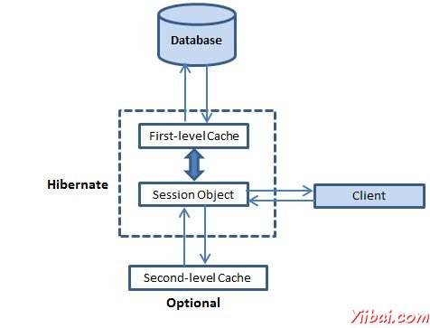

# Hibernate缓存 - hibernate

缓存是所有关于应用程序的性能优化和它位于应用程序和数据库之间，以避免数据库访问多次，让性能关键型应用程序有更好的表现。

缓存对Hibernate很重要，它采用了多级缓存方案下文所述：



## 第一级缓存：

第一级缓存是Session的缓存，是一个强制性的缓存，通过它所有的请求都必须通过。 Session对象不断自身的动力的对象，提交到数据库之前。

如果发出多个更新一个对象，Hibernate试图拖延尽可能长的时间做了更新，以减少发出的更新SQL语句的数量。如果您关闭会话，所有被缓存的对象都将丢失，要么持久，或在数据库中更新。

## 二级缓存：

二级缓存是可选的缓存和一级缓存，总是会征询任何试图找到一个对象的二级缓存之前。第二级缓存可以在每个类和每个集合基础上进行配置，主要负责在会话缓存的对象。

任何第三方缓存可以使用Hibernate。org.hibernate.cache.CacheProvider接口提供，必须实施提供Hibernate一个句柄缓存实现。

## 查询级别缓存：

Hibernate也实现了查询结果集缓存与二级缓存的紧密集成在一起。

这是一个可选功能，需要两个额外的物理缓存中保存缓存的查询结果和地区当一个表的最后更新的时间戳。这只是针对那些使用相同的参数经常运行的查询非常有用。

## 二级缓存：

Hibernate使用一级缓存，默认情况下，你什么都没有做使用第一级缓存。让我们直接进入可选的第二级缓存。并不是所有的类受益于缓存，这样一来就能禁用二级缓存是很重要的

Hibernate二级缓存被设置为两个步骤。首先，必须决定要使用的并发策略。在此之后，可以配置缓存过期和使用缓存提供物理缓存属性。

## 并发策略：

并发策略是一个中介的负责存储数据项在缓存并从缓存中检索它们。如果要启用二级缓存，将必须决定，为每个持久化类和集合，要使用的缓存并发策略。

*   Transactional: 使用这种策略的主要读取数据的地方，以防止过时的数据的并发事务，在更新的罕见情况下是至关重要的。

*   Read-write: 再次使用这种策略的主要读取数据的地方，以防止并发事务陈旧的数据是至关重要的，在更新的罕见情况。

*   Nonstrict-read-write: 这种策略不保证缓存与数据库之间的一致性。使用此策略，如果数据很少改变和陈旧数据的可能性很小关键是不关注。

*   Read-only: 并发策略适用于数据，永远不会改变。使用数据仅供参考。

如果我们要使用第二级缓存为我们的Employee类，让我们添加告诉Hibernate使用可读写的高速缓存策略Employee实例所需的映射元素。

```
<?xml version="1.0" encoding="utf-8"?>
<!DOCTYPE hibernate-mapping PUBLIC 
 "-//Hibernate/Hibernate Mapping DTD//EN"
 "http://www.hibernate.org/dtd/hibernate-mapping-3.0.dtd"> 

<hibernate-mapping>
   <class name="Employee" table="EMPLOYEE">
      <meta attribute="class-description">
         This class contains the employee detail. 
      </meta>
      <cache usage="read-write"/>
      <id name="id" type="int" column="id">
         <generator class="native"/>
      </id>
      <property name="firstName" column="first_name" type="string"/>
      <property name="lastName" column="last_name" type="string"/>
      <property name="salary" column="salary" type="int"/>
   </class>
</hibernate-mapping>
```

 usage="read-write" 属性告诉Hibernate使用一个可读写的并发策略定义的缓存。

## 缓存提供者：

考虑到会用你的缓存候选类的并发策略后，下一步就是选择一个缓存提供程序。Hibernate迫使选择一个缓存提供整个应用程序。

| S.N. | 缓存名称 | 描述 |
| --- | --- | --- |
| 1 | EHCache | 它可以在内存或磁盘上以及群集缓存缓存，它支持可选的Hibernate查询结果缓存。 |
| 2 | OSCache | 支持缓存内存和磁盘在一个JVM中，有一组丰富的过期策略和查询缓存的支持。 |
| 3 | warmCache | 基于JGroups的集群缓存。它使用群集失效，但不支持Hibernate的查询缓存 |
| 4 | JBoss Cache | 一个完全的事务复制的集群缓存也是基于JGroups的组播库。它支持复制或失效，同步或异步通信，乐观和悲观锁定。支持Hibernate的查询缓存 |

每一个缓存提供程序是不是与每个并发策略兼容。以下兼容性矩阵将帮助选择合适的组合。

| Strategy/Provider | Read-only | Nonstrictread-write | Read-write | Transactional |
| --- | --- | --- | --- | --- |
| EHCache | X | X | X |
| OSCache | X | X | X |
| SwarmCache | X | X |
| JBoss Cache | X | X |

在指定hibernate.cfg.xml配置文件中的缓存提供。选择EHCache作为第二级缓存提供程序：

```
<?xml version="1.0" encoding="utf-8"?>
<!DOCTYPE hibernate-configuration SYSTEM 
"http://www.hibernate.org/dtd/hibernate-configuration-3.0.dtd">

<hibernate-configuration>
   <session-factory>
   <property name="hibernate.dialect">
      org.hibernate.dialect.MySQLDialect
   </property>
   <property name="hibernate.connection.driver_class">
      com.mysql.jdbc.Driver
   </property>

   <!-- Assume students is the database name -->
   <property name="hibernate.connection.url">
      jdbc:mysql://localhost/test
   </property>
   <property name="hibernate.connection.username">
      root
   </property>
   <property name="hibernate.connection.password">
      root123
   </property>
   <property name="hibernate.cache.provider_class">
      org.hibernate.cache.EhCacheProvider
   </property>

   <!-- List of XML mapping files -->
   <mapping resource="Employee.hbm.xml"/>

</session-factory>
</hibernate-configuration>
```

现在，需要指定缓存区域的属性。EHCache都有自己的配置文件ehcache.xml，在应用程序在CLASSPATH中。在ehcache.xml中Employee类高速缓存配置可能看起来像这样：

```
<diskStore path="java.io.tmpdir"/>
<defaultCache
maxElementsInMemory="1000"
eternal="false"
timeToIdleSeconds="120"
timeToLiveSeconds="120"
overflowToDisk="true"
/>

<cache name="Employee"
maxElementsInMemory="500"
eternal="true"
timeToIdleSeconds="0"
timeToLiveSeconds="0"
overflowToDisk="false"
/>
```

就这样，现在启用Employee类的二级缓存和Hibernate现在二级缓存，每当浏览到一个雇员或当通过标识符加载雇员。

应该分析你所有的类，并选择适当的缓存策略为每个类。有时，二级缓存可能降级的应用程序的性能。所以建议到基准应用程序第一次没有启用缓存，非常适合缓存和检查性能。如果缓存不提高系统性能再有就是在使任何类型的缓存是没有意义的。

## 查询级别缓存：

使用查询缓存，必须先使用 hibernate.cache.use_query_cache="true"属性配置文件中激活它。如果将此属性设置为true，让Hibernate的在内存中创建所需的高速缓存来保存查询和标识符集。

接下来，使用查询缓存，可以使用Query类的setCacheable（Boolean）方法。例如：

```
Session session = SessionFactory.openSession();
Query query = session.createQuery("FROM EMPLOYEE");
query.setCacheable(true);
List users = query.list();
SessionFactory.closeSession();
```

Hibernate也支持通过一个缓存区域的概念非常细粒度的缓存支持。缓存区是这是给定一个名称缓存的一部分。

```
Session session = SessionFactory.openSession();
Query query = session.createQuery("FROM EMPLOYEE");
query.setCacheable(true);
query.setCacheRegion("employee");
List users = query.list();
SessionFactory.closeSession();
```

此代码使用方法告诉Hibernate来存储和查找在缓存中的员工方面的查询。

