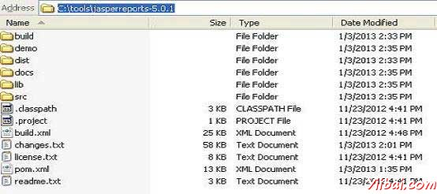

# JasperReport环境设置 - JasperReports教程

JasperReport是一个纯Java库，而不是一个独立的应用程序。它不能单独运行，因此它需要被嵌入到另一个客户端或服务器端的Java应用程序。因为它是基于Java，它可以在任何支持Java的平台（JDK1.3及以上）上运行。所有JasperReports的功能是聚集在一个JAR文件中，一般名称为：jasperreports-x.x.x.jar。JasperReport库链接：这个JAR文件必需及可选库（压缩文件）可以从网站上下载。[下载最新的版本](http://sourceforge.net/projects/jasperreports/files/jasperreports/)。

ZIP文件包含JasperReports源代码，相关JAR和大量的实例演示JasperReport功能以及JasperReportsJAR文件。

## JasperReport环境配置

要开始创建我们需要设置环境准备。解压缩下载的JasperReport ZIP文件到任何位置（在我们的例子中，我们已经提取到C: oolsjasperreports-5.0.1）。解压缩文件的目录结构如下图示：



下面是所有目录的详细信息：

*   build: 包含已编译的JasperReport类文件。

*   demo: 包含演示JasperReports功能几个方面的各种例子。

*   dist: 包含的JasperReports-x.x.x.jar文件。将这个JAR文件添加到CLASSPATH。

*   docs: 包含了JasperReports的文档的本地副本。

*   lib: 包含所需的所有JAR文件，这样既可以建立JasperReports，并把它用在我们的应用程序。

*   src: 包含了JasperReports的源代码。

*   build.xml: Ant构建文件构建JasperReports的源代码。如果不打算修改JasperReports，并不需要使用这个文件，因为JasperReports发布成已编译的形式。

*   changes.txt: 一个文本文件解释的JasperReports类库的当前和以前版本之间的差异。

*   license.txt: 包含LGPL（较宽松通用公共许可证）许可的全文文本文档。

*   readme.txt: 一个文本文件包含有关如何建立和执行提供的示例说明。

基本上，我们只使用jasperreports-x.x.x.jar 在lib目录下的路程和JAR下生成报表。由于Jasper报表作为一个开源的工具，如果任何缺陷或错误执行的jasperreports-x.x.x.jar中是公认的，我们可以修复它​​并使用build.xml文件再次生成的JAR文件。

## 设置CLASSPATH

要使用JasperReport，需要设置下列文件到CLASSPATH中：

*   jasperreports-x.x.x.jar, 其中x.x.x是JasperReports的版本。此目录下找到 C: oolsjasperreports-x.x.xdist).

*   lib子目录中的所有JAR文件 (C: oolsjasperreports-x.x.xlib).

在安装的时候，我们使用JasperReport5.0.1版本。在“我的电脑”右键单击并选择“属性”，“高级”选项卡下单击“环境变量”按钮。现在有了这个更新的“路径”变量添加：C: oolsjasperreports-5.0.1distjasperreports-5.0.1.jar;C: oolsjasperreports-5.0.1lib;. 现在，可以创建报表了。

&gt; 在本教程中的所有例子中，已经使用Ant任务来生成报告。构建文件会自己负责，包括所有所需的JAR生成报告。因此，设定上述的CLASSPATH只会帮助生成报表，而无需使用ANT。

## 生成安装

在本教程中的所有例子：

*   使用简单的文本编辑器写入。

*   已保存的目录下 C: oolsjasperreports-5.0.1 estsrccomyiibai.

*   已编译并从命令提示符下执行，使用Apache Ant。我们将使用它我们将在Ant build.xml文件中的后续章节中导入abaseBuild.xml文件。将此文件保存到C: oolsjasperreports-5.0.1 est. 以下是baseBuild.xml文件的内容：

```
<?xml version="1.0" encoding="UTF-8"?>
<project name="JasperReportExample" basedir=".">
   <description>Previews our JasperReport XML Design</description>
   <property name="file.name" value="jasper_report_template" />
   <!-- Directory where the JasperReports project file was extracted
   needs to be changed to match the local environment -->
   <property name="jasper.dir" value="../" />
   <property name="dist.dir" value="${jasper.dir}/dist" />
   <property name="lib.dir" value="${jasper.dir}/lib" />
   <property name="src.dir" value="src" />
   <property name="classes.dir" value="classes" />
   <property name="main-class" value="com.yiibai.HelpMe" />

   <path id="classpath">
      <pathelement location="./" />
      <pathelement location="${classes.dir}" />
      <fileset dir="${lib.dir}">
         <include name="**/*.jar" />
      </fileset>
      <fileset dir="${dist.dir}">
         <include name="**/*.jar" />
      </fileset>
   </path>

   <target name="compile" depends="clean-sample">
   <mkdir dir="${classes.dir}"/>
   <javac srcdir="${src.dir}" destdir="${classes.dir}"
      classpathref="classpath" />
   </target>

   <target name="run" depends="compile">
      <echo message="Running class : ${main-class}"/>
      <java fork="true" classname="${main-class}">
         <classpath>
            <path refid="classpath" />
         </classpath>
      </java>
   </target>
   <target name="clean-sample">
      <delete dir="${classes.dir}" />
      <delete file="./${file.name}.jasper" />
      <delete file="./${file.name}.jrprint" />
   </target>
</project>
```

此文件具有所有必需的目标，比如清除目录，编译java文件，并执行类文件。

以下是baseBuild.xml提到的细节不同的目录。假设当前目录是 C: oolsjasperreports-5.0.1 est):

*   jasper.dir: 是 C: oolsjasperreports-5.0.1 directory

*   lib.dir: 是 C: oolsjasperreports-5.0.1lib directory

*   src.dir: 是 C: oolsjasperreports-5.0.1 estsrc

*   classes.dir: 是 C: oolsjasperreports-5.0.1 estclasses

*   main-class: com.yiibai.HelpMe. 这个类执行，如果没有类文件名是在命令行中通过一个简单的类。将此文件保存到 C: oolsjasperreports-5.0.1 estsrccomyiibai.

```
package com.yiibai;

public class HelpMe {
    public static void main(String[] args) {
        System.out.println("This is the default class executed."
            + "Please pass the fully qualified class"
            + " name to be executed as command line"
            + " parameter, for example,"
            + " com.yiibai.HelpMe ");
    }
}
```

## Jasper 管理类

还有的类，它们将被用来编译JRXML报表设计，以填补报表，打印报表，导出为PDF，HTML和XML文件，查看生成的报表和报表设计序号。

这些类的列表是：

*   _net.sf.jasperreports.engine.JasperCompileManager: _用于编译JRXML报表模板。

*   _net.sf.jasperreports.engine.JasperFillManager:_ 用于填充一个报表，从数据源的数据

*   _net.sf.jasperreports.engine.JasperPrintManager: _用于打印的JasperReports类库生成的文件

*   _net.sf.jasperreports.engine.JasperExportManager:_ 用于获取PDF，HTML或XML内容以供报表填充过程中产生的文件

*   _net.sf.jasperreports.view.JasperViewer:_ 它代表了一个简单的Java Swing应用程序，可以加载和显示报表。

*   _net.sf.jasperreports.view.JasperDesignViewer:_ 用于在设计时预览报表模板。

## 设置Apache ANT

我们将构建所有的例子使用Apache Ant。所以请检查ANT - [设置Apache Ant环境](http://www.yiibai.com/ant/ant_environment.html)。 

