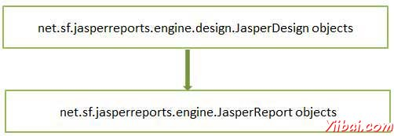
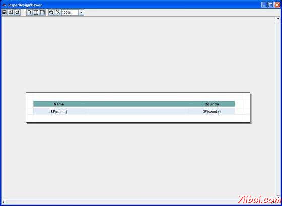

# JasperReport编译报表设计 - JasperReports教程

我们在前面的章节中产生的JasperReport模板（JRXML文件）。这个文件不能直接用于生成报告。它必须被编译成JasperReport的“本地二进制"格式，称为Jasperfile。在编制我们把JasperDesign对象转换成JasperReport的对象：



接口net.sf.jasperreports.engine.design.JRCompiler编译过程中起着核心的一部分。这个接口有根据用于报表表达式语言，它可以只要编译器可以实现在运行时计算它被用Java编写的，Groovy，JavaScript的或任何其他脚本语言的几个实现。我们可以通过以下两种方式编译JRXML文件：

1.  提供编程编译。

2.  编译通过ANT任务。

## JRXML提供编程编译

JasperReports的API提供了一个门面类net.sf.jasperreports.engine.JasperCompileManager用于编译JasperReport。这个类包含几个公共静态方法编制的报告模板。模板的源可以从文件，输入流，内存中的对象。

该jrxml文件（jasper_report_template.jrxml）的内容如下。它被保存在目录 **C: oolsjasperreports-5.0.1 est:**

```
<?xml version="1.0" encoding="UTF-8"?>
<!DOCTYPE jasperReport PUBLIC "//JasperReports//DTD Report Design//EN"
"http://jasperreports.sourceforge.net/dtds/jasperreport.dtd">
<jasperReport xmlns="http://jasperreports.sourceforge.net/jasperreports"
xmlns:xsi="http://www.w3.org/2001/XMLSchema-instance"
xsi:schemaLocation="http://jasperreports.sourceforge.net/jasperreports
http://jasperreports.sourceforge.net/xsd/jasperreport.xsd"
name="jasper_report_template" language="groovy" pageWidth="595"
pageHeight="842" columnWidth="555" leftMargin="20" rightMargin="20"
topMargin="20" bottomMargin="20">

    <queryString>
    <![CDATA[]]>
    </queryString>
    <field name="country" class="java.lang.String">
        <fieldDescription><![CDATA[country]]></fieldDescription>
    </field>
    <field name="name" class="java.lang.String">
        <fieldDescription><![CDATA[name]]></fieldDescription>
    </field>
    <columnHeader>
     <band height="23">
    <staticText>
        <reportElement mode="Opaque" x="0" y="3" width="535"
         height="15" backcolor="#70A9A9" />
        <box>
            <bottomPen lineWidth="1.0" lineColor="#CCCCCC" />
        </box>
        <textElement />
        <text><![CDATA[]]> </text>
    </staticText>
    <staticText>
        <reportElement x="414" y="3" width="121" height="15" />
        <textElement textAlignment="Center"
            verticalAlignment="Middle">
        <font isBold="true" />
        </textElement>
        <text><![CDATA[Country]]></text>
    </staticText>
    <staticText>
        <reportElement x="0" y="3" width="136" height="15" />
        <textElement textAlignment="Center"
            verticalAlignment="Middle">
        <font isBold="true" />
        </textElement>
        <text><![CDATA[Name]]></text>
    </staticText>
     </band>
    </columnHeader>
    <detail>
        <band height="16">
     <staticText>
         <reportElement mode="Opaque" x="0" y="0" width="535"
         height="14" backcolor="#E5ECF9" />
         <box>
                <bottomPen lineWidth="0.25" lineColor="#CCCCCC" />
         </box>
         <textElement />
         <text><![CDATA[]]> </text>
     </staticText>
     <textField>
         <reportElement x="414" y="0" width="121" height="15" />
         <textElement textAlignment="Center"
             verticalAlignment="Middle">
         <font size="9" />
         </textElement>
         <textFieldExpression class="java.lang.String">
             <![CDATA[$F{country}]]>
        </textFieldExpression>
     </textField>
     <textField>
         <reportElement x="0" y="0" width="136" height="15" />
         <textElement textAlignment="Center"
             verticalAlignment="Middle" />
             <textFieldExpression class="java.lang.String">
            <![CDATA[$F{name}]]>
             </textFieldExpression>
     </textField>
        </band>
    </detail>
</jasperReport>
```

下面的代码演示了上述jasper_report_template.jrxml文件的编译。

```
package com.yiibai;

import net.sf.jasperreports.engine.JRException;
import net.sf.jasperreports.engine.JasperCompileManager;

public class JasperReportCompile {

   public static void main(String[] args) {
      String sourceFileName = "C://tools/jasperreports-5.0.1/test" +
      "/jasper_report_template.jrxml";

      System.out.println("Compiling Report Design ...");
      try {
         /**
          * Compile the report to a file name same as
          * the JRXML file name
          */
         JasperCompileManager.compileReportToFile(sourceFileName);
      } catch (JRException e) {
         e.printStackTrace();
      }
      System.out.println("Done compiling!!! ...");
   }
}
```

### 模板编译

至于下一步，让我们保存上面的文件内容：**C: oolsjasperreports-5.0.1 estsrccomyiibaiJasperReportCompile.java** 并导入baseBuild.xml在为下面的build.xml文件。baseBuild.xml已经编译和运行的目标：

```
<?xml version="1.0" encoding="UTF-8"?>
<project name="JasperReportTest" default="run" basedir=".">

   <import file="baseBuild.xml"/>

</project>
```

接下来，让我们打开命令行窗口并转到build.xml文件放置的目录。最后执行的命令**ant -Dmain-class=com.yiibai.JasperReportCompile **如下:

```
C:    oolsjasperreports-5.0.1    est>ant -Dmain-class=com.yiibai.JasperReportCompile
Buildfile: C:    oolsjasperreports-5.0.1    estuild.xml
compile:
    [javac] C:    oolsjasperreports-5.0.1    estaseBuild.xml:27:
    warning: 'includeantruntime' was not set, defaulting to
    build.sysclasspath=last;set to false for repeatable builds
    [javac] Compiling 1 source file to C:    oolsjasperreports-5.0.1    estclasses

run:
     [echo] Runnin class : com.yiibai.JasperReportCompile
     [java] Compiling Report Design ...
     [java] log4j:WARN No appenders could be found for logger
     (net.sf.jasperreports.engine.xml.JRXmlDigesterFactory).
     [java] log4j:WARN Please initialize the log4j system properly.
     [java] Done compiling!!! ...

BUILD SUCCESSFUL
Total time: 8 seconds

```

正如上文编译的结果，会看到jasper_report_template.jasper得到了语言生成的模板文件在C: oolsjasperreports-5.0.1 est 目录。

### 预览编译报表模板

net.sf.jasperreports.view.JasperDesignViewer 正如在前面的章节中讨论可用来预览编译报告模板以及JRXML模板。

为了进一步推动，让我们添加一个新的目标viewDesign上述build.xml文件，这将让我们先看盾编译报告。下面是修改后build.xml：
导入文件 - baseBuild.xml做好环境设置，并应放置在同一目录中的build.xml。

```
<?xml version="1.0" encoding="UTF-8"?>
<project name="JasperReportTest" default="viewDesign" basedir=".">

   <import file="baseBuild.xml" />
   <target name="viewDesign" description="Design viewer is launched
            to preview the compiled report design.">
      <java classname="net.sf.jasperreports.view.JasperDesignViewer"
               fork="true">
      <arg value="-F${file.name}.jasper" />
      <classpath refid="classpath" />
      </java>
   </target>

</project>
```

让我们执行命令：ant（viewDesign是默认的目标），在命令提示符下。 JasperDesignViewer窗口打开显示Jasper文件如下：



## 通过ANT任务编译

报告模板编译更像是比一个运行时的工作设计时的工作，JasperReport库具有一个自定义ANT任务。因为当在运行时创建JRXML文件某些情况下，不能使用此ANT任务。自定义ANT任务被称为JRC和由类实现：net.sf.jasperreports.ant.JRAntCompileTask。其语法和行为是非常相似的内置&lt;javac&gt; ANT任务。

### 模板编译

让我们添加新的目标编译报表设计，以我们现有的build.xml。这里使用与文件集的嵌套&lt;src&gt;标签中指定的源文件夹。嵌套的源标签允许编译器，可通过许多不同的地点分散，在一个单一的根报表源文件夹不进行分组报告模板。下面是修改后的build.xml：

```
<?xml version="1.0" encoding="UTF-8"?>
<project name="JasperReportTest" default="compilereportdesing" basedir=".">
   <import file="baseBuild.xml" />
   <target name="viewDesign" description="Design viewer is launched
         to preview the compiled report design.">
      <java classname="net.sf.jasperreports.view.JasperDesignViewer"
            fork="true">
      <arg value="-F${file.name}.jasper" />
      <classpath refid="classpath" />
      </java>
   </target>

   <target name="compilereportdesing" description="Compiles the JXML
         file and produces the .jasper file.">
      <taskdef name="jrc"
         classname="net.sf.jasperreports.ant.JRAntCompileTask">
         <classpath refid="classpath" />
      </taskdef>
      <jrc destdir=".">
         <src>
            <fileset dir=".">
            <include name="*.jrxml" />
            </fileset>
         </src>
         <classpath refid="classpath" />
      </jrc>
   </target>

</project>
```

接下来，让我们打开命令提示符并转到build.xml文件放置的目录。执行命令ant（compilereportdesing是默认的目标）输出为如下：

```
C:    oolsjasperreports-5.0.1    est>ant
Buildfile: C:    oolsjasperreports-5.0.1    estuild.xml

compilereportdesing:
      [jrc] Compiling 1 report design files.
      [jrc] log4j:WARN No appenders could be found for logger
      (net.sf.jasperreports.engine.xml.JRXmlDigesterFactory).
      [jrc] log4j:WARN Please initialize the log4j system properly.
      [jrc] log4j:WARN See
      http://logging.apache.org/log4j/1.2/faq.htmll#noconfig
      for more info.
      [jrc] File :
      C:    oolsjasperreports-5.0.1    estjasper_report_template.jrxml ... OK.

BUILD SUCCESSFUL
Total time: 5 seconds 
```

文件jasper_report_template.jasper是在文件系统（在我们的例子中为 C: oolsjasperreports-5.0.1 est目录）产生的。这个文件是相同的通过调用net.sf.jasperreports.engine.JasperCompileManager.compileReportToFile()程序生成一个。我们可以预览这个 jasper文件，执行ant viewDesign。

