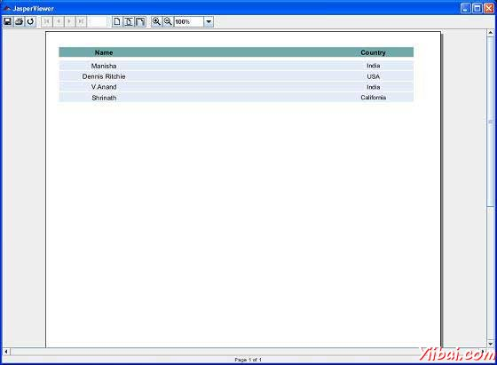

# JasperReport查看和打印报告 - JasperReports教程

报表填充过程JasperPrint对象的输出可以使用内置的浏览器组件来查看，打印或导出到更多的流行的文件格式，如PDF，HTML，RTF，XLS，ODT，CSV或XML。Jasper文件查看和打印将包括在本章中。导出将包括在下一章[导出报表](http://www.yiibai.com/jasper_reports/jasper_exporting_reports.html).

## 查看报表

JasperReport提供了一个内置的浏览器观看原始格式生成的报表。这是一个基于Swing的组件和其他Java应用程序可以无需将文档导出为其他格式，以便查看或打印此集成组件。net.sf.jasperreports.view.JRViewer类表示这个可视组件。这个类也可以被定制为每个应用程序的需要，通过继承它。

JasperReports也有用来查看报表的可视化组件Swing应用程序。此应用程序可以帮助在相同的格式查看报表为*.jrprint就产生了。这个Swing应用程序是在类net.sf.jasperreports.view.JasperViewer实现。要使用此功能，我们可以把这个包成一个Ant目标，以查看报表。

### 查看生成的报告

下面的示例演示如何查看使用JasperViewer类的报表。

让我们来写一个报告模板。在JRXML文件(C: oolsjasperreports-5.0.1 estjasper_report_template.jrxml)的内容如下：

```
<?xml version="1.0" encoding="UTF-8"?>
<!DOCTYPE jasperReport PUBLIC "//JasperReports//DTD Report Design//EN"
"http://jasperreports.sourceforge.net/dtds/jasperreport.dtd">
<jasperReport xmlns="http://jasperreports.sourceforge.net/jasperreports"
xmlns:xsi="http://www.w3.org/2001/XMLSchema-instance"
xsi:schemaLocation="http://jasperreports.sourceforge.net/jasperreports
http://jasperreports.sourceforge.net/xsd/jasperreport.xsd"
name="jasper_report_template" language="groovy" pageWidth="595"
pageHeight="842" columnWidth="555" leftMargin="20" rightMargin="20"
topMargin="20" bottomMargin="20">

    <queryString>
    <![CDATA[]]>
    </queryString>
    <field name="country" class="java.lang.String">
        <fieldDescription><![CDATA[country]]></fieldDescription>
    </field>
    <field name="name" class="java.lang.String">
        <fieldDescription><![CDATA[name]]></fieldDescription>
    </field>
    <columnHeader>
     <band height="23">
    <staticText>
        <reportElement mode="Opaque" x="0" y="3" width="535"
         height="15" backcolor="#70A9A9" />
        <box>
            <bottomPen lineWidth="1.0" lineColor="#CCCCCC" />
        </box>
        <textElement />
        <text><![CDATA[]]> </text>
    </staticText>
    <staticText>
        <reportElement x="414" y="3" width="121" height="15" />
        <textElement textAlignment="Center"
            verticalAlignment="Middle">
        <font isBold="true" />
        </textElement>
        <text><![CDATA[Country]]></text>
    </staticText>
    <staticText>
        <reportElement x="0" y="3" width="136" height="15" />
        <textElement textAlignment="Center"
            verticalAlignment="Middle">
        <font isBold="true" />
        </textElement>
        <text><![CDATA[Name]]></text>
    </staticText>
     </band>
    </columnHeader>
    <detail>
        <band height="16">
     <staticText>
         <reportElement mode="Opaque" x="0" y="0" width="535"
         height="14" backcolor="#E5ECF9" />
         <box>
                <bottomPen lineWidth="0.25" lineColor="#CCCCCC" />
         </box>
         <textElement />
         <text><![CDATA[]]> </text>
     </staticText>
     <textField>
         <reportElement x="414" y="0" width="121" height="15" />
         <textElement textAlignment="Center"
             verticalAlignment="Middle">
         <font size="9" />
         </textElement>
         <textFieldExpression class="java.lang.String">
             <![CDATA[$F{country}]]>
        </textFieldExpression>
     </textField>
     <textField>
         <reportElement x="0" y="0" width="136" height="15" />
         <textElement textAlignment="Center"
             verticalAlignment="Middle" />
             <textFieldExpression class="java.lang.String">
            <![CDATA[$F{name}]]>
             </textFieldExpression>
     </textField>
        </band>
    </detail>
</jasperReport>
```

接下来，让我们通过Java数据对象（Java bean）的集合，到Jasper报表引擎，填补了这一编译报告。

写一个POJO DataBean.java表示数据对象（的Java bean）。这个类定义了两个字符串对象name和country。把它保存到目录 **C: oolsjasperreports-5.0.1 estsrccomyiibai**.

```
package com.yiibai;

public class DataBean {
   private String name;
   private String country;

   public String getName() {
      return name;
   }

   public void setName(String name) {
      this.name = name;
   }

   public String getCountry() {
      return country;
   }

   public void setCountry(String country) {
      this.country = country;
   }
}
```

编写一个类DataBeanList.java具有业务逻辑生成java bean对象的集合。这是进一步传递到Jasper 报表引擎，生成报告。在这里，我们添加在列表中的4个DataBean进行对象。把它保存到目录**C: oolsjasperreports-5.0.1 estsrccomyiibai**.

```
package com.yiibai;

import java.util.ArrayList;

public class DataBeanList {
   public ArrayList<DataBean> getDataBeanList() {
      ArrayList<DataBean> dataBeanList = new ArrayList<DataBean>();

      dataBeanList.add(produce("Manisha", "India"));
      dataBeanList.add(produce("Dennis Ritchie", "USA"));
      dataBeanList.add(produce("V.Anand", "India"));
      dataBeanList.add(produce("Shrinath", "California"));

      return dataBeanList;
   }

   /**
    * This method returns a DataBean object,
    * with name and country set in it.
    */
   private DataBean produce(String name, String country) {
      DataBean dataBean = new DataBean();
      dataBean.setName(name);
      dataBean.setCountry(country);
      return dataBean;
   }
}
```

写一个主类文件JasperReportFill.java，它从类（DataBeanList）得到的java bean的集合，并将其传递到Jasper报表引擎，填补了报告模板。把它保存到目录 C: oolsjasperreports-5.0.1 estsrccomyiibai.

```
package com.yiibai;

import java.util.ArrayList;
import java.util.HashMap;
import java.util.Map;

import net.sf.jasperreports.engine.JRException;
import net.sf.jasperreports.engine.JasperFillManager;
import net.sf.jasperreports.engine.data.JRBeanCollectionDataSource;

public class JasperReportFill {
   @SuppressWarnings("unchecked")
   public static void main(String[] args) {
      String sourceFileName =
         "c://tools/jasperreports-5.0.1/test/jasper_report_template.jasper";
      DataBeanList DataBeanList = new DataBeanList();
      ArrayList<DataBean> dataList = DataBeanList.getDataBeanList();

      JRBeanCollectionDataSource beanColDataSource =
      new JRBeanCollectionDataSource(dataList);

      Map parameters = new HashMap();
      try {
         JasperFillManager.fillReportToFile(
         sourceFileName,
         parameters,
         beanColDataSource);
      } catch (JRException e) {
         e.printStackTrace();
      }
   }
}
```

让我们来写一个目标viewFillReport的build.xml文件。 build.xml文件如下所示：

&gt; 导入文件 - baseBuild.xml环境设置，并应放置在同一目录中的build.xml。

```
<?xml version="1.0" encoding="UTF-8"?>
<project name="JasperReportTest" default="viewFillReport" basedir=".">
   <import file="baseBuild.xml"/>

   <target name="viewFillReport" depends="compile,compilereportdesing,run"
      description="Launches the report viewer
      to preview the report stored in the .JRprint file.">
      <java classname="net.sf.jasperreports.view.JasperViewer" fork="true">
         <arg value="-F${file.name}.JRprint" />
         <classpath refid="classpath" />
      </java>
   </target>
   <target name="compilereportdesing"
      description="Compiles the JXML file and
      produces the .jasper file.">
      <taskdef name="jrc"
      classname="net.sf.jasperreports.ant.JRAntCompileTask">
         <classpath refid="classpath" />
      </taskdef>
      <jrc destdir=".">
         <src>
         <fileset dir=".">
            <include name="*.jrxml" />
         </fileset>
         </src>
         <classpath refid="classpath" />
      </jrc>
   </target>
</project>
```

接下来，让我们打开命令行窗口并转到build.xml文件放置的目录。最后执行的命令 **ant -Dmain-class=com.yiibai.JasperReportFill**（viewFillReport是默认的目标）。因此，我们看到一个JasperViewer窗口，如下面的屏幕：



## 打印报表

我们可以使用net.sf.jasperreports.engine.JasperPrintManager类打印的JasperReports类库生成的文件（在他们的专有格式i.eJasperPrint对象）。这是依赖于Java2 API打印一个假象类。我们还可以打印文档，一旦JasperReport的文档导出为其他格式，如HTML或PDF。

### 打印生成的报告

下面的代码演示报表的打印。让我们更新现有的类JasperReportFill。我们将使用JasperPrintManager.printReport()方法。此方法需要源文件名.jrprint（这里我们通过我们在上一步生成的使用方法JasperFillManager.fillReportToFile()）作为第一个参数。第二个参数是布尔值，用于显示标准打印对话框（我们将其设置为true这里）。

```
package com.yiibai;

import java.util.ArrayList;
import java.util.HashMap;
import java.util.Map;

import net.sf.jasperreports.engine.JRException;
import net.sf.jasperreports.engine.JasperFillManager;
import net.sf.jasperreports.engine.JasperPrintManager;
import net.sf.jasperreports.engine.data.JRBeanCollectionDataSource;

public class JasperReportFill {
   @SuppressWarnings("unchecked")
   public static void main(String[] args) {
      String sourceFileName = "c://tools/jasperreports-5.0.1/" +
              "test/jasper_report_template.jasper";
      String printFileName = null;
      DataBeanList DataBeanList = new DataBeanList();
      ArrayList <databean>dataList = DataBeanList.getDataBeanList();

      JRBeanCollectionDataSource beanColDataSource =
      new JRBeanCollectionDataSource(dataList);

      Map parameters = new HashMap();
      try {
          printFileName = JasperFillManager.fillReportToFile(
         sourceFileName,
         parameters,
         beanColDataSource);
         if(printFileName != null){
           JasperPrintManager.printReport(
               printFileName, true);
      }
      } catch (JRException e) {
         e.printStackTrace();
      }
   }
}</databean>
```

现在，让我们将此文件保存到目录C: oolsjasperreports-5.0.1 estsrccomyiibai. 我们将使用ANT编译并执行此文件.build.xml文件的内容如下：

```
<?xml version="1.0" encoding="UTF-8"?>
<project name="JasperReportTest" default="executereport" basedir=".">
   <import file="baseBuild.xml"/>

   <target name="executereport"
   depends="compile,compilereportdesing,run">
        <echo message="Im here"/>
   </target>
    <target name="compilereportdesing"
         description="Compiles the JXML file and
         produces the .jasper file.">
         <taskdef name="jrc"
         classname="net.sf.jasperreports.ant.JRAntCompileTask">
            <classpath refid="classpath" />
         </taskdef>
         <jrc destdir=".">
            <src>
            <fileset dir=".">
               <include name="*.jrxml" />
            </fileset>
            </src>
            <classpath refid="classpath" />
         </jrc>
   </target>
</project>
```

接下来，让我们打开命令提示符并转到build.xml文件放置的目录。最后，执行命令 **ant -Dmain-class=com.yiibai.JasperReportPrint**. 因此，会出现一个打印对话框。单击确定以打印文档。

