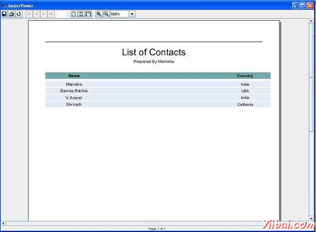

# JasperReport报表参数 - JasperReports教程

填充一个报表的主要输入是：报表模板，参数和数据源。本章将介绍这些参数，并在接下来的章节中，我们将介绍数据源。

参数是在报表填充操作传递给报表引擎的对象引用。参数传递有用的数据到报表引擎，它可以不通过数据源来传递的数据是有用的。如作者姓名，报告等的标题数据，可以通过参数传递。 Jasper报表模板或JRXML模板可以包含零个或多个参数的元素。

## 参数声明

参数声明很简单，如下所示：

```
<parameter name="exampleParameter" class="java.lang.String" />
```

### name属性

parameter&gt;元素的name属性是强制性的。它通过名称引用的参数在报表表达式。参数名应该是一个单词。它不应该包含任何特殊字符，如句号或逗号。

### class属性

class属性也是强制性的，它指定了参数值的类名。它的默认值是java.lang.String。这是可以改变的，以在运行时可用任何类。不论报表参数的类型，引擎采用构造于$P{}标记是用来报表表达，从而使手工投射不必要。

## 内置参数

以下是预定义的报表参数，准备在表达式中使用：

| Parameter Name | 描述 |
| --- | --- |
| REPORT_PARAMETERS_MAP | 包含所有用户定义和内置参数映射 |
| REPORT_CONNECTION | 这指向用于JDBC数据源的用户提供java.sql.Connection中 |
| REPORT_DATA_SOURCE | 这是JRDataSource代表任一用户提供的实例中的内置的数据源类型或用户定义 |
| REPORT_MAX_COUNT | 这是一个java.lang.Integer的值，从而允许用户从数据源限制记录。 |
| REPORT_SCRIPTLET | 这指向net.sf.jasperreports.engine.JRAbstractScriptlet和包含报表的scriptlet，由用户提供的一个实例 |
| REPORT_LOCALE | 这是一个java.util.Locale的实例，包含资源包所需的语言环境 |
| REPORT_RESOURCE_BUNDLE | 这指向java.util.ResourceBundle对象和包含本地化的消息 |
| REPORT_TIME_ZONE | 这是一个java.util.TimeZone的实例，用于日期格式 |
| REPORT_VIRTUALIZER | 这是net.sf.jasperreports.engine.JRVirtualizerobject一个实例，以及用于网页的虚拟化（优化内存消耗） |
| REPORT_CLASS_LOADER | 这是在报告充填过程中使用的加载，如图像，字体和子报表模板资源java.lang.ClassLoader的实例 |
| IS_IGNORE_PAGINATION | 如果设置为java.lang.Boolean.TRUE报告将在一个很长的网页和分页符来产生不会发生 |

## 例子

让我们通过ReportTitle和 Author报表（由JasperReportFill.java生成）。经修订的文件C: oolsjasperreports-5.0.1 estsrccomyiibaiJasperReportFill.java 如下：

```
package com.yiibai;

import java.util.ArrayList;
import java.util.HashMap;
import java.util.Map;

import net.sf.jasperreports.engine.JRException;
import net.sf.jasperreports.engine.JasperFillManager;
import net.sf.jasperreports.engine.data.JRBeanCollectionDataSource;

public class JasperReportFill {
   @SuppressWarnings("unchecked")
   public static void main(String[] args) {
      String sourceFileName =
      "C://tools/jasperreports-5.0.1/test/jasper_report_template.jasper";

      DataBeanList DataBeanList = new DataBeanList();
      ArrayList<DataBean> dataList = DataBeanList.getDataBeanList();

      JRBeanCollectionDataSource beanColDataSource =
      new JRBeanCollectionDataSource(dataList);

      Map parameters = new HashMap();
      /**
       * Passing ReportTitle and Author as parameters
       */
      parameters.put("ReportTitle", "List of Contacts");
      parameters.put("Author", "Prepared By Manisha");

      try {
         JasperFillManager.fillReportToFile(
         sourceFileName, parameters, beanColDataSource);
      } catch (JRException e) {
         e.printStackTrace();
      }
   }
}
```

POJO文件的内容 C: oolsjasperreports-5.0.1 estsrccomyiibaiDataBean.java 如下所示：

```
package com.yiibai;

public class DataBean {
   private String name;
   private String country;

   public String getName() {
      return name;
   }

   public void setName(String name) {
      this.name = name;
   }

   public String getCountry() {
      return country;
   }

   public void setCountry(String country) {
      this.country = country;
   }
}
```

文件 **C: oolsjasperreports-5.0.1 estsrccomyiibaiDataBeanList.java** 的内容如下：

```
package com.yiibai;

import java.util.ArrayList;

public class DataBeanList {
   public ArrayList<DataBean> getDataBeanList() {
      ArrayList<DataBean> dataBeanList = new ArrayList<DataBean>();

      dataBeanList.add(produce("Manisha", "India"));
      dataBeanList.add(produce("Dennis Ritchie", "USA"));
      dataBeanList.add(produce("V.Anand", "India"));
      dataBeanList.add(produce("Shrinath", "California"));

      return dataBeanList;
   }

   /**
    * This method returns a DataBean object,
    * with name and country set in it.
    */
   private DataBean produce(String name, String country) {
      DataBean dataBean = new DataBean();
      dataBean.setName(name);
      dataBean.setCountry(country);
      return dataBean;
   }
}
```

让我们添加参数&lt;ReportTitle&gt;和&lt;AUTHOR&gt;我们现有的报告模板（章报表设计）。报告标题和作者将在报表的开头显示。修订后的报告模板（jasper_report_template.jrxml）如下。将其保存到 C: oolsjasperreports-5.0.1 est 目录:

```
<?xml version="1.0"?>
<!DOCTYPE jasperReport PUBLIC
"//JasperReports//DTD Report Design//EN"
"http://jasperreports.sourceforge.net/dtds/jasperreport.dtd">

<jasperReport xmlns="http://jasperreports.sourceforge.net/jasperreports"
xmlns:xsi="http://www.w3.org/2001/XMLSchema-instance"
xsi:schemaLocation="http://jasperreports.sourceforge.net/jasperreports
http://jasperreports.sourceforge.net/xsd/jasperreport.xsd"
name="jasper_report_template" pageWidth="595"
pageHeight="842" columnWidth="515"
leftMargin="40" rightMargin="40" topMargin="50" bottomMargin="50"> **<parameter name="ReportTitle" class="java.lang.String"/>
<parameter name="Author" class="java.lang.String"/>**

   <queryString>
    <![CDATA[]]>
   </queryString>

   <field name="country" class="java.lang.String">
      <fieldDescription><![CDATA[country]]></fieldDescription>
   </field>

   <field name="name" class="java.lang.String">
      <fieldDescription><![CDATA[name]]></fieldDescription>
   </field>

   <title>
      <band height="70">
         <line>
            <reportElement x="0" y="0" width="515"
            height="1"/>
         </line>
         <textField isBlankWhenNull="true" bookmarkLevel="1">
            <reportElement x="0" y="10" width="515"
            height="30"/>
            <textElement textAlignment="Center">
            <font size="22"/>
            </textElement>
            <textFieldExpression class="java.lang.String">
            <![CDATA[$P{ReportTitle}]]>
            </textFieldExpression>
            <anchorNameExpression><![CDATA["Title"]]>
            </anchorNameExpression>
            </textField>
            <textField isBlankWhenNull="true">
            <reportElement  x="0" y="40" width="515" height="20"/>
            <textElement textAlignment="Center">
                 <font size="10"/>
            </textElement>
            <textFieldExpression class="java.lang.String">
            <![CDATA[$P{Author}]]>
            </textFieldExpression>
            </textField>
      </band>
   </title>

   <columnHeader>
      <band height="23">
         <staticText>
            <reportElement mode="Opaque" x="0" y="3"
            width="535"    height="15"
            backcolor="#70A9A9" />
            <box>
            <bottomPen lineWidth="1.0"
            lineColor="#CCCCCC" />
            </box>
            <textElement />
            <text><![CDATA[]]>
            </text>
         </staticText>
         <staticText>
            <reportElement x="414" y="3" width="121"
            height="15" />
            <textElement textAlignment="Center"
            verticalAlignment="Middle">
                   <font isBold="true" />
            </textElement>
            <text><![CDATA[Country]]></text>
         </staticText>
         <staticText>
            <reportElement x="0" y="3" width="136"
            height="15" />
            <textElement textAlignment="Center"
            verticalAlignment="Middle">
               <font isBold="true" />
            </textElement>
            <text><![CDATA[Name]]></text>
         </staticText>
      </band>
   </columnHeader>

   <detail>
      <band height="16">
         <staticText>
            <reportElement mode="Opaque" x="0" y="0"
            width="535"    height="14"
            backcolor="#E5ECF9" />
            <box>
               <bottomPen lineWidth="0.25"
               lineColor="#CCCCCC" />
            </box>
            <textElement />
            <text><![CDATA[]]>
            </text>
         </staticText>
         <textField>
            <reportElement x="414" y="0" width="121"
            height="15" />
            <textElement textAlignment="Center"
            verticalAlignment="Middle">
               <font size="9" />
            </textElement>
            <textFieldExpression class="java.lang.String">
            <![CDATA[$F{country}]]>
            </textFieldExpression>
         </textField>
         <textField>
            <reportElement x="0" y="0" width="136"
            height="15" />
            <textElement textAlignment="Center"
            verticalAlignment="Middle" />
            <textFieldExpression class="java.lang.String">
            <![CDATA[$F{name}]]>
            </textFieldExpression>
         </textField>
      </band>
   </detail>
</jasperReport>
```

## 报表生成

编译和执行使用常规Ant构建过程上面的文件。 build.xml文件中的内容（根据目录保存C: oolsjasperreports-5.0.1 est）情况如下。

&gt; 导入文件 - baseBuild.xml可以从环境设置章节中了解，并应放置在同一目录中的build.xml。

```
<?xml version="1.0" encoding="UTF-8"?>
<project name="JasperReportTest" default="viewFillReport" basedir=".">
   <import file="baseBuild.xml" />
   <target name="viewFillReport"
      depends="compile,compilereportdesing,run"
      description="Launches the report viewer to preview
      the report stored in the .JRprint file.">
      <java classname="net.sf.jasperreports.view.JasperViewer"
      fork="true">
         <arg value="-F${file.name}.JRprint" />
         <classpath refid="classpath" />
      </java>
   </target>
   <target name="compilereportdesing"
      description="Compiles the JXML file and
      produces the .jasper file.">
      <taskdef name="jrc"
      classname="net.sf.jasperreports.ant.JRAntCompileTask">
         <classpath refid="classpath" />
      </taskdef>
      <jrc destdir=".">
         <src>
         <fileset dir=".">
            <include name="*.jrxml" />
         </fileset>
         </src>
         <classpath refid="classpath" />
      </jrc>
   </target>
</project>
```

接下来，让我们打开命令行窗口并转到build.xml文件放置的目录。最后执行的命令 **ant -Dmain-class=com.yiibai.JasperReportFill** （viewFullReport是默认的目标），如下所示：

```
C:    oolsjasperreports-5.0.1    est>ant -Dmain-class=com.yiibai.JasperReportFill
Buildfile: C:    oolsjasperreports-5.0.1    estuild.xml

clean-sample:
   [delete] Deleting directory C:    oolsjasperreports-5.0.1    estclasses
   [delete] Deleting: C:    oolsjasperreports-5.0.1    estjasper_report_template.jasper
   [delete] Deleting: C:    oolsjasperreports-5.0.1    estjasper_report_template.jrprint

compile:
    [mkdir] Created dir: C:    oolsjasperreports-5.0.1    estclasses
    [javac] C:    oolsjasperreports-5.0.1    estaseBuild.xml:28: warning:
    'includeantruntime' was not set, defaulting to build.sysclasspath=last;
    set to false for repeatable builds
    [javac] Compiling 7 source files to C:    oolsjasperreports-5.0.1    estclasses

compilereportdesing:
      [jrc] Compiling 1 report design files.
      [jrc] log4j:WARN No appenders could be found for logger
      (net.sf.jasperreports.engine.xml.JRXmlDigesterFactory).
      [jrc] log4j:WARN Please initialize the log4j system properly.
      [jrc] log4j:WARN See http://logging.apache.org/log4j/1.2/faq.htmll#noconfig
      for more info.
      [jrc] File : C:    oolsjasperreports-5.0.1    estjasper_report_template.jrxml ... OK.

run:
     [echo] Runnin class : com.yiibai.JasperReportFill
     [java] log4j:WARN No appenders could be found for logger
     (net.sf.jasperreports.extensions.ExtensionsEnvironment).
     [java] log4j:WARN Please initialize the log4j system properly.

viewFillReport:
     [java] log4j:WARN No appenders could be found for logger
     (net.sf.jasperreports.extensions.ExtensionsEnvironment).
     [java] log4j:WARN Please initialize the log4j system properly.

BUILD SUCCESSFUL
Total time: 18 seconds

```

正如上文编译的结果，JasperViewer窗口打开如下面的屏幕：



在这里，我们看到的是，报表头 "List Of Contacts"，并着有"Prepared By Manisha" 显示在报表的开头。

