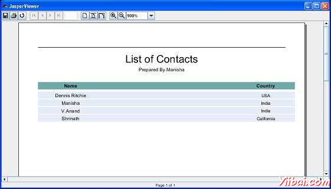

# JasperReports报表字段 - JasperReports教程

报表字段是代表数据源和报表模板之间的数据映射元素。字段可以在报告中的表达式进行组合，以获得所需的输出。报表模板可以包含零个或更多的&lt;field&gt;元素。当声明报表字段，数据源应提供相应的数据到所有在报告模板中定义的字段。

## 字段声明

字段声明做如下：

```
<field name="FieldName" class="java.lang.String"/>
```

### name属性

&lt;field&gt;元素的name属性是强制性的。它通过名称引用的报表表达的字段。

### class属性

class属性指定的字段值的类名。它的默认值是java.lang.String。这是可以改变的，以在运行时可用任何类。不论一个报表字段的类型，引擎采用铸造于该$ F{}标记用于报表表达式，从而使手工投射不必要。

### 字段描述

&lt;fieldDesciption&gt;元素是可选元素。实现自定义的数据源，例如，当这是非常有用的。我们可以存储一个密钥或一些信息，使用它我们可以在运行时自定义数据源中检索字段的值。通过使用&lt;fieldDesciption&gt;元素而不是字段名，可以检索从数据源中的字段值时容易克服字段命名约定的限制。

下面是一段代码从我们现有的jrxml文件（第二章报告的设计）。在这里我们可以看到name, class 和 fieldDescription 元素的使用。

```
<field name="country" class="java.lang.String">
    <fieldDescription><![CDATA[country]]></fieldDescription>
</field>
<field name="name" class="java.lang.String">
    <fieldDescription><![CDATA[name]]></fieldDescription>
</field>
```

### 排序字段

数据的排序是必要的，数据源实现不支持它（如CSV数据源），JasperReports的支持在内存领域为基础的数据源排序。排序可以使用的报表模板的一个或多个&lt;sortField&gt;元素来完成。

如果指定ATLEAST1排序字段，在报告填充过程中的数据源传递给JRSortableDataSource实例。这反过来从获取数据源中的所有记录，根据指定的字段进行排序的内存中，并替换原来的数据源。

排序字段名称应该是相同的报表字段名称。用于排序的字段应该具有实现java.util.Comparable类型。进行自然顺序排序的所有字段除外java.lang.String类型（对于字符串类型，对应报告的填充区域自动分页使用）。当有多个排序字段指定，排序将使用的字段进行中它们出现在报告模板的顺序排序键。下面的例子demonstartes显示排序功能。

## Sorted Report 例子

sortField&gt;元素添加到我们现有的报告模板（第报表设计）。让我们排序字段country 降序排列。修订后的报告模板（jasper_report_template.jrxml）如下。将其保存到C: oolsjasperreports-5.0.1 est directory:

```
<?xml version="1.0"?>
<!DOCTYPE jasperReport PUBLIC
"//JasperReports//DTD Report Design//EN"
"http://jasperreports.sourceforge.net/dtds/jasperreport.dtd">

<jasperReport xmlns="http://jasperreports.sourceforge.net/jasperreports" xmlns:xsi="http://www.w3.org/2001/XMLSchema-instance" xsi:schemaLocation="http://jasperreports.sourceforge.net/jasperreports http://jasperreports.sourceforge.net/xsd/jasperreport.xsd" name="jasper_report_template" pageWidth="595" pageHeight="842" columnWidth="515" leftMargin="40" rightMargin="40" topMargin="50" bottomMargin="50">
<parameter name="ReportTitle" class="java.lang.String"/>
<parameter name="Author" class="java.lang.String"/>
   <queryString>
    <![CDATA[]]>
   </queryString>
   <field name="country" class="java.lang.String">
      <fieldDescription><![CDATA[country]]></fieldDescription>
   </field>
   <field name="name" class="java.lang.String">
      <fieldDescription><![CDATA[name]]></fieldDescription>
   </field>
  **<sortField name="country" order="Descending"/>
   <sortField name="name"/>**
   <title>
      <band height="70">
         <line>
            <reportElement x="0" y="0" width="515"
            height="1"/>
         </line>
         <textField isBlankWhenNull="true" bookmarkLevel="1">
            <reportElement x="0" y="10" width="515"
            height="30"/>
            <textElement textAlignment="Center">
            <font size="22"/>
            </textElement>
            <textFieldExpression class="java.lang.String">
            <![CDATA[$P{ReportTitle}]]>
            </textFieldExpression>
            <anchorNameExpression><![CDATA["Title"]]>
            </anchorNameExpression>
            </textField>
            <textField isBlankWhenNull="true">
            <reportElement  x="0" y="40" width="515" height="20"/>
            <textElement textAlignment="Center">
                 <font size="10"/>
            </textElement>
            <textFieldExpression class="java.lang.String">
            <![CDATA[$P{Author}]]>
            </textFieldExpression>
            </textField>
      </band>
   </title>
   <columnHeader>
      <band height="23">
         <staticText>
            <reportElement mode="Opaque" x="0" y="3"
            width="535"    height="15"
            backcolor="#70A9A9" />
            <box>
            <bottomPen lineWidth="1.0"
            lineColor="#CCCCCC" />
            </box>
            <textElement />
            <text><![CDATA[]]>
            </text>
         </staticText>
         <staticText>
            <reportElement x="414" y="3" width="121"
            height="15" />
            <textElement textAlignment="Center"
            verticalAlignment="Middle">
                   <font isBold="true" />
            </textElement>
            <text><![CDATA[Country]]></text>
         </staticText>
         <staticText>
            <reportElement x="0" y="3" width="136"
            height="15" />
            <textElement textAlignment="Center"
            verticalAlignment="Middle">
               <font isBold="true" />
            </textElement>
            <text><![CDATA[Name]]></text>
         </staticText>
      </band>
       </columnHeader>
       <detail>
      <band height="16">
         <staticText>
            <reportElement mode="Opaque" x="0" y="0"
            width="535"    height="14"
            backcolor="#E5ECF9" />
            <box>
               <bottomPen lineWidth="0.25"
               lineColor="#CCCCCC" />
            </box>
            <textElement />
            <text><![CDATA[]]>
            </text>
         </staticText>
         <textField>
            <reportElement x="414" y="0" width="121"
            height="15" />
            <textElement textAlignment="Center"
            verticalAlignment="Middle">
               <font size="9" />
            </textElement>
            <textFieldExpression class="java.lang.String">
            <![CDATA[$F{country}]]>
            </textFieldExpression>
         </textField>
         <textField>
            <reportElement x="0" y="0" width="136"
            height="15" />
            <textElement textAlignment="Center"
            verticalAlignment="Middle" />
            <textFieldExpression class="java.lang.String">
            <![CDATA[$F{name}]]>
            </textFieldExpression>
         </textField>
      </band>
   </detail>
</jasperReport>
```

在java代码报告填充保持不变。该文件 C: oolsjasperreports-5.0.1 estsrccomyiibaiJasperReportFill.java 的内容如下：

```
package com.yiibai;

import java.util.ArrayList;
import java.util.HashMap;
import java.util.Map;

import net.sf.jasperreports.engine.JRException;
import net.sf.jasperreports.engine.JasperFillManager;
import net.sf.jasperreports.engine.data.JRBeanCollectionDataSource;

public class JasperReportFill {
   @SuppressWarnings("unchecked")
   public static void main(String[] args) {
      String sourceFileName =
      "C://tools/jasperreports-5.0.1/test/jasper_report_template.jasper";

      DataBeanList DataBeanList = new DataBeanList();
      ArrayList<DataBean> dataList = DataBeanList.getDataBeanList();

      JRBeanCollectionDataSource beanColDataSource =
      new JRBeanCollectionDataSource(dataList);

      Map parameters = new HashMap();
      /**
       * Passing ReportTitle and Author as parameters
       */
      parameters.put("ReportTitle", "List of Contacts");
      parameters.put("Author", "Prepared By Manisha");

      try {
         JasperFillManager.fillReportToFile(
         sourceFileName, parameters, beanColDataSource);
      } catch (JRException e) {
         e.printStackTrace();
      }
   }
}
```

POJO文件**C: oolsjasperreports-5.0.1 estsrccomyiibaiDataBean.java**的内容如下：

```
package com.yiibai;

public class DataBean {
   private String name;
   private String country;

   public String getName() {
      return name;
   }

   public void setName(String name) {
      this.name = name;
   }

   public String getCountry() {
      return country;
   }

   public void setCountry(String country) {
      this.country = country;
   }
}
```

文件 **C: oolsjasperreports-5.0.1 estsrccomyiibaiDataBeanList.java** 的内容如下：

```
package com.yiibai;

import java.util.ArrayList;

public class DataBeanList {
   public ArrayList<DataBean> getDataBeanList() {
      ArrayList<DataBean> dataBeanList = new ArrayList<DataBean>();

      dataBeanList.add(produce("Manisha", "India"));
      dataBeanList.add(produce("Dennis Ritchie", "USA"));
      dataBeanList.add(produce("V.Anand", "India"));
      dataBeanList.add(produce("Shrinath", "California"));

      return dataBeanList;
   }

   /**
    * This method returns a DataBean object,
    * with name and country set in it.
    */
   private DataBean produce(String name, String country) {
      DataBean dataBean = new DataBean();
      dataBean.setName(name);
      dataBean.setCountry(country);
      return dataBean;
   }
}
```

## 报表生成

我们将编译和执行使用我们常规Ant构建过程上面的文件。 build.xml文件（目录下保存的内容 C: oolsjasperreports-5.0.1 est) 如下：

&gt; 导入文件 - baseBuild.xml从环境设置章节中了解，并应放置在同一目录中的build.xml。

```
<?xml version="1.0" encoding="UTF-8"?>
<project name="JasperReportTest" default="viewFillReport" basedir=".">
   <import file="baseBuild.xml" />
   <target name="viewFillReport"
      depends="compile,compilereportdesing,run"
      description="Launches the report viewer to preview
      the report stored in the .JRprint file.">
      <java classname="net.sf.jasperreports.view.JasperViewer"
      fork="true">
         <arg value="-F${file.name}.JRprint" />
         <classpath refid="classpath" />
      </java>
   </target>
   <target name="compilereportdesing"
      description="Compiles the JXML file and
      produces the .jasper file.">
      <taskdef name="jrc"
      classname="net.sf.jasperreports.ant.JRAntCompileTask">
         <classpath refid="classpath" />
      </taskdef>
      <jrc destdir=".">
         <src>
         <fileset dir=".">
            <include name="*.jrxml" />
         </fileset>
         </src>
         <classpath refid="classpath" />
      </jrc>
   </target>
</project>
```

接下来，打开命令行窗口并转到build.xml文件放置的目录。最后执行命令 **ant -Dmain-class=com.yiibai.JasperReportFill** （viewFullReport是默认的目标），如下所示：

```
C:    oolsjasperreports-5.0.1    est>ant -Dmain-class=com.yiibai.JasperReportFill
Buildfile: C:    oolsjasperreports-5.0.1    estuild.xml

clean-sample:
   [delete] Deleting directory C:    oolsjasperreports-5.0.1    estclasses
   [delete] Deleting: C:    oolsjasperreports-5.0.1    estjasper_report_template.jasper
   [delete] Deleting: C:    oolsjasperreports-5.0.1    estjasper_report_template.jrprint

compile:
    [mkdir] Created dir: C:    oolsjasperreports-5.0.1    estclasses
    [javac] C:    oolsjasperreports-5.0.1    estaseBuild.xml:28: warning:
    'includeantruntime' was not set, defaulting to build.sysclasspath=last;
    set to false for repeatable builds
    [javac] Compiling 7 source files to C:    oolsjasperreports-5.0.1    estclasses

compilereportdesing:
      [jrc] Compiling 1 report design files.
      [jrc] log4j:WARN No appenders could be found for logger
      (net.sf.jasperreports.engine.xml.JRXmlDigesterFactory).
      [jrc] log4j:WARN Please initialize the log4j system properly.
      [jrc] log4j:WARN See http://logging.apache.org/log4j/1.2/faq.htmll#noconfig
      for more info.
      [jrc] File : C:    oolsjasperreports-5.0.1    estjasper_report_template.jrxml ... OK.

run:
     [echo] Runnin class : com.yiibai.JasperReportFill
     [java] log4j:WARN No appenders could be found for logger
     (net.sf.jasperreports.extensions.ExtensionsEnvironment).
     [java] log4j:WARN Please initialize the log4j system properly.

viewFillReport:
     [java] log4j:WARN No appenders could be found for logger
     (net.sf.jasperreports.extensions.ExtensionsEnvironment).
     [java] log4j:WARN Please initialize the log4j system properly.

BUILD SUCCESSFUL
Total time: 18 seconds

```

正如上文编译的结果，一个JasperViewer窗口打开如下面的屏幕：



在这里，我们可以看到，country排列的字母顺序降序排列。

