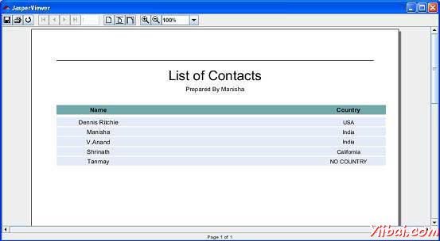

# JasperReports报表表达式 - JasperReports教程

报表表达式是[JasperReports](http://www.yiibai.com/jasper_reports/)使我们能够显示在报表上的数据计算的强大功能。计算出数据不是一个静态数据，并且不受特别的报表参数或数据源字段传递的数据。报表表达式是由组合报表参数，字段和静态数据。默认情况下，Java语言是用于编写报表的表达式。其他脚本语言如Groovy脚本语言，[JavaScript](http://www.yiibai.com/javascription/)或BeanShell脚本，报表表达式是由JasperReports编译器支持。

本章将解释如何报表表达式工作假设他们一直只用Java语言编写的。在JRXML报表模板，那里有定义表达式几个元素，如下所示：

*   &lt;variableExpression&gt;

*   &lt;initialValueExpression&gt;

*   &lt;groupExpression&gt;

*   &lt;printWhenExpression&gt;

*   &lt;imageExpression&gt;

*   &lt;textFieldExpression&gt;

## 声明表达式

基本上，所有的报表表达式是可以参考的报表字段，报表变量和报表参数Java表达式。

### 字段引用表达式

使用在表达式中一个报表字段参考，字段的名称必须放在$F{ 和 }字符序列之间，如下图所示。 

```
<textfieldexpression>
   $F{Name}
</textfieldexpression>
```

下面是一段代码从我们现有的jrxml文件，从[报表设计](http://www.yiibai.com/jasper_reports/jasper_report_designs.html) 章节中了解：

```
<textFieldExpression class="java.lang.String">
    <![CDATA[$F{country}]]>
</textFieldExpression>
```

### 变量引用表达式

引用在表达式中的变量，我们必须把像在下面的例子中的变量名放在$V {和}之间：

```
<textfieldexpression>
   "Total height : " + $V{SumOfHeight} + " ft."
</textfieldexpression>
```

### 参数参考表达

引用在表达式中的一个参数，该参数的名称应放在$ P{和}之间，如下面的例子：

```
<textfieldexpression>
   "ReportTitle : " + $P{Title}
</textfieldexpression>
```

下面是一段代码从现有的jrxml文件，这用来表示参数在表达式中引用。 

```
<textField isBlankWhenNull="true" bookmarkLevel="1">
    <reportElement x="0" y="10" width="515" height="30"/>
    <textElement textAlignment="Center">
        <font size="22"/>
    </textElement>
    <textFieldExpression class="java.lang.String">
       <![CDATA[$P{ReportTitle}]]>
    </textFieldExpression>
    <anchorNameExpression>
       <![CDATA["Title"]]>
    </anchorNameExpression>
</textField>
<textField isBlankWhenNull="true">
    <reportElement  x="0" y="40" width="515" height="20"/>
    <textElement textAlignment="Center">
        <font size="10"/>
    </textElement>
    <textFieldExpression class="java.lang.String">
       <![CDATA[$P{Author}]]>
    </textFieldExpression>
</textField>
```

正如在上面看到，参数，字段和变量引用，其实是真正的Java对象。从参数，字段或在报表模板所作的变量声明知道他们的类，甚至可以在表达式中调用的对象引用的方法。

下面的示例演示如何提取并显示java.lang.String报表字段的第一个字母 "Name":

```
<textFieldExpression>
    $F{Name}.substring(0, 1)
</textFieldExpression>
```

### 资源包参考表达

引用在表达式中的资源，关键要$R{和}之间放像下面的例子：

```
<textfieldexpression>
   $R{report.title}
</textfieldexpression>
```

基于运行时提供的语言环境和report.title键，报表模板相关的资源包加载。因此，报表标题是从资源包中提取字符串值显示。更多关于国际化可以在国际化一章中找到。

## 计算器

计算器是JasperReports，其计算表达式和增量变量或数据集在报表填充时间的实体。在编译过程中，信息被产生并存储在由编译器在编译报表。在报表，填充时间此信息用于构建net.sf.jasperreports.engine.fill.JRCalculator类的一个实例。

Java源文件生成，并通过对飞基于Java的报表编译器编译。这个生成的类是JRCalculator子类，并通过将其编译产生的字节码存储在JasperReport对象的内部。bytcode被加载在报表填充时间和由此产生的类被实例化，以获得所需的表达式求值计算器对象。

## 条件表达式

定义变量表达式时，Jasper报表不支持if-else语句。相反，可以使用三元运算符{cond}？ {语句1}：{语句2}。可以嵌套这个操作符Java表达式里面获得基于多个条件所需的输出。

## 在报表条件表达式的示例

让我们修改现有报告的模板（第报表设计），并增加对country条件表达式。修订后的报表模板（jasper_report_template.jrxml）如下。将其保存到 C: oolsjasperreports-5.0.1 est 目录:

```
<?xml version="1.0"?>
<!DOCTYPE jasperReport PUBLIC
"//JasperReports//DTD Report Design//EN"
"http://jasperreports.sourceforge.net/dtds/jasperreport.dtd">

<jasperReport xmlns="http://jasperreports.sourceforge.net/jasperreports" xmlns:xsi="http://www.w3.org/2001/XMLSchema-instance" xsi:schemaLocation="http://jasperreports.sourceforge.net/jasperreports http://jasperreports.sourceforge.net/xsd/jasperreport.xsd" name="jasper_report_template" pageWidth="595" pageHeight="842" columnWidth="515" leftMargin="40" rightMargin="40" topMargin="50" bottomMargin="50">
<parameter name="ReportTitle" class="java.lang.String"/>
<parameter name="Author" class="java.lang.String"/>
   <queryString>
    <![CDATA[]]>
   </queryString>
   <field name="country" class="java.lang.String">
      <fieldDescription><![CDATA[country]]></fieldDescription>
   </field>
   <field name="name" class="java.lang.String">
      <fieldDescription><![CDATA[name]]></fieldDescription>
   </field>
   <sortField name="country" order="Descending"/>
   <sortField name="name"/>
   <title>
      <band height="70">
         <line>
            <reportElement x="0" y="0" width="515"
            height="1"/>
         </line>
         <textField isBlankWhenNull="true" bookmarkLevel="1">
            <reportElement x="0" y="10" width="515"
            height="30"/>
            <textElement textAlignment="Center">
            <font size="22"/>
            </textElement>
            <textFieldExpression class="java.lang.String">
            <![CDATA[$P{ReportTitle}]]>
            </textFieldExpression>
            <anchorNameExpression><![CDATA["Title"]]>
            </anchorNameExpression>
            </textField>
            <textField isBlankWhenNull="true">
            <reportElement  x="0" y="40" width="515" height="20"/>
            <textElement textAlignment="Center">
                 <font size="10"/>
            </textElement>
            <textFieldExpression class="java.lang.String">
            <![CDATA[$P{Author}]]>
            </textFieldExpression>
            </textField>
      </band>
   </title>
   <columnHeader>
      <band height="23">
         <staticText>
            <reportElement mode="Opaque" x="0" y="3"
            width="535"    height="15"
            backcolor="#70A9A9" />
            <box>
            <bottomPen lineWidth="1.0"
            lineColor="#CCCCCC" />
            </box>
            <textElement />
            <text><![CDATA[]]>
            </text>
         </staticText>
         <staticText>
            <reportElement x="414" y="3" width="121"
            height="15" />
            <textElement textAlignment="Center"
            verticalAlignment="Middle">
                   <font isBold="true" />
            </textElement>
            <text><![CDATA[Country]]></text>
         </staticText>
         <staticText>
            <reportElement x="0" y="3" width="136"
            height="15" />
            <textElement textAlignment="Center"
            verticalAlignment="Middle">
               <font isBold="true" />
            </textElement>
            <text><![CDATA[Name]]></text>
         </staticText>
      </band>
       </columnHeader>
       <detail>
      <band height="16">
         <staticText>
            <reportElement mode="Opaque" x="0" y="0"
            width="535"    height="14"
            backcolor="#E5ECF9" />
            <box>
               <bottomPen lineWidth="0.25"
               lineColor="#CCCCCC" />
            </box>
            <textElement />
            <text><![CDATA[]]>
            </text>
         </staticText>
         <textField>
            <reportElement x="414" y="0" width="121"
            height="15" />
            <textElement textAlignment="Center"
            verticalAlignment="Middle">
               <font size="9" />
            </textElement>
            <textFieldExpression class="java.lang.String"> **<![CDATA[$F{country}.isEmpty() ? "NO COUNTRY" : $F{country}]]>**
            </textFieldExpression>
         </textField>
         <textField>
            <reportElement x="0" y="0" width="136"
            height="15" />
            <textElement textAlignment="Center"
            verticalAlignment="Middle" />
            <textFieldExpression class="java.lang.String">
            <![CDATA[$F{name}]]>
            </textFieldExpression>
         </textField>
      </band>
   </detail>
</jasperReport>
```

Java代码填充报表如下。该文件的内容 **C: oolsjasperreports-5.0.1 estsrccomyiibaiJasperReportFill.java** 如下所述。

```
package com.yiibai;

import java.util.ArrayList;
import java.util.HashMap;
import java.util.Map;

import net.sf.jasperreports.engine.JRException;
import net.sf.jasperreports.engine.JasperFillManager;
import net.sf.jasperreports.engine.data.JRBeanCollectionDataSource;

public class JasperReportFill {
   @SuppressWarnings("unchecked")
   public static void main(String[] args) {
      String sourceFileName =
      "C://tools/jasperreports-5.0.1/test/jasper_report_template.jasper";

      DataBeanList DataBeanList = new DataBeanList();
      ArrayList<DataBean> dataList = DataBeanList.getDataBeanList();

      JRBeanCollectionDataSource beanColDataSource =
      new JRBeanCollectionDataSource(dataList);

      Map parameters = new HashMap();
      /**
       * Passing ReportTitle and Author as parameters
       */
      parameters.put("ReportTitle", "List of Contacts");
      parameters.put("Author", "Prepared By Manisha");

      try {
         JasperFillManager.fillReportToFile(
         sourceFileName, parameters, beanColDataSource);
      } catch (JRException e) {
         e.printStackTrace();
      }
   }
}
```

POJO文件的内容 **C: oolsjasperreports-5.0.1 estsrccomyiibaiDataBean.java **情况如下：

```
package com.yiibai;

public class DataBean {
   private String name;
   private String country;

   public String getName() {
      return name;
   }

   public void setName(String name) {
      this.name = name;
   }

   public String getCountry() {
      return country;
   }

   public void setCountry(String country) {
      this.country = country;
   }
}
```

将增加country字段在Java bean列表为空的新纪录。该文件的内容C: oolsjasperreports-5.0.1 estsrccomyiibaiDataBeanList.java 情况如下：

```
package com.yiibai;

import java.util.ArrayList;

public class DataBeanList {
   public ArrayList<DataBean> getDataBeanList() {
      ArrayList<DataBean> dataBeanList = new ArrayList<DataBean>();

      dataBeanList.add(produce("Manisha", "India"));
      dataBeanList.add(produce("Dennis Ritchie", "USA"));
      dataBeanList.add(produce("V.Anand", "India"));
      dataBeanList.add(produce("Shrinath", "California")); **dataBeanList.add(produce("Tanmay", ""));**
      return dataBeanList;
   }

   /**
    * This method returns a DataBean object,
    * with name and country set in it.
    */
   private DataBean produce(String name, String country) {
      DataBean dataBean = new DataBean();
      dataBean.setName(name);
      dataBean.setCountry(country);
      return dataBean;
   }
}
```

## 报表生成

我们将编译和执行使用我们常规Ant构建过程上面的文件。build.xml文件中的内容（根据目录保存：C: oolsjasperreports-5.0.1 est）情况如下。导入文件 - baseBuild.xml，并应放置在同一目录build.xml。

```
<?xml version="1.0" encoding="UTF-8"?>
<project name="JasperReportTest" default="viewFillReport" basedir=".">
   <import file="baseBuild.xml" />
   <target name="viewFillReport"
      depends="compile,compilereportdesing,run"
      description="Launches the report viewer to preview
      the report stored in the .JRprint file.">
      <java classname="net.sf.jasperreports.view.JasperViewer"
      fork="true">
         <arg value="-F${file.name}.JRprint" />
         <classpath refid="classpath" />
      </java>
   </target>
   <target name="compilereportdesing"
      description="Compiles the JXML file and
      produces the .jasper file.">
      <taskdef name="jrc"
      classname="net.sf.jasperreports.ant.JRAntCompileTask">
         <classpath refid="classpath" />
      </taskdef>
      <jrc destdir=".">
         <src>
         <fileset dir=".">
            <include name="*.jrxml" />
         </fileset>
         </src>
         <classpath refid="classpath" />
      </jrc>
   </target>
</project>
```

接下来，让我们打开命令行窗口并转到build.xml文件放置的目录。最后执行的命令 **ant -Dmain-class=com.yiibai.JasperReportFill** （viewFullReport是默认的目标），如下所示：

```
C:    oolsjasperreports-5.0.1    est>ant -Dmain-class=com.yiibai.JasperReportFill
Buildfile: C:    oolsjasperreports-5.0.1    estuild.xml

clean-sample:
   [delete] Deleting directory C:    oolsjasperreports-5.0.1    estclasses
   [delete] Deleting: C:    oolsjasperreports-5.0.1    estjasper_report_template.jasper
   [delete] Deleting: C:    oolsjasperreports-5.0.1    estjasper_report_template.jrprint

compile:
    [mkdir] Created dir: C:    oolsjasperreports-5.0.1    estclasses
    [javac] C:    oolsjasperreports-5.0.1    estaseBuild.xml:28:
    warning: 'includeantruntime' was not set, defaulting to build.sysclasspath=last;
    set to false for repeatable builds
    [javac] Compiling 3 source files to C:    oolsjasperreports-5.0.1    estclasses

compilereportdesing:
      [jrc] Compiling 1 report design files.
      [jrc] log4j:WARN No appenders could be found for logger
      (net.sf.jasperreports.engine.xml.JRXmlDigesterFactory).
      [jrc] log4j:WARN Please initialize the log4j system properly.
      [jrc] log4j:WARN See
      http://logging.apache.org/log4j/1.2/faq.htmll#noconfig for more info.
      [jrc] File : C:    oolsjasperreports-5.0.1    estjasper_report_template.jrxml ... OK.

run:
     [echo] Runnin class : com.yiibai.JasperReportFill
     [java] log4j:WARN No appenders could be found for logger
     (net.sf.jasperreports.extensions.ExtensionsEnvironment).
     [java] log4j:WARN Please initialize the log4j system properly.

viewFillReport:
     [java] log4j:WARN No appenders could be found for logger
     (net.sf.jasperreports.extensions.ExtensionsEnvironment).
     [java] log4j:WARN Please initialize the log4j system properly.

BUILD SUCCESSFUL
Total time: 5 minutes 5 seconds

C:    oolsjasperreports-5.0.1    est>

```

正如上文编译的结果，JasperViewer窗口打开如下面的屏幕：



在这里，可以看到，因为没有通过该字段country任何数据的最后一条记录，“NO COUNTRY”正在打印。

