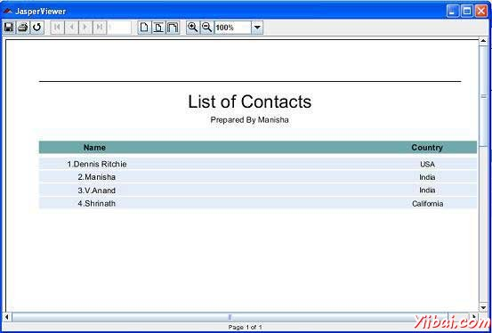

# JasperReports报表变量 - JasperReports教程

报表变量是建立在报表表达式之上的特殊对象。报表变量简化以下任务：

*   报表，其中大量使用在整个报告模板表达式。这些表达式可以通过使用报表变量只能声明一次。

*   计数，求和，平均，最低，最高，方差等：报表变量可以基于像对应的表达式的值执行各种计算

如果变量是在报表设计定义，那么这些可以通过在表达式中的新变量引用。因此，在该变量是在报表设计中声明的顺序是非常重要的。

## 变量声明

变量声明如下：

```
<variable name="CityNumber" class="java.lang.Integer" incrementType="Group"
   incrementGroup="CityGroup" calculation="Count">
   <variableExpression>
       <![CDATA[Boolean.TRUE]]>
   </variableExpression>
</variable>
```

如上面所看到的，&lt;variable&gt;元素包含属性的数量。这些属性总结如下：

### name属性

类似的参数和字段，&lt;/variable&gt;元素的name属性是强制性的。它允许引用由它的声明的名称在报表表达式中的变量。

### class属性

class属性也是强制性的，它指定了变量值的类名。它的默认值是java.lang.String。这是可以改变的，在classpath可用的任何类无论是在报表编译时间和报告充填时间。无论报告值的类型，引擎采用该$V {}标记是用来报告表达，从而不必要手动投射。

### 计算方法

这个属性决定的变量填充报表时要执行什么计算。下面的小节描述所有的&lt;variable&gt;元素的计算属性的可能值。

*   Average: 变量的值是变量表达式的每一个非空值的平均值。有效期仅为数值变量。

*   Count: 该变量的值是变量表达式非空实例的数量。

*   First: 变量的值是变量表达式的第一个实例的值。随后的值将被忽略。

*   Highest: 变量的值是变量表达式的最高值。

*   Lowest: 该变量的值是变量表达式在报表中的最低值。

*   Nothing: 不进行计算的变量。

*   StandardDeviation: 该变量的值是所有非空值匹配报表表达式的标准偏差。有效期仅为数值变量。

*   Sum: 该变量的值是由报表表达式返回所有非空值的总和。

*   System: 该变量的值是一个自定义计算（计算该变量自己的值，使用JasperReports小脚本功能）

*   Variance: 该变量的值是一个报表变量的表达式求值返回的所有非空值的方差。

### 增量FACTORYCLASS

此属性确定填充报表上的当前记录时，用于计算变量的值的类。默认值是任何类实现net.sf.jasperreports.engine.fill.JRIncrementerFactory。工厂类将被用于由发动机来实例化对象的增量在运行时根据该变量中设置的计算属性。

### INCREMENTTYPE

这个决定何时重新计算变量的值。此属性使用的值，如下：

*   Column: 该变量的值重新计算各列的结尾

*   Group: 当指定incrementGroup改变该组的变量值重新计算。

*   None: 该变量的值重新计算每个记录。

*   Page: 该变量的值被重新计算在每一页的末尾。

*   Report: 该变量的值被重新计算一次，在报表的末尾。

### INCREMENTGROUP

这决定了该变量的值被重新计算，当incrementType是组的名称。这需要在JRXML报表模板中声明的任何组的名称。

### RESETTYPE

这决定了当一个变量的值被复位。此属性使用的值，如下：

*   Column: 该变量的值复位在每一列的开头。

*   Group: 该变量的值是当指定incrementGroup修改组复位。

*   None: 该变量的值不会被重置。

*   Page: 该变量的值复位在每一页的开头。

*   Report: 该变量的值复位只有一次，在报表的开头。

### RESETGROUP

这决定了该变量的值复位，当resetType是组的名称。该属性的值是在JRXML报表模板中声明的任何组的名称。

## 内置报表变量

有一些内置的系统变量，准备在表达式中使用，如下所示：

| Variable Name | 描述 |
| --- | --- |
| PAGE_NUMBER | 这个变量的值是它的当前页码。它可以被用来同时显示当前页面的数量和使用JasperReports文本字段的元素，evaluationTime属性的一种特殊的功能的总页数。 |
| COLUMN_NUMBER | 这个变量包含了当前的列号 |
| REPORT_COUNT | 此报表变量包含的处理记录的总数。 |
| PAGE_COUNT | 这个变量包含了生成当前页面时所处理的记录数。 |
| COLUMN_COUNT | 这个变量包含了生成当前列时所处理的记录数。 |
| GroupName_COUNT | 这个变量的名称是从它所对应的组，后缀为_COUNT序列的名称派生的。这个变量包含的记录在当前组的数量。 |

## 例子

让一个变量（countNumber）加入到现有的报表模板（第报表设计）。我们将前缀数到每个记录。修订后的报告模板（jasper_report_template.jrxml）如下。将其保存到C: oolsjasperreports-5.0.1 est 目录:

```
<?xml version="1.0"?>
<!DOCTYPE jasperReport PUBLIC
"//JasperReports//DTD Report Design//EN"
"http://jasperreports.sourceforge.net/dtds/jasperreport.dtd">

<jasperReport xmlns="http://jasperreports.sourceforge.net/jasperreports"
xmlns:xsi="http://www.w3.org/2001/XMLSchema-instance"
xsi:schemaLocation="http://jasperreports.sourceforge.net/jasperreports
http://jasperreports.sourceforge.net/xsd/jasperreport.xsd"
name="jasper_report_template" pageWidth="595"
pageHeight="842" columnWidth="515"
leftMargin="40" rightMargin="40" topMargin="50" bottomMargin="50">
<parameter name="ReportTitle" class="java.lang.String"/>
<parameter name="Author" class="java.lang.String"/>

   <queryString>
    <![CDATA[]]>
   </queryString>

   <field name="country" class="java.lang.String">
      <fieldDescription>
         <![CDATA[country]]>
      </fieldDescription>
   </field>

   <field name="name" class="java.lang.String">
      <fieldDescription>
         <![CDATA[name]]>
      </fieldDescription>
   </field> **<variable name="countNumber" class="java.lang.Integer" calculation="Count">
      <variableExpression>
         <![CDATA[Boolean.TRUE]]>
      </variableExpression>
   </variable>**
   <title>
      <band height="70">
         <line>
            <reportElement x="0" y="0" width="515"
            height="1"/>
         </line>
         <textField isBlankWhenNull="true" bookmarkLevel="1">
            <reportElement x="0" y="10" width="515"
            height="30"/>
            <textElement textAlignment="Center">
               <font size="22"/>
            </textElement>
            <textFieldExpression class="java.lang.String">
               <![CDATA[$P{ReportTitle}]]>
            </textFieldExpression>
            <anchorNameExpression>
               <![CDATA["Title"]]>
            </anchorNameExpression>
         </textField>
         <textField isBlankWhenNull="true">
            <reportElement  x="0" y="40" width="515" height="20"/>
            <textElement textAlignment="Center">
                 <font size="10"/>
            </textElement>
            <textFieldExpression class="java.lang.String">
               <![CDATA[$P{Author}]]>
            </textFieldExpression>
         </textField>
      </band>
   </title>

   <columnHeader>
      <band height="23">
         <staticText>
            <reportElement mode="Opaque" x="0" y="3"
            width="535"    height="15"
            backcolor="#70A9A9" />
            <box>
            <bottomPen lineWidth="1.0"
            lineColor="#CCCCCC" />
            </box>
            <textElement />
            <text><![CDATA[]]>
            </text>
         </staticText>
         <staticText>
            <reportElement x="414" y="3" width="121"
            height="15" />
            <textElement textAlignment="Center"
            verticalAlignment="Middle">
                   <font isBold="true" />
            </textElement>
            <text><![CDATA[Country]]></text>
         </staticText>
         <staticText>
            <reportElement x="0" y="3" width="136"
            height="15" />
            <textElement textAlignment="Center"
            verticalAlignment="Middle">
               <font isBold="true" />
            </textElement>
            <text><![CDATA[Name]]></text>
         </staticText>
      </band>
   </columnHeader>

   <detail>
      <band height="16">
         <staticText>
            <reportElement mode="Opaque" x="0" y="0"
            width="535"    height="14"
            backcolor="#E5ECF9" />
            <box>
               <bottomPen lineWidth="0.25"
               lineColor="#CCCCCC" />
            </box>
            <textElement />
            <text><![CDATA[]]>
            </text>
         </staticText>
         <textField>
            <reportElement x="414" y="0" width="121"
            height="15" />
            <textElement textAlignment="Center"
            verticalAlignment="Middle">
               <font size="9" />
            </textElement>
            <textFieldExpression class="java.lang.String">
            <![CDATA[$F{country}]]>
            </textFieldExpression>
         </textField>
         <textField>
            <reportElement x="0" y="0" width="136"
            height="15" />
            <textElement textAlignment="Center"
            verticalAlignment="Middle" />
            <textFieldExpression class="java.lang.String"> **<![CDATA["  " + String.valueOf($V{countNumber}) +"."+$F{name}]]>**
            </textFieldExpression>
         </textField>
      </band>
   </detail>
</jasperReport>
```

在java代码报表充填保持不变。文件**C: oolsjasperreports-5.0.1 estsrccomyiibaiJasperReportFill.java**内容如下：

```
package com.yiibai;

import java.util.ArrayList;
import java.util.HashMap;
import java.util.Map;

import net.sf.jasperreports.engine.JRException;
import net.sf.jasperreports.engine.JasperFillManager;
import net.sf.jasperreports.engine.data.JRBeanCollectionDataSource;

public class JasperReportFill {
   @SuppressWarnings("unchecked")
   public static void main(String[] args) {
      String sourceFileName =
      "C://tools/jasperreports-5.0.1/test/jasper_report_template.jasper";

      DataBeanList DataBeanList = new DataBeanList();
      ArrayList<DataBean> dataList = DataBeanList.getDataBeanList();

      JRBeanCollectionDataSource beanColDataSource =
      new JRBeanCollectionDataSource(dataList);

      Map parameters = new HashMap();
      /**
       * Passing ReportTitle and Author as parameters
       */
      parameters.put("ReportTitle", "List of Contacts");
      parameters.put("Author", "Prepared By Manisha");

      try {
         JasperFillManager.fillReportToFile(
         sourceFileName, parameters, beanColDataSource);
      } catch (JRException e) {
         e.printStackTrace();
      }
   }
}
```

POJO文件的内容 C: oolsjasperreports-5.0.1 estsrccomyiibaiDataBean.java的内容如下：

```
package com.yiibai;

public class DataBean {
   private String name;
   private String country;

   public String getName() {
      return name;
   }

   public void setName(String name) {
      this.name = name;
   }

   public String getCountry() {
      return country;
   }

   public void setCountry(String country) {
      this.country = country;
   }
}
```

该文件 **C: oolsjasperreports-5.0.1 estsrccomyiibaiDataBeanList.java** 的内容如下：

```
package com.yiibai;

import java.util.ArrayList;

public class DataBeanList {
   public ArrayList<DataBean> getDataBeanList() {
      ArrayList<DataBean> dataBeanList = new ArrayList<DataBean>();

      dataBeanList.add(produce("Manisha", "India"));
      dataBeanList.add(produce("Dennis Ritchie", "USA"));
      dataBeanList.add(produce("V.Anand", "India"));
      dataBeanList.add(produce("Shrinath", "California"));

      return dataBeanList;
   }

   /**
    * This method returns a DataBean object,
    * with name and country set in it.
    */
   private DataBean produce(String name, String country) {
      DataBean dataBean = new DataBean();
      dataBean.setName(name);
      dataBean.setCountry(country);
      return dataBean;
   }
}
```

## 报表生成

我们将编译和执行使用我们常规Ant构建过程上面的文件。 build.xml文件中的内容（根据目录保存在C: oolsjasperreports-5.0.1 est）如下。 

```
<?xml version="1.0" encoding="UTF-8"?>
<project name="JasperReportTest" default="viewFillReport" basedir=".">
   <import file="baseBuild.xml" />
   <target name="viewFillReport"
      depends="compile,compilereportdesing,run"
      description="Launches the report viewer to preview
      the report stored in the .JRprint file.">
      <java classname="net.sf.jasperreports.view.JasperViewer"
      fork="true">
         <arg value="-F${file.name}.JRprint" />
         <classpath refid="classpath" />
      </java>
   </target>
   <target name="compilereportdesing"
      description="Compiles the JXML file and
      produces the .jasper file.">
      <taskdef name="jrc"
      classname="net.sf.jasperreports.ant.JRAntCompileTask">
         <classpath refid="classpath" />
      </taskdef>
      <jrc destdir=".">
         <src>
         <fileset dir=".">
            <include name="*.jrxml" />
         </fileset>
         </src>
         <classpath refid="classpath" />
      </jrc>
   </target>
</project>
```

接下来，打开命令行窗口并转到build.xml文件放置的目录。最后执行的命令 **ant -Dmain-class=com.yiibai.JasperReportFill** （viewFullReport默认的目标），如下所示：

```
C:    oolsjasperreports-5.0.1    est>ant -Dmain-class=com.yiibai.JasperReportFill
Buildfile: C:    oolsjasperreports-5.0.1    estuild.xml

clean-sample:
   [delete] Deleting directory C:    oolsjasperreports-5.0.1    estclasses
   [delete] Deleting: C:    oolsjasperreports-5.0.1    estjasper_report_template.jasper
   [delete] Deleting: C:    oolsjasperreports-5.0.1    estjasper_report_template.jrprint

compile:
    [mkdir] Created dir: C:    oolsjasperreports-5.0.1    estclasses
    [javac] C:    oolsjasperreports-5.0.1    estaseBuild.xml:28: warning:
    'includeantruntime' was not set, defaulting to build.sysclasspath=last;
    set to false for repeatable builds
    [javac] Compiling 7 source files to C:    oolsjasperreports-5.0.1    estclasses

compilereportdesing:
      [jrc] Compiling 1 report design files.
      [jrc] log4j:WARN No appenders could be found for logger
      (net.sf.jasperreports.engine.xml.JRXmlDigesterFactory).
      [jrc] log4j:WARN Please initialize the log4j system properly.
      [jrc] log4j:WARN See http://logging.apache.org/log4j/1.2/faq.htmll#noconfig
      for more info.
      [jrc] File : C:    oolsjasperreports-5.0.1    estjasper_report_template.jrxml ... OK.

run:
     [echo] Runnin class : com.yiibai.JasperReportFill
     [java] log4j:WARN No appenders could be found for logger
     (net.sf.jasperreports.extensions.ExtensionsEnvironment).
     [java] log4j:WARN Please initialize the log4j system properly.

viewFillReport:
     [java] log4j:WARN No appenders could be found for logger
     (net.sf.jasperreports.extensions.ExtensionsEnvironment).
     [java] log4j:WARN Please initialize the log4j system properly.

BUILD SUCCESSFUL
Total time: 18 seconds

```

正如上文编译的结果，一个JasperViewer窗口打开如下面的屏幕：



在这里，我们看到，计数前缀为每个记录。

