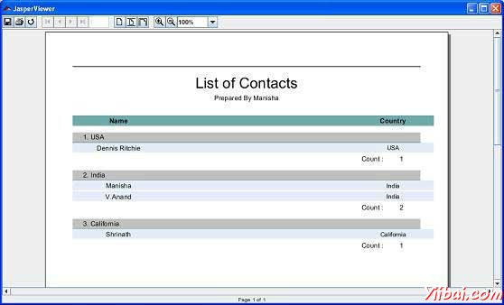

# JasperReports报表组 - JasperReports教程

组在JasperReports的协助组织对报告的数据以逻辑方式。报告组代表连续记录的数据源中有一些共同点，比如某个报表字段的值的序列。报告组由&lt;group&gt;元素定义。一个报表可以有任意数量的组。一旦声明，群体可以在整个报告中提到的。

报告组有三个要素：

*   Group expression: 这表示必须改变，以启动一个新的数据组中的数据。

*   Group header section: 帮助位置标签在分组数据的开始。

*   Group footer section: : 帮助位置标签在分组数据的末尾。

在截至于若该组表达变化，一组发生断裂和相应的&lt;groupFooter&gt;和&lt;groupHeader&gt;部分的值插入到生成的文档中报告充填时数据源的迭代。

&gt; 报表组的机制不执行由数据源所提供的资料的任何排序。数据分组按预期工作，只有当数据源中的记录按照报告中使用的组表达式已经下令。

## 属性组

&lt;group&gt;元素包含属性，使我们能够控制分组的数据是如何布局。属性概括于下表：

| 属性 | 描述 |
| --- | --- |
| name | 这是强制性的。它通过名称引用该组中的报表表达式。它遵循相同的命名约定我们，我们提到的报告参数，字段和报表变量。它可以在其他JRXML属性被用于当想引用一个特定的报告组。 |
| isStartNewColumn | 当设置为true时，每个数据组将开始一个新的列。默认值是false |
| isStartNewPage | 当设置为true时，每个数据组将开始一个新的页面上。默认值是false |
| isResetPageNumber | 当设置为true，该报告页码将每一个新组开始时被重置。默认值是false |
| isReprintHeaderOnEachPage | 当设置为true时，组头会被重印每一页上。默认值是false |
| minHeightToStartNewPage | 定义在列的底部，以便将组头当前列所需要的垂直空间最小量。被指定在报告单位的数量。 |
| footerPosition | 呈现在页面上的组页脚的位置，以及其有关的报告的部分它后面的行为。它的值可以是: _Normal_, _StackAtBottom_, _ForceAtBottom_, _CollateAtBottom_.默认值是 _Normal_ |
| keepTogether | 当设置为true，将阻止该集团从分割它第一次突破的尝试 |

## 例子

让我们添加一个组（CountryGroup）现有的报告模板（章报表设计）。每个国家的次数进行计数，计数显示为组页脚。在组头中每个记录的计数前缀。修订后的报告模板（jasper_report_template.jrxml）如下。将其保存到 C: oolsjasperreports-5.0.1 est 目录：

```
<?xml version="1.0"?>
<!DOCTYPE jasperReport PUBLIC
"//JasperReports//DTD Report Design//EN"
"http://jasperreports.sourceforge.net/dtds/jasperreport.dtd">

<jasperReport xmlns="http://jasperreports.sourceforge.net/jasperreports"
xmlns:xsi="http://www.w3.org/2001/XMLSchema-instance"
xsi:schemaLocation="http://jasperreports.sourceforge.net/jasperreports
http://jasperreports.sourceforge.net/xsd/jasperreport.xsd"
name="jasper_report_template" pageWidth="595"
pageHeight="842" columnWidth="515"
leftMargin="40" rightMargin="40" topMargin="50" bottomMargin="50">
<parameter name="ReportTitle" class="java.lang.String"/>
<parameter name="Author" class="java.lang.String"/>

   <queryString>
    <![CDATA[]]>
   </queryString>

   <field name="country" class="java.lang.String">
      <fieldDescription><![CDATA[country]]></fieldDescription>
   </field>

   <field name="name" class="java.lang.String">
      <fieldDescription><![CDATA[name]]></fieldDescription>
   </field>
   <sortField name="country" order="Descending"/>
   <sortField name="name"/>
   <variable name="CountryNumber" class="java.lang.Integer"
      incrementType="Group" incrementGroup="CountryGroup"
      calculation="Count">
      <variableExpression><![CDATA[Boolean.TRUE]]></variableExpression>
   </variable> **<group name="CountryGroup" minHeightToStartNewPage="60">
      <groupExpression><![CDATA[$F{country}]]></groupExpression>
      <groupHeader>
         <band height="20">
            <textField evaluationTime="Group" evaluationGroup="CountryGroup"
               bookmarkLevel="1">
               <reportElement mode="Opaque" x="0" y="5" width="515"
                  height="15" backcolor="#C0C0C0"/>
               <box leftPadding="10">
                  <bottomPen lineWidth="1.0"/>
               </box>
               <textElement/>
               <textFieldExpression class="java.lang.String">
                  <![CDATA["  " + String.valueOf($V{CountryNumber}) + ". "
                  + String.valueOf($F{country})]]>
               </textFieldExpression>
               <anchorNameExpression>
                  <![CDATA[String.valueOf($F{country})]]>
               </anchorNameExpression>
            </textField>
         </band>
      </groupHeader>
      <groupFooter>
         <band height="20">
            <staticText>
               <reportElement x="400" y="1" width="60" height="15"/>
               <textElement textAlignment="Right"/>
               <text><![CDATA[Count :]]></text>
            </staticText>
            <textField>
               <reportElement x="460" y="1" width="30" height="15"/>
               <textElement textAlignment="Right"/>
               <textFieldExpression class="java.lang.Integer">
                  <![CDATA[$V{CountryGroup_COUNT}]]>
               </textFieldExpression>
            </textField>
         </band>
      </groupFooter>
   </group>**
   <title>
      <band height="70">
         <line>
            <reportElement x="0" y="0" width="515"
            height="1"/>
         </line>
         <textField isBlankWhenNull="true" bookmarkLevel="1">
            <reportElement x="0" y="10" width="515"
            height="30"/>
            <textElement textAlignment="Center">
            <font size="22"/>
            </textElement>
            <textFieldExpression class="java.lang.String">
            <![CDATA[$P{ReportTitle}]]>
            </textFieldExpression>
            <anchorNameExpression><![CDATA["Title"]]>
            </anchorNameExpression>
            </textField>
            <textField isBlankWhenNull="true">
            <reportElement  x="0" y="40" width="515" height="20"/>
            <textElement textAlignment="Center">
                 <font size="10"/>
            </textElement>
            <textFieldExpression class="java.lang.String">
            <![CDATA[$P{Author}]]>
            </textFieldExpression>
            </textField>
      </band>
   </title>

   <columnHeader>
      <band height="23">
         <staticText>
            <reportElement mode="Opaque" x="0" y="3"
            width="535"    height="15"
            backcolor="#70A9A9" />
            <box>
            <bottomPen lineWidth="1.0"
            lineColor="#CCCCCC" />
            </box>
            <textElement />
            <text><![CDATA[]]>
            </text>
         </staticText>
         <staticText>
            <reportElement x="414" y="3" width="121"
            height="15" />
            <textElement textAlignment="Center"
            verticalAlignment="Middle">
                   <font isBold="true" />
            </textElement>
            <text><![CDATA[Country]]></text>
         </staticText>
         <staticText>
            <reportElement x="0" y="3" width="136"
            height="15" />
            <textElement textAlignment="Center"
            verticalAlignment="Middle">
               <font isBold="true" />
            </textElement>
            <text><![CDATA[Name]]></text>
         </staticText>
      </band>
   </columnHeader>

   <detail>
      <band height="16">
         <staticText>
            <reportElement mode="Opaque" x="0" y="0"
            width="535"    height="14"
            backcolor="#E5ECF9" />
            <box>
               <bottomPen lineWidth="0.25"
               lineColor="#CCCCCC" />
            </box>
            <textElement />
            <text><![CDATA[]]>
            </text>
         </staticText>
         <textField>
            <reportElement x="414" y="0" width="121"
            height="15" />
            <textElement textAlignment="Center"
            verticalAlignment="Middle">
               <font size="9" />
            </textElement>
            <textFieldExpression class="java.lang.String">
            <![CDATA[$F{country}]]>
            </textFieldExpression>
         </textField>
         <textField>
            <reportElement x="0" y="0" width="136"
            height="15" />
            <textElement textAlignment="Center"
            verticalAlignment="Middle" />
            <textFieldExpression class="java.lang.String">
            <![CDATA[$F{name}]]>
            </textFieldExpression>
         </textField>
      </band>
   </detail>
</jasperReport>
```

在java代码报表填充保持不变。该文件的内容 **C: oolsjasperreports-5.0.1 estsrccomyiibaiJasperReportFill.java** 如下：

```
package com.yiibai;

import java.util.ArrayList;
import java.util.HashMap;
import java.util.Map;

import net.sf.jasperreports.engine.JRException;
import net.sf.jasperreports.engine.JasperFillManager;
import net.sf.jasperreports.engine.data.JRBeanCollectionDataSource;

public class JasperReportFill {
   @SuppressWarnings("unchecked")
   public static void main(String[] args) {
      String sourceFileName =
      "C://tools/jasperreports-5.0.1/test/jasper_report_template.jasper";

      DataBeanList DataBeanList = new DataBeanList();
      ArrayList<DataBean> dataList = DataBeanList.getDataBeanList();

      JRBeanCollectionDataSource beanColDataSource =
      new JRBeanCollectionDataSource(dataList);

      Map parameters = new HashMap();
      /**
       * Passing ReportTitle and Author as parameters
       */
      parameters.put("ReportTitle", "List of Contacts");
      parameters.put("Author", "Prepared By Manisha");

      try {
         JasperFillManager.fillReportToFile(
         sourceFileName, parameters, beanColDataSource);
      } catch (JRException e) {
         e.printStackTrace();
      }
   }
}
```

该POJO文件的内容 C: oolsjasperreports-5.0.1 estsrccomyiibaiDataBean.java 如下：

```
package com.yiibai;

public class DataBean {
   private String name;
   private String country;

   public String getName() {
      return name;
   }

   public void setName(String name) {
      this.name = name;
   }

   public String getCountry() {
      return country;
   }

   public void setCountry(String country) {
      this.country = country;
   }
}
```

该文件的内容C: oolsjasperreports-5.0.1 estsrccomyiibaiDataBeanList.java 如下：

```
package com.yiibai;

import java.util.ArrayList;

public class DataBeanList {
   public ArrayList<DataBean> getDataBeanList() {
      ArrayList<DataBean> dataBeanList = new ArrayList<DataBean>();

      dataBeanList.add(produce("Manisha", "India"));
      dataBeanList.add(produce("Dennis Ritchie", "USA"));
      dataBeanList.add(produce("V.Anand", "India"));
      dataBeanList.add(produce("Shrinath", "California"));

      return dataBeanList;
   }

   /**
    * This method returns a DataBean object,
    * with name and country set in it.
    */
   private DataBean produce(String name, String country) {
      DataBean dataBean = new DataBean();
      dataBean.setName(name);
      dataBean.setCountry(country);
      return dataBean;
   }
}
```

## 报表生成

我们将编译和执行使用我们常规Ant构建过程上面的文件.build.xml文件中的内容（根据目录保存 C: oolsjasperreports-5.0.1 est）如下：

```
<?xml version="1.0" encoding="UTF-8"?>
<project name="JasperReportTest" default="viewFillReport" basedir=".">
   <import file="baseBuild.xml" />
   <target name="viewFillReport"
      depends="compile,compilereportdesing,run"
      description="Launches the report viewer to preview
      the report stored in the .JRprint file.">
      <java classname="net.sf.jasperreports.view.JasperViewer"
      fork="true">
         <arg value="-F${file.name}.JRprint" />
         <classpath refid="classpath" />
      </java>
   </target>
   <target name="compilereportdesing"
      description="Compiles the JXML file and
      produces the .jasper file.">
      <taskdef name="jrc"
      classname="net.sf.jasperreports.ant.JRAntCompileTask">
         <classpath refid="classpath" />
      </taskdef>
      <jrc destdir=".">
         <src>
         <fileset dir=".">
            <include name="*.jrxml" />
         </fileset>
         </src>
         <classpath refid="classpath" />
      </jrc>
   </target>
</project>
```

接下来，让我们打开命令行窗口并转到build.xml文件放置的目录。最后执行的命令ant -Dmain-class=com.yiibai.JasperReportFill （viewFullReport是默认的目标），如下所示：

```
C:    oolsjasperreports-5.0.1    est>ant -Dmain-class=com.yiibai.JasperReportFill
Buildfile: C:    oolsjasperreports-5.0.1    estuild.xml

clean-sample:
   [delete] Deleting directory C:    oolsjasperreports-5.0.1    estclasses
   [delete] Deleting: C:    oolsjasperreports-5.0.1    estjasper_report_template.jasper
   [delete] Deleting: C:    oolsjasperreports-5.0.1    estjasper_report_template.jrprint

compile:
    [mkdir] Created dir: C:    oolsjasperreports-5.0.1    estclasses
    [javac] C:    oolsjasperreports-5.0.1    estaseBuild.xml:28: warning:
    'includeantruntime' was not set, defaulting to build.sysclasspath=last;
    set to false for repeatable builds
    [javac] Compiling 7 source files to C:    oolsjasperreports-5.0.1    estclasses

compilereportdesing:
      [jrc] Compiling 1 report design files.
      [jrc] log4j:WARN No appenders could be found for logger
      (net.sf.jasperreports.engine.xml.JRXmlDigesterFactory).
      [jrc] log4j:WARN Please initialize the log4j system properly.
      [jrc] log4j:WARN See http://logging.apache.org/log4j/1.2/faq.htmll#noconfig
      for more info.
      [jrc] File : C:    oolsjasperreports-5.0.1    estjasper_report_template.jrxml ... OK.

run:
     [echo] Runnin class : com.yiibai.JasperReportFill
     [java] log4j:WARN No appenders could be found for logger
     (net.sf.jasperreports.extensions.ExtensionsEnvironment).
     [java] log4j:WARN Please initialize the log4j system properly.

viewFillReport:
     [java] log4j:WARN No appenders could be found for logger
     (net.sf.jasperreports.extensions.ExtensionsEnvironment).
     [java] log4j:WARN Please initialize the log4j system properly.

BUILD SUCCESSFUL
Total time: 18 seconds

```

正如上文编译的结果，JasperViewer窗口打开如下面的屏幕：



在这里，我们看到，各个国家分组和发生每个国家的计数显示在每个组页脚。

