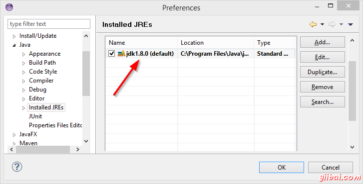
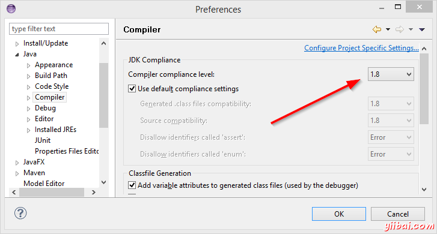
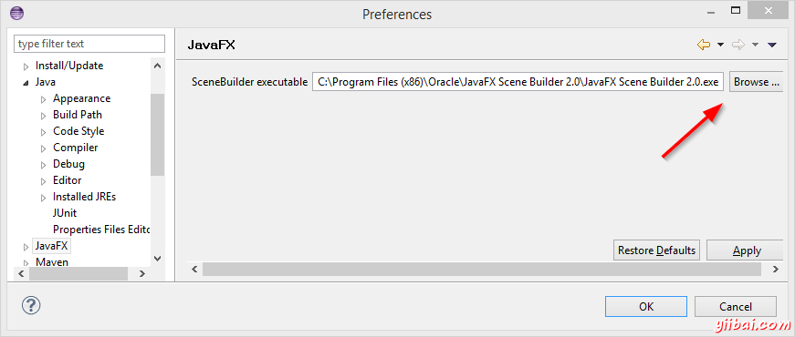

# JavaFX - Scene Builder - JavaFX教程

### 第一部分的主题

*   开始了解 JavaFX 。
*   创建并运行一个 JavaFX 项目。
*   使用 Scene Builder 来设计用户界面。
*   使用 模型 - 视图 - 控制器(MVC)模式 构造基础的应用。

### 你需要准备

*   最新的 [Java JDK 8](http://www.oracle.com/technetwork/java/javase/downloads/index.html) (包含 JavaFX 8)。
*   Eclipse 4.3 或更高版本与 e(fx)clipse 插件。最简单的方法是从 [e(fx)clipse 网站](http://efxclipse.bestsolution.at/install.html#all-in-one) 下载预先配置的发行版本。作为一种备选你可以使用一个 [update site](http://www.eclipse.org/efxclipse/install.html) 来给您的 Eclipse 安装。
*   [Scene Builder 2.0](http://www.oracle.com/technetwork/java/javase/downloads/javafxscenebuilder-info-2157684.html) 或更高。

### Eclipse 配置

配置Eclipse 所使用 JDK 和 Scene Builder：

1.  打开 Eclipse 的设置并找到 Java | Installed JREs 。

2.  点击 Add..., 选择 Standard VM 并选择你安装 JDK 8 的 Directory 。

3.  移除其他的 JREs 或 JDKs 从而使 JDK 8 成为默认。 
    

4.  在 Java | Compiler 中设置 Compiler compliance level 到 1.8。 
    

5.  在 JavaFX 中指定你的 Scene Builder 可执行文件的路径。 
    

### 帮助链接

你可能会想收藏下面的链接：

*   [Java 8 API](http://docs.oracle.com/javase/8/docs/api/) - Java 标准类的文档。
*   [JavaFX 8 API](http://docs.oracle.com/javase/8/javafx/api/) - JavaFX 类的文档。
*   [ControlsFX API](http://controlsfx.bitbucket.org/) - [ControlsFX project](http://fxexperience.com/controlsfx/) 额外 JavaFX 控件的文档。
*   [Oracle's JavaFX Yiibai](http://docs.oracle.com/javase/8/javafx/get-started-tutorial/get_start_apps.html) - Oracle 的 JavaFX 官方教程。

一切就绪，让我们开始吧！

