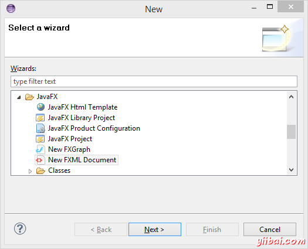
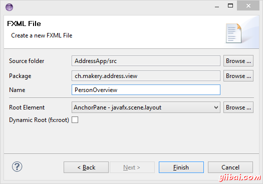

# JavaFX - 创建JavaFX项目 - JavaFX教程

## 创建一个新的 JavaFX 项目

在 Eclipse(已安装 e(fx)clipse 的)中，点击 File | New | Other... 并选择 JavaFX Project。 指定这个项目的名字(e.g. AddressApp)并点击 Finish。

如果 application 包被自动创建，那么删除它和它的内容。

### 创建包

[Model-View-Controller (MVC)](http://zh.wikipedia.org/wiki/MVC)是一个非常重要的软件设计原则。按照MVC模式可以将我们的应用程序划分成3个部分，然后为这每一部分建立自己的包 (在源代码文件夹上右键， 选择 新建 | 包):

*   ch.makery.address - 放置所有的控制器类(也就是应用程序的业务逻辑)
*   ch.makery.address.model - 放置所有的模型类
*   ch.makery.address.view - 放置所有界面和控件类

注意: view包里可能会包含一些控制器类，它可以直接被单个的view引用，我们叫它 视图-控制器。

## 创建FXML布局文件

有两种方式来创建用户界面，一终是能过XML文件来定义，另外一种就是直接通过java代码来创建. 这两种方式你都可以在网上搜到. 我们这里将使用XML的方式来创建大部分的界面。因为这种方式将会更好的将你的业务逻辑和你的界面开来，以保持代码的简洁。在接下来的内容里，我们将会介绍使用Scene Builder(所见即所得)来编辑我们的XML布局文件，它可以避免我们直接去修改XML文件。

在view包上右键创建一个新FXML Document，把它命名为PersonOverview。

