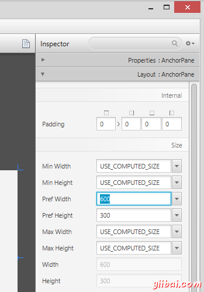
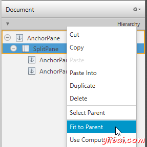
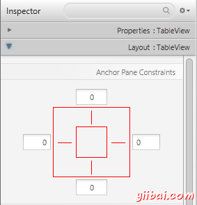
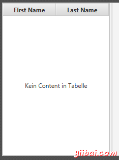
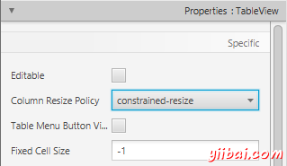
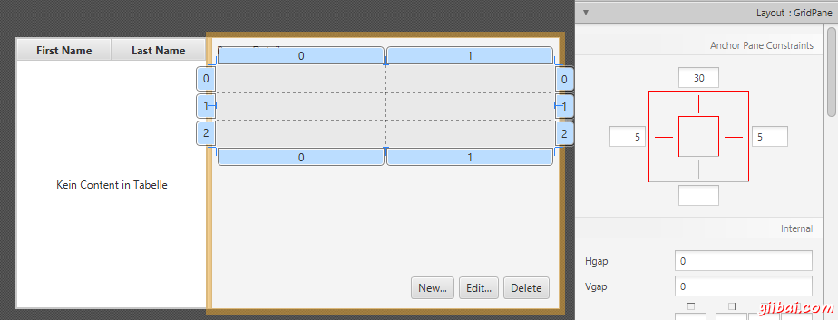
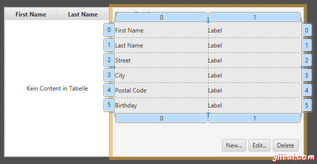
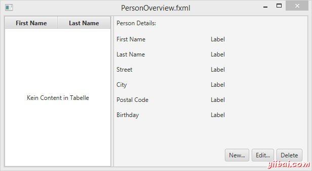

# JavaFX - Scene Builder设计界面 - JavaFX教程

## 用Scene Builder来设计你的界面

注意: 你可以下载这部分教程的源码，它里面已经包含了设计好的布局文件。

在PersonOverview.fxml 右键选择 Open with Scene Builder，那么你将会在打开的Scene Builder里面看到一个固定的界面设计区域(在整个界面的左边)。

1.  选中这个界面设计区域，你就可以在右边的属性设置栏中对它的尺寸进行修改: 
    

2.  从Scene Builder的左边控件栏中拖拽一个 Splite Pane(Horizontal Flow) 到界面设计区域，在Builder的右边视图结构中选择刚添加的Pane，在弹出的右键菜单中选择 Fit to Parent 。 

3.  同样从左边的控件栏中拖拽一个 TableView 到 SplitePane 的左边，选择这个TableView(而不是它的列)对它的布局进行设置，你可以在 AnchorPane 中对这个TableView四个边的外边距进行调节。([more information on Layouts](http://docs.oracle.com/javase/8/javafx/layout-tutorial/builtin_layouts.html)). 

4.  点击菜单中的 Preview | Show Preview in Window 可以预览你设计好的界面，试着缩放预览的界面，你会发现TableView会随着窗口的缩放而变化。

5.  修改TableView中的列名字，"First Name" and "Last Name"，在右边面板中的属性设置项 
    

6.  选择这个 TableView ，在右边面板中将它的 Column Resize Policy 修改成 constrained-resize (同样是在属性设置项里面)。确保这个TableView的列能够铺满所有的可用空间。 

7.  添加一个 Label 到 SplitePane的右边部分，并设置它的显示文字为 "Person Details" (提示: 你可以通过搜索来找到 Label 这个控件)。 使用anchors来调节这个控件的布局位置。 

8.  再添加一个 GridPane SplitePane的右边部分, 使用anchors来调节这个控件的布局位置。 

9.  按照下面的图添加多个 Lables到表格中去。

10.  注意: 添加一个控件到已经存在的行里面去，你可在这行的行号上右键选择 "Add Row"。 
    

11.  添加3个按钮到这个 GridPane 的下面。 小提示: 选择这3个按钮，右键 Wrap In | HBox，那么它们会被放置到一个HBox里面。 你可能需要对这个HBox指定一个 spacing,同时也需要设置它们的右边和下边的anchors。 

12.  那么基本已经完成了界面的设计，你可以通过 Preview 来预览一下你设计的界面，同时缩放一下窗口来检验一下各个控件的位置是否正确。 

