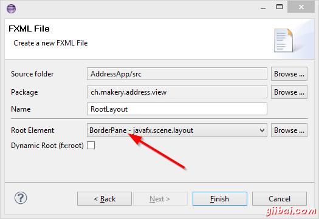
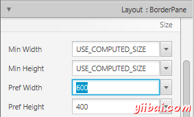
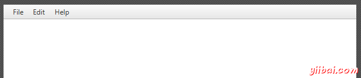
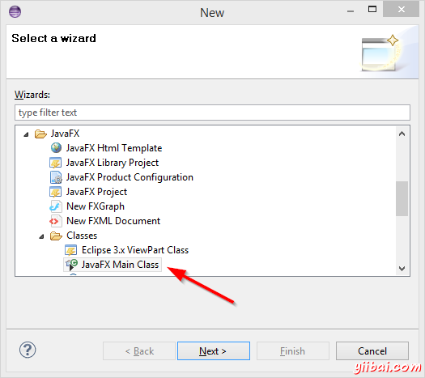
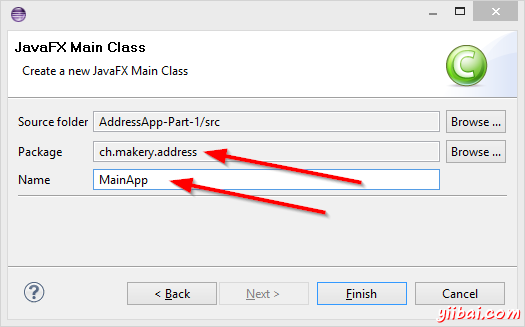
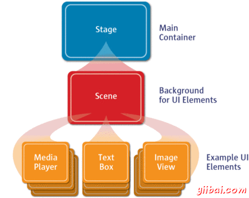

# JavaFX - 创建主应用程序 - JavaFX教程

## 创建主应用程序

我们需要建立一个新的布局文件 `PersonOverview.fxml` 来做为主布局文件，它将包含一个菜单栏和你即将要显示的布局。

1.  在view包里面创建一个新的 _FXML Document_ 叫做 `RootLayout.fxml`, 这一次，选择 _BorderPane_ 做为它的根节点 

2.  在Scene Builder中打开 `RootLayout.fxml`。

3.  通过设置 _Pref Width_ 为600和 _Pref Height_ 为400来改变这个 _BorderPane_的尺寸。 

4.  在最顶上添加一个 _MenuBar_，先不去给这个菜单添加任何的功能。 

### The JavaFX Main Class

现在，我们需要创建一个 main java class 用来加载 `RootLayout.fxml` ，同时添加 `PersonOverview.fxml`到_RootLayout.fxml_中去，这个main class将做为我们这个应用程序的入口。

1.  在工程上右键选择 _New | Other..._，然后选择 _JavaFX Main Class_。 

2.  将这个class命名为 `MainApp`，将它放置到controller包中，也就是上面建的 `ch.makery.address` (注意: 这个包下有两个子包，分别是`view` 和 `model`)。
    

你可能注意到了IDE生成的 `MainApp.java` 继承自 `Application` 同时包含了两个方法， 这是一个JavaFX应用程序的最基本的代码结构，这里最重要的方法是 `start(Stage primaryStage)` ，它将会在应用程序运行时通过内部的 `main` 方法自动调用。

正如你所看到的，这个`start(...)` 方法会接收一个 `Stage` 类型的参数，下面的图向你展示了一个JavaFX应用程序的基本结构。


_Image Source: [http://www.oracle.com](http://www.oracle.com/)_

一切看起来象是剧场里表演: 这里的 `Stage` 是一个主容器，它就是我们通常所认为的窗口(有边，高和宽，还有关闭按钮)。在这个 `Stage` 里面，你可以放置一个 `Scene`，当然你可以切换别的 `Scene`，而在这个 `Scene` 里面，我们就可以放置各种各样的控件。

更详细的信息，你可以参考 [Working with the JavaFX Scene Graph](http://docs.oracle.com/javase/8/javafx/scene-graph-tutorial/scenegraph.html).

打开 `MainApp.java`，将已有的代码替换成下面的代码:

```
package ch.makery.address;

import java.io.IOException;

import javafx.application.Application;
import javafx.fxml.FXMLLoader;
import javafx.scene.Scene;
import javafx.scene.layout.AnchorPane;
import javafx.scene.layout.BorderPane;
import javafx.stage.Stage;

public class MainApp extends Application {

    private Stage primaryStage;
    private BorderPane rootLayout;

    @Override
    public void start(Stage primaryStage) {
        this.primaryStage = primaryStage;
        this.primaryStage.setTitle("AddressApp");

        initRootLayout();

        showPersonOverview();
    }

    /**
     * Initializes the root layout.
     */
    public void initRootLayout() {
        try {
            // Load root layout from fxml file.
            FXMLLoader loader = new FXMLLoader();
            loader.setLocation(MainApp.class.getResource("view/RootLayout.fxml"));
            rootLayout = (BorderPane) loader.load();

            // Show the scene containing the root layout.
            Scene scene = new Scene(rootLayout);
            primaryStage.setScene(scene);
            primaryStage.show();
        } catch (IOException e) {
            e.printStackTrace();
        }
    }

    /**
     * Shows the person overview inside the root layout.
     */
    public void showPersonOverview() {
        try {
            // Load person overview.
            FXMLLoader loader = new FXMLLoader();
            loader.setLocation(MainApp.class.getResource("view/PersonOverview.fxml"));
            AnchorPane personOverview = (AnchorPane) loader.load();

            // Set person overview into the center of root layout.
            rootLayout.setCenter(personOverview);
        } catch (IOException e) {
            e.printStackTrace();
        }
    }

    /**
     * Returns the main stage.
     * @return
     */
    public Stage getPrimaryStage() {
        return primaryStage;
    }

    public static void main(String[] args) {
        launch(args);
    }
}
```

代码中的注释会给你一些小提示，注明代码的含义。

如果你现在就运行这个程序，那么你将会看到和这篇文章开头所展示的图片那样的界面。

### 你有可能遇见的问题

如果你的应用程序找不到你所指定的 `fxml` 布局文件，那么系统会提示以下的错误：

`java.lang.IllegalStateException: Location is not set.`

你可以检查一下你的 `fxml` 文件名是否拼写错误

如果还是不能工作，请下载这篇教程所对应的源代码，然后将源代码中的fxml文件替换掉你的

