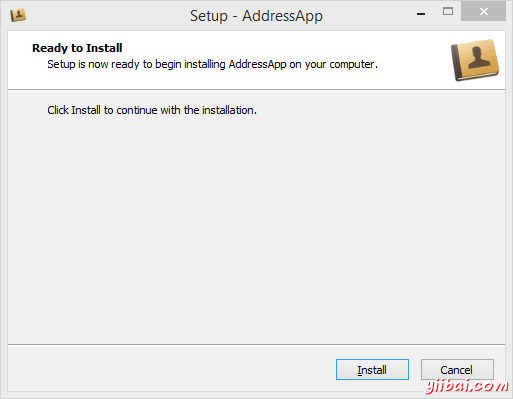
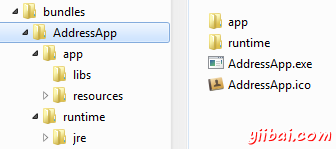
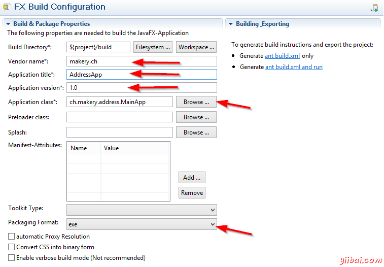
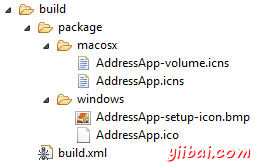
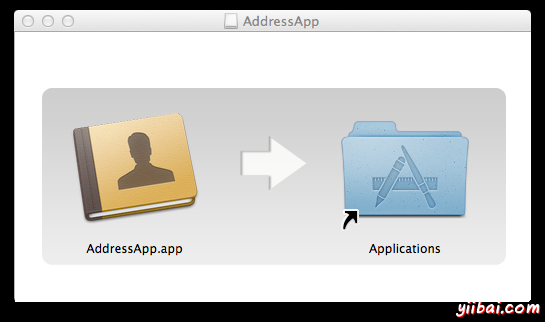

# JavaFX - 部署 - JavaFX教程



我想已经写到本教程系列的最后一部分了，应该教你如何部署(例如：打包和发布)AddressApp

## 第7部分的主题

*   使用e(fx)clipse本地包(Native Package)部署我们的JavaFX应用程序。

## 什么是部署

部署是打包和发布软件给用户的过程。这是软件开发的关键部分，因为它是第一次与使用我们软件的用户交流。

Java的广告口号是编写一次，到处运行，这说明Java语言的跨平台好处。理想情况下，这意味着我们Java应用可以运行在任何装备有JVM的设备上。 在过去，安装Java应用程序的用户经验不总是平滑的。如果用户在系统中没有要求的Java版本，它必须首先直接安装它。这导致有些困难，例如，需要管理员权限，Java版本之间的兼容问题等等。 幸运的是，JavaFX提供新的部署选项称为本地打包(也称为自包含应用程序包)。一个本地包是一个包含你的应用代码和平台指定的Java运行时的打包程序。 Oracle提供的官方JavaFx文档包含一个所有[JavaFX部署选项](http://docs.oracle.com/javafx/2/deployment/jfxpub-deployment.html)的扩展指南。 在本章节中，我们教你如何使用Eclipse和[e(fx)clipse插件](http://www.eclipse.org/efxclipse/)创建本地包。

## 创建本地包

目标是在用户的计算机上单个目录中创建一个自包含的应用程序。下面是AddressApp应用看起来的样子(在Windows上):



`app`目录包含我们的应用数据和`runtime`目录(包含平台相关的Java运行时)。

为了让用户更加舒适，我们也提供一个安装器：

*   Windows下的`exe`文件安装器
*   MacOS下的`dmg`(拖放)安装器。

E(fx)clipse插件会帮助我们生成本地包和安装器。

### 第1步 编辑build.fxbuild

E(fx)clipse使用`build.fxbuild`文件生成一个被Ant编译工具使用的文件。(如果你没有一个`build.fxbuid`文件，在Eclipse中创建一个新的Java FX项目，并且拷贝生成的文件过来。

1.  从项目的根目录下打开`build.fxbuild`。

2.  填写包含一个星号的字段。_对于MacOS：在应用程序标题中不能使用空格，因为好像会产生问题_。 

3.  在Windows下Packaging Format选择`exe`，MacOS下选择`dmg`，Linux下选择`rpm`

4.  点击`Generate ant build.xml only`的连接(在右边可以找到)。 

5.  验证是否创建一个新的`build`目录和文件`build.xml`

### 第2步 添加安装程序的图标

我们希望安装程序有一些好看的图标:

*   [AddressApp.ico](http://code.makery.ch/assets/library/javafx-8-tutorial/part7/AddressApp.ico) 安装文件图标
*   [AddressApp-setup-icon.bmp](http://code.makery.ch/assets/library/javafx-8-tutorial/part7/AddressApp-setup-icon.bmp) 安装启动画面图标
*   [AddressApp.icns](http://code.makery.ch/assets/library/javafx-8-tutorial/part7/AddressApp.icns) Mac安装程序图标

1.  在`build`目录下创建下面的子目录:
    *   `build/package/windows` (只用于Windows)
    *   `build/package/macos` (只用于macos)
2.  拷贝上面的相关图标到这些目录中，现在它应该看起来如下所示:
    
3.  重要：图标的名称必须精确匹配`build.fxbuild`中指定的Application的标题名：
    *   `YourAppTitle.ico`
    *   `YourAppTitle-setup-icon.bmp`
    *   `YourAppTitle.icns`

### 第3步 添加资源

我们的`resources`目录不能自动拷贝。我们必须手动添加它到build目录下:

1.  在`build`目录下创建下面的子目录:
    *   `build/dist`
2.  拷贝`resources`目录(包含我们应用的图标)到`build/dist`.
    

### 第4步 编辑build.xml包含图标

E(fx)clipse生成的`build/build.xml`文件(准备使用Ant执行)。我们的安装器图标和资源图像不能正常工作。

当e(fx)clipse没有告诉它包含其它资源，例如`resources`目录和上面添加的安装文件图标时，我们必须手动编辑`build.xml`文件。

打开`build.xml`文件，找到路径`fxant`。添加一行到`${basedir}`(将让我们安装器图标可用)。

##### build.xml - 添加"basedir"

```
<path id="fxant">
  <filelist>
    <file name="${java.home}\..\lib\ant-javafx.jar"/>
    <file name="${java.home}\lib\jfxrt.jar"/>
    <file name="${basedir}"/>
  </filelist>
</path>
```

找到块`fx:resources id="appRes"`，文件的更下面位置。为`resources`添加一行：

##### build.xml - 添加"resources"

```
<fx:resources id="appRes">
    <fx:fileset dir="dist" includes="AddressApp.jar"/>
    <fx:fileset dir="dist" includes="libs/*"/>
    <fx:fileset dir="dist" includes="resources/**"/>
</fx:resources> 
```

有时候，版本数不能添加到`fx:application`中，使得安装器总是缺省的版本`1.0`(在注释中很多人指出这个问题)。为了修复它，手动添加版本号(感谢Marc找到解决办法)。 [解决](http://code.makery.ch/library/javafx-8-tutorial/part7/#comment-1566725959)):

##### build.xml - 添加 "version"

```
<fx:application id="fxApplication"
    name="AddressApp"
    mainClass="ch.makery.address.MainApp"
    version="1.0"
/>
```

现在，我们已经能够使用ant编译运行`build.xml`了。这将会生成一个可运行的项目jar文件。但是我们希望更进一步，创建一个很好的安装器。

### 第5步(Windows) - Windows exe安装器


使用Inno Setup，我们能为我们的应用程序创建一个单独`.exe`文件的Windows安装器。生成的`.exe`执行用户级别的安装(无需管理员权限)。也创建一个快捷方式(菜单和桌面)。

1.  下载[Inno Setup 5](http://www.jrsoftware.org/isdl.php)以后版本，安装Inno程序到你的计算机上。我们的Ant脚本将使用它自动生成安装器。

2.  告诉Windows Inno程序的安装路径(例如：`C:\Program Files (x86)\Inno Setup 5)`。添加Inno安装路径到Path环境变量中。如果你不知道哪里可以找到它，阅读[Windows中如何设置路径和环境变量](http://www.computerhope.com/issues/ch000549.html).

3.  重启Eclipse，并且继续第6步。

### 第5步(MAC) - MacOS dmg安装器



为了创建Mac OS `dmg`拖放安装器，不需要任何的要求。

注意：为了让安装器映像能工作，它的名称必须与应用名称相同。

### 第5步(Linux等) Linux rpm安装器

其它打包选项(Windows的`msi`，Linux的`rpm`)参考本地打包[博客](https://blogs.oracle.com/talkingjavadeployment/entry/native_packaging_for_javafx) 或者本[oracle 文档](http://docs.oracle.com/javafx/2/deployment/self-contained-packaging.html#A1324980).

### 第6步 运行build.xml

最后一步，我们使用ant运行`build.xml`，_右击_ `build.xml`文件| _Run As_ | _Ant Build_。


编译将运行一会(在我的计算机上大概1分钟)。

如果一切都成功，你应该在`build/deploy/bundles`目录下找到本地打包。Windows版本看起来如下所示：


文件`AddressApp-1.0.exe`可以用作为单个文件安装应用。该安装程序将拷贝打包到`C:/Users/[yourname]/AppData/Local/AddressApp`目录下。

