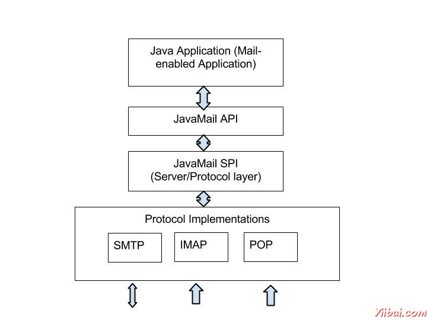

# JavaMail API 概述 - JavaMail

JavaMail API提供了一种与平台无关和协议独立的框架来构建邮件和消息应用程序。 JavaMail API提供了一组抽象类定义构成一个邮件系统的对象。它是阅读，撰写和发送电子信息的可选包（标准扩展）。

JavaMail 规定，用于构造一个接口，一个消息传送系统中的元素，包括系统的部件和接口。虽然本规范没有定义任何特定的实现，JavaMail是否包括实现RFC822和MIME Internet邮件标准几类。这些类都作为JavaMail的类包的一部分。

以下是一些在 JavaMail API 支持的协议：

*   SMTP:缩写为简单邮件传输协议。它提供传送邮件的机制。

*   POP: 缩写为邮局协议。 POP是大多数人在互联网上使用，以获得他们的邮件的机制。它定义了一个单个邮箱的支持为每个用户。 RFC 1939定义了该协议。

*   IMAP: 缩写为Internet邮件访问协议。它是一种先进的协议，用于接收消息。它提供了多个邮箱的支持为每个用户，除了邮箱可以被多个用户共享。它是在RFC2060中定义。

*   MIME: 缩写为多用途Internet邮件扩展。 。这不是一个邮件传输协议。相反，它定义了什么是传输的内容：邮件，附件，等等的格式。有许多不同的文档生效这里：RFC822，RFC2045，RFC2046和RFC2047。作为 JavaMail API 用户，您通常不需要担心这些格式。然而，这些格式确实存在，并且由程序使用。

*   NNTP 其它: 有由第三方供应商提供的许多协议。其中有些是网络新闻传输协议（NNTP），安全多用途Internet邮件扩展（S / MIME）等。

这些细节将包括在后续章节。

## 体系结构

正如上面的 java 应用程序表示用户使用 JavaMail API 来编写，发送和接收电子邮件。下图说明了JavaMail 的体系结构：

JavaMail API 的抽象机制类似于其他的J2EE API，如[JDBC](http://www.yiibai.com/jdbc/)，JNDI和JMS。如上面看到的体系结构图，JavaMail API 被分为两个主要部分：

*   与应用程序无关的部分：应用程序编程接口（API）是由应用程序使用的组件来发送和接收邮件，独立于底层的供应商或协议中使用的。

*   一个服务相关的部分：一个服务提供商接口（SPI）说，协议特定的语言，如SMTP，POP，IMAP和网络新闻传输协议（NNTP）。它是用来插在一封邮件服务到J2EE平台的供应商。

