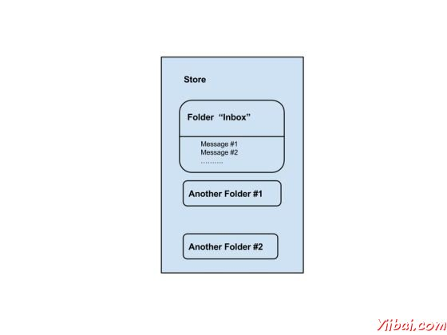

# JavaMail API 核心类 - JavaMail

JavaMail API包含了一些接口，用于发送，读取和删除电子邮件消息的类。虽然有许多软件包在JavaMail API中，频繁用于Java邮件API主要有两个包：javax.mail和javax.mail.internet。这些软件包包含所有的JavaMail核心类。它们分别是：

| 类 | 描述 |
| --- | --- |
| [javax.mail.Session](http://www.yiibai.com/javamail_api/javamail_api_core_classes.html#class_session) | The key class of the API. A multithreaded object represents the connection factory. |
| [javax.mail.Message](http://www.yiibai.com/javamail_api/javamail_api_core_classes.html#class_message) | An abstract class that models an e-mail message. Subclasses provide the actual implementations. |
| [javax.mail.Address](http://www.yiibai.com/javamail_api/javamail_api_core_classes.html#class_address) | An abstract class that models the addresses (from and to addresses) in a message. Subclasses provide the specific implementations. |
| [javax.mail.Authenticator](http://www.yiibai.com/javamail_api/javamail_api_core_classes.html#class_authenticator) | An abstract class used to protect mail resources on the mail server. |
| [javax.mail.Transport](http://www.yiibai.com/javamail_api/javamail_api_core_classes.html#class_transport) | An abstract class that models a message transport mechanism for sending an e-mail message. |
| [javax.mail.Store](http://www.yiibai.com/javamail_api/javamail_api_core_classes.html#class_store) | An abstract class that models a message store and its access protocol, for storing and retrieving messages. A Store is divided into Folders. |
| [javax.mail.Folder](http://www.yiibai.com/javamail_api/javamail_api_core_classes.html#class_folder) | An abstract class that represents a folder of mail messages. It can contain subfolders. |
| javax.mail.internet.**MimeMessage** | Message is an abstract class, hence must work with a subclass; in most cases, you’ll use a MimeMessage. A MimeMessage is an e-mail message that understands MIME types and headers. |
| javax.mail.internet.**InternetAddress** | This class represents an Internet email address using the syntax of RFC822\. Typical address syntax is of the form_user@host.domain_ or _Personal Name &lt;user@host.domain&gt;_. |

让我们研究这些类的细节，并在随后的章节中，我们将使用所有这些研究的例子。

<a name="class_session" style="margin: 0px; padding: 0px; color: rgb(0, 0, 0); font-family: Helvetica, Arial, sans-serif; background-color: rgb(255, 255, 255);"></a>

## 会话类

会话类是JavaMail API的主要类，它不创建子类。 Session 对象充当连接工厂的JavaMail API，它可以同时处理配置设置和身份验证。

Session 对象可以通过以下方式创建：

*   通过查找存储在JNDI服务的管理对象

    ```
    InitialContext ctx = new InitialContext();
    Session session = (Session) ctx.lookup("usersMailSession");
    ```

    usersMailSession是用作Session 对象的管理对象的JNDI名称的对象。 usersMailSession 可以创建并配置必要的参数作为名称/值对，包括信息，如邮件服务器的主机名，用户帐户发送邮件，并通过 Session 对象所支持的协议。

*   创建Session对象的另一种方法是基于编程方法，可以在其中使用的java.util.Properties对象来覆盖一些默认信息，如邮件服务器名，用户名，密码，那可以是其他信息整个应用程序共享。

该构造Session类是私有的。因此，会话类提供了两个方法（如下所示），它获得了Session对象。

*   getDefaultInstance(): 有两种方法使用getDefaultInstance（）方法来获取会话对象。它返回默认的会话。

    ```
    public static Session getDefaultInstance(Properties props)
    public static Session getDefaultInstance(Properties props,Authenticator auth)
    ```

*   **getInstance()**: 有两种方法使用getInstance（）方法来获取会话对象。它返回新的会话。

    ```
    public static Session getInstance(Properties props)
    public static Session getInstance(Properties props,Authenticator auth)
    ```

<a name="class_message" style="margin: 0px; padding: 0px; color: rgb(0, 0, 0); font-family: Helvetica, Arial, sans-serif; background-color: rgb(255, 255, 255);"></a>

## 消息类

与Session对象创建的，我们现在继续创建将要发送的消息。该消息类型将是javax.mail.Message。

*   Message是一个抽象类。因此，它的子类javax.mail.internet.MimeMessage类大多使用。

*   创建消息，你需要传递会话对象中的MimeMessage类的构造函数。例如：

    ```
    MimeMessage message=new MimeMessage(session);
    ```

*   一旦消息对象被创建，我们需要存储的信息在里面。消息类实现了javax.mail.Part接口，当使用javax.mail.internet。的MimeMessage实现javax.mail.internet.MimePart。您可以使用message.setContent()或mimeMessage.setText()来存储内容。

*   MimeMessage类的常用的方法有

    | 方法 | 描述 |
    | --- | --- |
    | public void setFrom(Address address) | used to set the from header field. |
    | public void addRecipients(Message.RecipientType type, String addresses) | used to add the given address to the recipient type. |
    | public void setSubject(String subject) | used to set the subject header field. |
    | public void setText(String textmessage) | used to set the text as the message content using text/plain MIME type. |

<a name="class_address" style="margin: 0px; padding: 0px; color: rgb(0, 0, 0); font-family: Helvetica, Arial, sans-serif; background-color: rgb(255, 255, 255);"></a>

## 地址类

现在，我们有一个会话和消息（存储在它里面的内容）的对象，我们需要使用地址对象，以解决这封邮件。

*   Address 是一个抽象类。因此，它的子类javax.mail.internet.InternetAddress类大多被使用。

*   Address 可以通过刚好路过的电子邮件地址来创建：

    ```
    Address address = new InternetAddress("manisha@gmail.com"); 
    ```

*   创建地址的另一种方式是通过将名称与电子邮件地址：

    ```
    Address address = new InternetAddress("manisha@gmail.com", Manisha); 
    ```

*   您还可以设置收件人，发件人，抄送，密件抄送（To, From, CC, BCC）字段如下  fields as below

    *   message.setFrom(address)

    *   message.addRecipient(type, address)

    *   三种预定义的地址类型是与这些值中的一个对象：

        *   Message.RecipientType.TO

        *   Message.RecipientType.CC

        *   Message.RecipientType.BCC

<a name="class_authenticator" style="margin: 0px; padding: 0px; color: rgb(0, 0, 0); font-family: Helvetica, Arial, sans-serif; background-color: rgb(255, 255, 255);"></a>

## Authenticator类

Authenticator 类表示懂得如何获得认证的网络连接的对象。通常情况下，它会通过提示信息的用户这样做。

*   身份验证是一个抽象类。您可以创建一个子类PasswordAuthentication，通过用户名和密码给它的构造。

*   必须注册认证者与当您创建会话对象的会话。

以下是验证器使用的一个例子：

```
Properties props = new Properties();
//Override props with any customized data
PasswordAuthentication auth = new PasswordAuthentication("manisha", "pswrd")
Session session = Session.getDefaultInstance(props, auth);
```

<a name="class_transport" style="margin: 0px; padding: 0px; color: rgb(0, 0, 0); font-family: Helvetica, Arial, sans-serif; background-color: rgb(255, 255, 255);"></a>

## Transport 类

Transport 类用来作为消息传输机制。这个类通常使用SMTP协议来发送消息。

*   它是一个抽象类。

*   你可以通过只调用静态的send（）方法使用该类的默认版本：

    ```
    Transport.send(message);
    ```

*   发送消息的另一种方法是通过从会话您的协议得到一个特定的实例，传递下去的用户名和密码（空白，如果不必要的），发送消息，并关闭连接：

    ```
    message.saveChanges(); // implicit with send()
    //Get transport for session
    Transport transport = session.getTransport("smtp");
    //Connect
    transport.connect(host, username, password);
    //repeat if necessary
    transport.sendMessage(message, message.getAllRecipients());
    //Done, close the connection
    transport.close();
    ```

<a name="class_store" style="margin: 0px; padding: 0px; color: rgb(0, 0, 0); font-family: Helvetica, Arial, sans-serif; background-color: rgb(255, 255, 255);"></a>

## Store 类

一个抽象类，模型信息存储和访问协议，用于存储和检索信息。子类提供实际的实现。存储扩展服务类，它提供命名商店，连接到存储，并听取连接事件很多常见的方法。

客户获得通过获得它实现了数据库访问协议的Store对象访问消息存储。大多数邮件存储需要进行身份验证，才允许访问的用户。 connect方法进行身份验证。

```
Store store = session.getStore("pop3");
store.connect(host, username, password);
```

<a name="class_folder" style="margin: 0px; padding: 0px; color: rgb(0, 0, 0); font-family: Helvetica, Arial, sans-serif; background-color: rgb(255, 255, 255);"></a>

## Folder 类

folder 是表示一个文件夹的邮件消息的抽象类。子类实现协议的具体文件夹。文件夹可以包含子文件夹，以及消息，从而提供了一种分层结构。

连接到存储后，您就可以得到一个文件夹，必须先打开，然后才能从中读取消息。

```
Folder folder = store.getFolder("INBOX");
folder.open(Folder.READ_ONLY);
Message message[] = folder.getMessages();
```

getFolder（字符串name）方法为一个Folder 对象返回指定的子文件夹。关闭一次读邮件完成两者的存储和文件夹的连接。

我们可以看到下面的图片的存储和文件夹的关系：



正如我们所看到的，每个用户帐户，该服务器有一个商店，这是用户的信息的存储。该存储分为文件夹，并在“收件箱”文件夹，其中包含电子邮件的主要文件夹。文件夹可以包含邮件和子文件夹。

