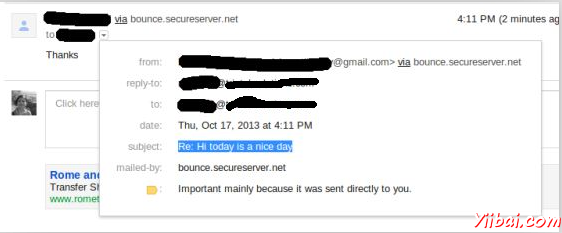

# JavaMail 电子邮件答复/回复 - JavaMail

在本章中，我们将看到如何使用JavaMail API来回复电子邮件。接着在下面的程序中的列出基本步骤：

*   获取Session对象与POP和SMTP 服务器的细节属性。我们需要 POP 细节来检索信息和SMPT详细信息发送邮件。

*   创建POP3存储对象，并连接到存储。

*   创建文件夹对象，并在您的邮箱中打开相应的文件夹。

*   检索消息。

*   遍历的消息，如果你想回复键入“Y”或“y”。

*   得到消息的所有信息（收件人，发件人，主题，内容）(To,From,Subject, Content) 。

*   建立应答消息，使用Message.reply()方法。这个方法配置一个新的消息与适当的收件人和主题。该方法接受一个布尔参数，指示是否只回复给发送者 (false)或回复给所有人（true）。

*   从设置，文本和回复到邮件中，并通过传输对象的实例发送。

*   关闭传输，文件夹和存储对象分别。

&gt; 在这里，我们使用JangoSMPT服务器通过该电子邮件发送到我们的目标电子邮件地址。设置是在[环境设置章节](http://www.yiibai.com/javamail_api/javamail_api_environment_setup.html)解释。

## 创建Java类

创建一个Java类文件ReplyToEmail，是其内容如下：

```
package com.yiibai;

import java.io.BufferedReader;
import java.io.InputStreamReader;
import java.util.Date;
import java.util.Properties;

import javax.mail.Folder;
import javax.mail.Message;
import javax.mail.Session;
import javax.mail.Store;
import javax.mail.Transport;
import javax.mail.internet.InternetAddress;
import javax.mail.internet.MimeMessage;

public class ReplyToEmail {
   public static void main(String args[]) 
   {
      Date date = null;

      Properties properties = new Properties();
      properties.put("mail.store.protocol", "pop3");
      properties.put("mail.pop3s.host", "pop.gmail.com");
      properties.put("mail.pop3s.port", "995");
      properties.put("mail.pop3.starttls.enable", "true");
      properties.put("mail.smtp.auth", "true");
      properties.put("mail.smtp.starttls.enable", "true");
      properties.put("mail.smtp.host", "relay.jangosmtp.net");
      properties.put("mail.smtp.port", "25");
      Session session = Session.getDefaultInstance(properties);

      // session.setDebug(true);
      try 
      {
         // Get a Store object and connect to the current host
         Store store = session.getStore("pop3s");
         store.connect("pop.gmail.com", "xyz@gmail.com",
            "*****");//change the user and password accordingly

         Folder folder = store.getFolder("inbox");
         if (!folder.exists()) {
            System.out.println("inbox not found");
               System.exit(0);
         }
         folder.open(Folder.READ_ONLY);

         BufferedReader reader = new BufferedReader(new InputStreamReader(
            System.in));

         Message[] messages = folder.getMessages();
         if (messages.length != 0) {

            for (int i = 0, n = messages.length; i < n; i++) {
               Message message = messages[i];
               date = message.getSentDate();
               // Get all the information from the message
               String from = InternetAddress.toString(message.getFrom());
               if (from != null) {
                  System.out.println("From: " + from);
               }
               String replyTo = InternetAddress.toString(message
             .getReplyTo());
               if (replyTo != null) {
                  System.out.println("Reply-to: " + replyTo);
               }
               String to = InternetAddress.toString(message
             .getRecipients(Message.RecipientType.TO));
               if (to != null) {
                  System.out.println("To: " + to);
               }

               String subject = message.getSubject();
               if (subject != null) {
                  System.out.println("Subject: " + subject);
               }
               Date sent = message.getSentDate();
               if (sent != null) {
                  System.out.println("Sent: " + sent);
               }

               System.out.print("Do you want to reply [y/n] : ");
               String ans = reader.readLine();
               if ("Y".equals(ans) || "y".equals(ans)) {

                  Message replyMessage = new MimeMessage(session);
                  replyMessage = (MimeMessage) message.reply(false);
                  replyMessage.setFrom(new InternetAddress(to));
                  replyMessage.setText("Thanks");
                  replyMessage.setReplyTo(message.getReplyTo());

                  // Send the message by authenticating the SMTP server
                  // Create a Transport instance and call the sendMessage
                  Transport t = session.getTransport("smtp");
                  try {
                //connect to the smpt server using transport instance
             //change the user and password accordingly    
                 t.connect("abc", "****");
                 t.sendMessage(replyMessage,
                        replyMessage.getAllRecipients());
                  } finally {
                     t.close();
                  }
                  System.out.println("message replied successfully ....");

                  // close the store and folder objects
                  folder.close(false);
                  store.close();

               } else if ("n".equals(ans)) {
                  break;
               }
            }//end of for loop

         } else {
            System.out.println("There is no msg....");
         }

      } catch (Exception e) {
         e.printStackTrace();
      }

   }

}
```

&gt; 您可以通过取消注释语句上设置调试 session.setDebug(true);

## 编译并运行

现在，我们班是准备好了，让我们编译上面的类。我已经保存了类ReplyToEmail.java到目录: /home/manisha/JavaMailAPIExercise. 我们需要 javax.mail.jar andactivation.jar 在 classpath 中。执行下面的命令从命令提示符编译类（两个罐子被放置在 /home/manisha/ 目录下）：

```
javac -cp /home/manisha/activation.jar:/home/manisha/javax.mail.jar: ReplyToEmail.java
```

现在，这个类被编译，执行下面的命令来运行：

```
java -cp /home/manisha/activation.jar:/home/manisha/javax.mail.jar: ReplyToEmail
```

## 验证输出

你应该看到下面的消息命令控制台上：

```
From: ABC <abc@gmail.com>
Reply-to: abc@trioteksolutions.com
To: XYZ <xyz@gmail.com>
Subject: Hi today is a nice day
Sent: Thu Oct 17 15:58:37 IST 2013
Do you want to reply [y/n] : y
message replied successfully ....

```

检查该邮件发送的收件箱。在我们的例子中收到的邮件看起来如下：



