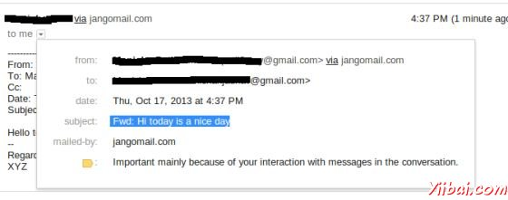
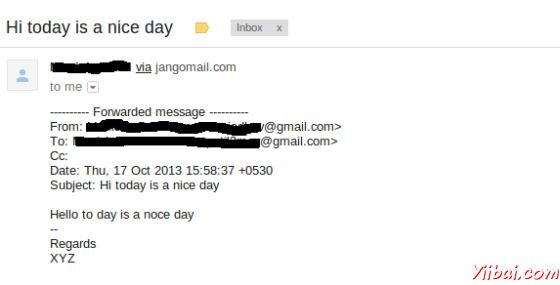

# JavaMail 转发电子邮件 - JavaMail

在本章中，我们将看到如何使用JavaMail API来转发电子邮件。接着在下面的程序的基本步骤是：

*   获取Session对象与POP和SMTP服务器的细节的属性。我们需要的POP细节来检索信息和SMPT详细信息发送邮件。

*   创建POP3存储对象，并连接到存储。

*   创建文件夹对象，并在您的邮箱中打开相应的文件夹。

*   检索消息。

*   遍历的消息，如果你想转发键入“Y”或“y”。

*   得到消息的所有信息（收件人，发件人，主题，内容）。

*   通过与组成消息的各个部分的工作建立转发消息。第一部分将是消息的文本和第二部分将要转发的邮件。结合两成多部分。那么你多部分添加到妥善处理消息并发送它。

*   关闭传输，文件夹和存储对象分别。

&gt; 在这里，我们使用JangoSMPT服务器通过该电子邮件被发送到我们的目标电子邮件地址。设置是在[环境设置章节](http://www.yiibai.com/javamail_api/javamail_api_environment_setup.html)解释。

## 创建Java类

创建一个Java类文件ForwardEmail，是其内容如下：

```
package com.yiibai;

import java.io.BufferedReader;
import java.io.InputStreamReader;
import java.util.Date;
import java.util.Properties;

import javax.mail.BodyPart;
import javax.mail.Folder;
import javax.mail.Message;
import javax.mail.Multipart;
import javax.mail.PasswordAuthentication;
import javax.mail.Session;
import javax.mail.Store;
import javax.mail.Transport;
import javax.mail.internet.InternetAddress;
import javax.mail.internet.MimeBodyPart;
import javax.mail.internet.MimeMessage;
import javax.mail.internet.MimeMultipart;

public class ForwardEmail {

   public static void main(String[] args) {
      Properties properties = new Properties();
      properties.put("mail.store.protocol", "pop3");
      properties.put("mail.pop3s.host", "pop.gmail.com");
      properties.put("mail.pop3s.port", "995");
      properties.put("mail.pop3.starttls.enable", "true");
      properties.put("mail.smtp.auth", "true");
      properties.put("mail.smtp.host", "relay.jangosmtp.net");
      properties.put("mail.smtp.port", "25");
      Session session = Session.getDefaultInstance(properties);
      try {
         // session.setDebug(true);
         // Get a Store object and connect to the current host
         Store store = session.getStore("pop3s");
         store.connect("pop.gmail.com", "xyz@gmail.com",
            "*****");//change the user and password accordingly

         // Create a Folder object and open the folder
         Folder folder = store.getFolder("inbox");
         folder.open(Folder.READ_ONLY);
         BufferedReader reader = new BufferedReader(new InputStreamReader(
            System.in));
         Message[] messages = folder.getMessages();
         if (messages.length != 0) {

         for (int i = 0, n = messages.length; i < n; i++) {
            Message message = messages[i];
            // Get all the information from the message
            String from = InternetAddress.toString(message.getFrom());
            if (from != null) {
               System.out.println("From: " + from);
            }
            String replyTo = InternetAddress.toString(message
               .getReplyTo());
            if (replyTo != null) {
               System.out.println("Reply-to: " + replyTo);
            }
            String to = InternetAddress.toString(message
               .getRecipients(Message.RecipientType.TO));
            if (to != null) {
               System.out.println("To: " + to);
            }

            String subject = message.getSubject();
            if (subject != null) {
               System.out.println("Subject: " + subject);
            }
            Date sent = message.getSentDate();
            if (sent != null) {
               System.out.println("Sent: " + sent);
            }
            System.out.print("Do you want to reply [y/n] : ");
            String ans = reader.readLine();
            if ("Y".equals(ans) || "y".equals(ans)) {
               Message forward = new MimeMessage(session);
               // Fill in header
               forward.setRecipients(Message.RecipientType.TO,
               InternetAddress.parse(from));
               forward.setSubject("Fwd: " + message.getSubject());
               forward.setFrom(new InternetAddress(to));

               // Create the message part
               MimeBodyPart messageBodyPart = new MimeBodyPart();
               // Create a multipart message
               Multipart multipart = new MimeMultipart();
               // set content
               messageBodyPart.setContent(message, "message/rfc822");
               // Add part to multi part
               multipart.addBodyPart(messageBodyPart);
               // Associate multi-part with message
               forward.setContent(multipart);
               forward.saveChanges();

               // Send the message by authenticating the SMTP server
               // Create a Transport instance and call the sendMessage
               Transport t = session.getTransport("smtp");
               try {
                  //connect to the smpt server using transport instance
          //change the user and password accordingly
                  t.connect("abc", "*****");
                  t.sendMessage(forward, forward.getAllRecipients());
               } finally {
                  t.close();
               }

               System.out.println("message forwarded successfully....");

            // close the store and folder objects
            folder.close(false);
            store.close();
            }// end if

         }// end for
   }// end if
   } catch (Exception e) {
      e.printStackTrace();
   }
}

}
```

&gt; 您可以通过取消注释语句上设置调试 session.setDebug(true);

## 编译并运行

现在类准备好了，编译上面的类。我已经保存了类ForwardEmail.java目录： /home/manisha/JavaMailAPIExercise. 我们需要javax.mail.jar 和 activation.jar 在 classpath中。执行下面的命令从命令提示符编译类（两个jar 放置在 /home/manisha/ 目录下）：

```
javac -cp /home/manisha/activation.jar:/home/manisha/javax.mail.jar: ForwardEmail.java
```

现在，这个类被编译，执行下面的命令来运行：

```
java -cp /home/manisha/activation.jar:/home/manisha/javax.mail.jar: ForwardEmail
```

## 验证输出

你应该看到下面的消息命令控制台上：

```
From: ABC <abc@gmail.com>
Reply-to: abc@trioteksolutions.com
To: XYZ <xyz@gmail.com>
Subject: Hi today is a nice day
Sent: Thu Oct 17 15:58:37 IST 2013
Do you want to reply [y/n] : y
message forwarded successfully....

```

检查该邮件发送的收件箱。在我们的例子中转发的邮件看起来如下：



