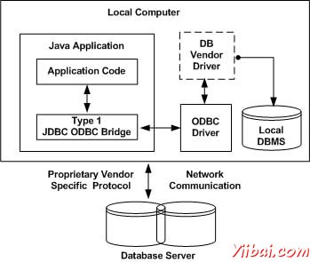
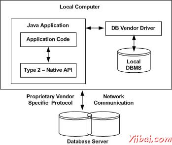
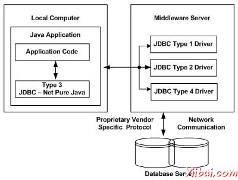
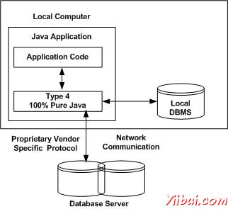

# JDBC驱动类型 - JDBC教程

## 什么是JDBC驱动程序？

JDBC驱动程序实现JDBC API中定义的接口，用于与数据库服务器进行交互。

例如，使用JDBC驱动程序可以打开数据库连接，并通过发送SQL或数据库命令，然后在收到结果与Java进行交互。

java.sql包中附带的JDK包含定义各种类与他们的行为和实际实现在第三方驱动程序。第三方供应商实现了他们的数据库驱动程序的java.sql.Driver接口。

## JDBC驱动程序类型：

JDBC驱动程序实现，因为各种各样的操作系统和Java运行在硬件平台的不同而不同。 Sun已经划分了实现类型分为四大类，类型1，2，3，4，其解释如下：

## 类型1：JDBC-ODBC桥驱动程序：

在类型1驱动程序，一个JDBC桥接器是用来访问安装在每个客户机上的ODBC驱动程序。使用ODBC，需要配置系统数据源名称（DSN），表示在目标数据库上。

当Java刚出来时，这是一个有用的驱动程序，因为大多数的数据库只支持ODBC访问，但现在建议使用此类型的驱动程序仅用于实验用途或在没有其他选择的情况。

自带JDK 1.2中的JDBC-ODBC桥是这类驱动程序的一个很好的例子。

## 类型2：JDBC-Native API调用：

在类型2驱动程序，JDBC API调用转换成原生的C / C+ + API调用都有它独特的数据库。这些通常由数据库厂商提供，并以相同的方式将JDBC-ODBC桥驱动程序使用，特定供应商的驱动程序必须安装在每台客户机上。

如果改变了数据库，那么必须改变本机API，因为它是具体到一个数据库，他们大多是过时了，但现在可以实现一些速度增加了类型2驱动程序，因为它消除了数据库的开销。

Oracle调用接口（OCI）驱动程序是一个类型2驱动程序的一个示例。

## 类型3：JDBC网络纯Java：

在类型3驱动程序，一个三层的方法来访问数据库。在JDBC客户端使用标准的网络套接字与中间件应用服务器进行通信。套接字的相关信息，然后由中间件应用服务器进入由DBMS所需要的的调用格式转换，并转发到数据库服务器。

这种驱动器是非常灵活的，因为它不需要安装在客户端上的代码和一个单一的驱动器实际上可以提供访问多个数据库。

可以将应用服务器作为一个JDBC“代理”，这意味着它会调用客户端应用程序。因此，需要应用服务器的配置，以有效地使用此驱动程序类型的一些知识。

应用服务器可能使用类型1，2，或4驱动程序与数据库进行通信，了解细微之处将证明是有益的。

## 类型4：100％纯Java：

在一个类型4驱动程序，直接与供应商的数据库进行通信，通过socket连接一个纯粹的基于Java的驱动程序。这是可用于数据库的最高性能的驱动程序，并且通常由供应商本身提供。

这种驱动器是非常灵活的，不需要在客户端或服务器上安装特殊的软件。此外，这些驱动程序可以动态下载。

[MySQL](http://www.yiibai.com/mysql/)的Connector/J的驱动程序是一个类型4驱动程序。因为他们的网络协议的专有性的，数据库厂商通常提供类型4的驱动程序。

## 其中驱动器应使用？

如果正在访问一个类型的数据库，如Oracle，Sybase或IBM，首选驱动程序是类型4。

如果Java应用程序同时访问多个数据库类型，类型3是首选的驱动程序。

第2类驱动程序是在情况下：类型3或类型4驱动程序还没有提供数据库非常有用。

类型1驱动程序不被认为是部署级别的驱动程序，它通常仅用于开发和测试目的。

