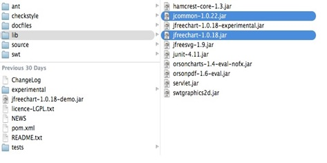

# JFreeChart安装 - JFreeChart教程

本章将指导您完成JFreeChart在Windows和Linux的安装设置过程。所需的用户管理，同时安装JFreeChart。JFreeChart是著名的高效图表创建和用户友好的安装设置。

## 系统要求：

| JDK | 1.5 或以上 |
| --- | --- |
| 内存 | 2GB RAM |
| --- | --- |
| 硬盘空间 | 没有最低要求 |
| --- | --- |
| 操作系统版本 | Linux / Windows |
| --- | --- |

## 安装JFreeChart

要安装JFreeChart，首先需要在系统上安装Java。

### 步骤1：验证Java安装

为了验证Java安装，打开控制台并执行下面的Java命令：

| 操作系统 | 任务 | 命令 |
| --- | --- | --- |
| Windows | 打开命令控制台 | C:&gt;java -version |
| Linux | 打开命令终端 | $java -version |

如果Java安装得当，那么应该得到两个操作系统下面的输出：

| 操作系统 | 描述 |
| --- | --- |
| Windows | Java version "1.7.0_60" Java (TM) SE Run Time Environment (build 1.7.0_60-b19) Java HotSpot(TM) 64-bit Server VM (build 24.60-b09,mixed mode) |
| Linux | java version "1.7.0_25" OpenJDK Runtime Environment (rhel-2.3.10.4.el6_4-x86_64) OpenJDK 64-Bit Server VM (build 23.7-b01, mixed mode) |

如果没有安装Java，那么可以链接到安装Java软件开发工具包（SDK）：

[http://www.oracle.com/technetwork/java/javase/downloads/index.html](http://www.oracle.com/technetwork/java/javase/downloads/index.html)

我们假设你已经进行了本教程之前安装了Java1.7.0_60 版本。

### 第2步：设置Java环境

设置 JAVA_HOME 环境变量指向到安装在机器上的 Java 基本目录的位置。例如，

| Os | 描述 |
| --- | --- |
| Windows | 设置的环境变量 JAVA_HOME 的值为 C:\ProgramFiles\java\jdk1.7.0_60 |
| Linux | export JAVA_HOME=/usr/local/java-current |

附加 Java编译器位置系统路径。

| OS | 描述 |
| --- | --- |
| Windows | 添加字符串 ; C:\Program Files\Java\jdk1.7.0_60\bin 到系统环境变量 PATH. |
| Linux | export PATH=$PATH:$JAVA_HOME/bin/ |

从命令提示符下验证命令 java-version 如上所述

### 第三步：安装 JFreeChart

从链接 http://www.jfree.org/jfreechart/download/ 下载JFreeChart.zip最新版本 解压下载文件库，可以链接到Java程序中的任何位置。下图显示了目录和文件的结构：

添加了JFreeChart1.0.18.jar 和 jcommon-1.0.22.jar 文件到 CLASSPATH 完整路径，如下图所示：

| OS | 描述 |
| --- | --- |
| Windows | 添加字符串 “C:\ jfreechart-1.0.18\lib\ jfreechart-1.0.18.jar” 和 “C:\ jfreechart-1.0.18\lib\ jcommon-1.0.22.jar” 到用户变量 CLASSPATH 的尾部 |
| Linux | Export CLASSPATH=$CLASSPATH: /usr/share/jfreechart-1.0.18/lib/jfreechart-1.0.18.jar: /usr/share/jfreechart-1.0.18/lib/jcommon-1.0.22.jar |

