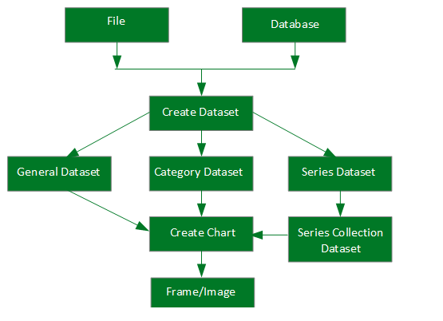
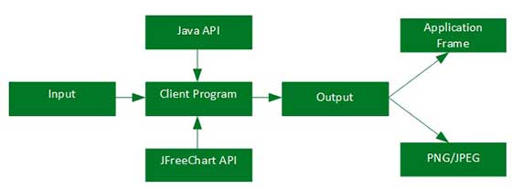

# JFreeChart架构 - JFreeChart教程

本章介绍给大家介绍 JFreeChart 不同类中如何交互的概念, JFreeChart基本类层次和应用水平的架构在基于Java应用程序如何工作的。

## 类层次架构

类层次架构解释了如何把不同阶层的相互库交互，以创建不同类型的图表。

以下是在上述框图中使用的单元细节：

| 单元 | 描述 |
| --- | --- |
| 文件 | 所用的用户输入为源，用于创建该文件中的数据集。 |
| 数据库 | 所用的用户输入为源，用于创建在数据库中的数据集。 |
| 创建数据集 | 接受数据集中存储和数据集中到数据集对象。 |
| 通用数据集 | 这种类型的数据集主要用于饼图。 |
| 分类数据集 | 这种类型的数据集，用于柱状图，折线图等等。 |
| 系列数据集 | 这种类型的数据集被用于存储一系列数据和构建线图表。 |
| 系列采集数据集 | 不同类别的一系列数据集添加系列集合数据集。这种类型的数据集，用于xy折线图表。 |
| 创建图表 | 这是被执行以创建最终的图表的方法。 |
| 帧/图片 | 该图显示在一个Swing框架或创建映像。 |

## 应用层架构

应用级架构说明，其中JFreeChart库在Java应用程序内线。

客户端程序接收用户数据，然后它使根据要求使用标准Java和JFreeChart的API来生成输出在任一帧的形式，它可以直接在该应用程序或独立地在所述图像格式，如JPEG或PNG显示。

