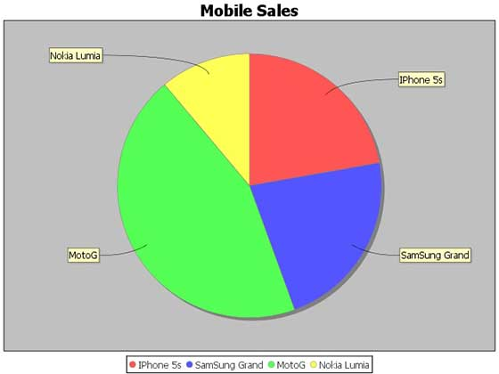

# JFreeChart饼图 - JFreeChart教程

在饼图中，每个扇区的弧长成正比它代表的数量。本章演示了如何使用JFreeChart 从一个给定的业务数据创建饼图。

## 业务数据

下面的例子描述了移动销售饼图。以下是不同移动品牌和销售(每天单位)列表。

| **S.N.** | **手机品牌** | **销售(天)** |
| --- | --- | --- |
| 1 | Iphone 5S | 20 |
| 2 | Samsung Grand | 20 |
| 3 | MOTO G | 40 |
| 4 | Nokia Lumia | 10 |

## 基于AWT 应用

以下是对从上述给定的信息创建饼图的代码。此代码可以帮助嵌入一个饼图在任何[AWT](http://www.yiibai.com/awt/ "awt") 应用程序。

```
import javax.swing.JPanel;
import org.jfree.chart.ChartFactory;
import org.jfree.chart.ChartPanel;
import org.jfree.chart.JFreeChart;
import org.jfree.data.general.DefaultPieDataset;
import org.jfree.data.general.PieDataset;
import org.jfree.ui.ApplicationFrame;
import org.jfree.ui.RefineryUtilities;

public class PieChart_AWT extends ApplicationFrame 
{
   public PieChart_AWT( String title ) 
   {
      super( title ); 
      setContentPane(createDemoPanel( ));
   }
   private static PieDataset createDataset( ) 
   {
      DefaultPieDataset dataset = new DefaultPieDataset( );
      dataset.setValue( "IPhone 5s" , new Double( 20 ) );  
      dataset.setValue( "SamSung Grand" , new Double( 20 ) );   
      dataset.setValue( "MotoG" , new Double( 40 ) );    
      dataset.setValue( "Nokia Lumia" , new Double( 10 ) );  
      return dataset;         
   }
   private static JFreeChart createChart( PieDataset dataset )
   {
      JFreeChart chart = ChartFactory.createPieChart(      
         "Mobile Sales",  // chart title 
         dataset,        // data    
         true,           // include legend   
         true, 
         false);

      return chart;
   }
   public static JPanel createDemoPanel( )
   {
      JFreeChart chart = createChart(createDataset( ) );  
      return new ChartPanel( chart ); 
   }
   public static void main( String[ ] args )
   {
      PieChart_AWT demo = new PieChart_AWT( "Mobile Sales" );  
      demo.setSize( 560 , 367 );    
      RefineryUtilities.centerFrameOnScreen( demo );    
      demo.setVisible( true ); 
   }
}

```

让我们继续上面PieChart_AWT.java文件中的Java代码，然后从命令提示符下编译并运行它，如下所示：

```
$javac PieChart_AWT.java 
$java PieChart_AWT 

```

如果一切顺利，它会编译并运行生成以下饼图：



如果不需要在应用程序嵌入图表中，那么可以在命令提示符下创建图表的图像。 JFreeChart允许以JPG或PNG格式保存图表图像。

## JPEG创建图像

让我们重新写上面的例子，生成命令行JPEG图像。以下是通过JFreeChart库，按要求提供两个API，用它来生成PNG或JPEG图像。

*   saveChartAsPNG() - API用来保存图像为PNG格式。

*   saveChartAsJPEG() - API用来保存图像JPEG格式。

```
import java.io.*;
import org.jfree.chart.ChartUtilities;
import org.jfree.chart.ChartFactory;
import org.jfree.chart.JFreeChart;
import org.jfree.data.general.DefaultPieDataset;

public class PieChart {
   public static void main( String[ ] args ) throws Exception
   {

      DefaultPieDataset dataset = new DefaultPieDataset( );
      dataset.setValue("IPhone 5s", new Double( 20 ) );
      dataset.setValue("SamSung Grand", new Double( 20 ) );
      dataset.setValue("MotoG", new Double( 40 ) );
      dataset.setValue("Nokia Lumia", new Double( 10 ) );

      JFreeChart chart = ChartFactory.createPieChart(
         "Mobile Sales", // chart title
         dataset, // data
         true, // include legend
         true,
         false);

      int width = 640; /* Width of the image */
      int height = 480; /* Height of the image */ 
      File pieChart = new File( "PieChart.jpeg" ); 
      ChartUtilities.saveChartAsJPEG( pieChart , chart , width , height );
   }
}

```

保持PieChart.java文件中如上面的Java代码，然后从命令提示符下编译并运行它，如下所示：

```
$javac PieChart.java 
$java PieChart 

```

如果一切顺利，它会编译并运行在当前的目录中创建JPEG图像文件为namedPieChart.jpeg。

