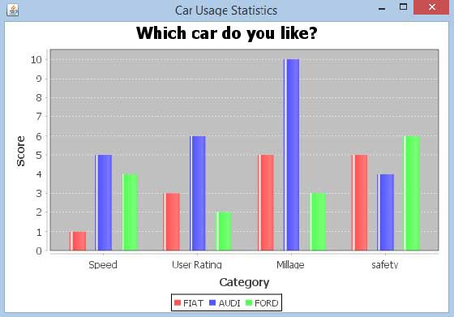

# JFreeChart条形图 - JFreeChart教程

本章演示了如何使用JFreeChart从一个给定的业务数据创建条形图。

条形图使用不同的方位(水平或垂直)条，以显示不同类别的比较。图表中的一个轴(域轴)示出了特定的域进行比较，并在另一个轴(范围轴)表示的离散值。

## 业务数据

下面的例子描述了各种汽车用统计柱状图。以下是汽车品牌以及它们的不同特点，我们将展示使用一个条形图的列表：

| 汽车 | 速度 | 用户评价 | 公里数 | 安全性 |
| --- | --- | --- | --- | --- |
| Fiat | 1.0 | 3.0 | 5.0 | 5.o |
| --- | --- | --- | --- | --- |
| Audi | 5.0 | 6.0 | 10.0 | 4.0 |
| --- | --- | --- | --- | --- |
| Ford | 4.0 | 2.0 | 3.0 | 6.0 |
| --- | --- | --- | --- | --- |

## 基于AWT的应用

以下是对从上述给定的信息创建条形图的代码。此代码可以在AWT的应用程序嵌入一个条形图。

```
import org.jfree.chart.ChartFactory;
import org.jfree.chart.ChartPanel; 
import org.jfree.chart.JFreeChart; 
import org.jfree.chart.plot.PlotOrientation;
import org.jfree.data.category.CategoryDataset; 
import org.jfree.data.category.DefaultCategoryDataset; 
import org.jfree.ui.ApplicationFrame; 
import org.jfree.ui.RefineryUtilities; 

public class BarChart_AWT extends ApplicationFrame
{
   public BarChart_AWT( String applicationTitle , String chartTitle )
   {
      super( applicationTitle );        
      JFreeChart barChart = ChartFactory.createBarChart(
         chartTitle,           
         "Category",            
         "Score",            
         createDataset(),          
         PlotOrientation.VERTICAL,           
         true, true, false);

      ChartPanel chartPanel = new ChartPanel( barChart );        
      chartPanel.setPreferredSize(new java.awt.Dimension( 560 , 367 ) );        
      setContentPane( chartPanel ); 
   }
   private CategoryDataset createDataset( )
   {
      final String fiat = "FIAT";        
      final String audi = "AUDI";        
      final String ford = "FORD";        
      final String speed = "Speed";        
      final String millage = "Millage";        
      final String userrating = "User Rating";        
      final String safety = "safety";        
      final DefaultCategoryDataset dataset = 
      new DefaultCategoryDataset( );  

      dataset.addValue( 1.0 , fiat , speed );        
      dataset.addValue( 3.0 , fiat , userrating );        
      dataset.addValue( 5.0 , fiat , millage ); 
      dataset.addValue( 5.0 , fiat , safety );           

      dataset.addValue( 5.0 , audi , speed );        
      dataset.addValue( 6.0 , audi , userrating );       
      dataset.addValue( 10.0 , audi , millage );        
      dataset.addValue( 4.0 , audi , safety );

      dataset.addValue( 4.0 , ford , speed );        
      dataset.addValue( 2.0 , ford , userrating );        
      dataset.addValue( 3.0 , ford , millage );        
      dataset.addValue( 6.0 , ford , safety );               

      return dataset; 
   }
   public static void main( String[ ] args )
   {
      BarChart_AWT chart = new BarChart_AWT("Car Usage Statistics", "Which car do you like?);
      chart.pack( );        
      RefineryUtilities.centerFrameOnScreen( chart );        
      chart.setVisible( true ); 
   }
}
```

保持BarChart_AWT.java文件中的Java代码，然后从命令提示符下编译并运行它，如下所示：

```
$javac BarChar_AWT.java 
$java BarChart_AWT 

```

如果一切顺利，它会编译并运行生成以下条形图：



## JPEG创建图像

让我们重新写上面的例子中，使用命令行生成JPEG图像。

```
import java.io.*;
import org.jfree.chart.ChartFactory;
import org.jfree.chart.JFreeChart;
import org.jfree.chart.plot.PlotOrientation;
import org.jfree.data.category.DefaultCategoryDataset;
import org.jfree.chart.ChartUtilities;

public class BarChart
{
   public static void main( String[ ] args )throws Exception 
   {

      final String fiat = "FIAT";
      final String audi = "AUDI";
      final String ford = "FORD";
      final String speed = "Speed";
      final String millage = "Millage";
      final String userrating = "User Rating";
      final String safety = "safety";

      final DefaultCategoryDataset dataset = new DefaultCategoryDataset( );

      dataset.addValue( 1.0 , fiat , speed );
      dataset.addValue( 3.0 , fiat , userrating );
      dataset.addValue( 5.0 , fiat , millage );
      dataset.addValue( 5.0 , fiat , safety );

      dataset.addValue( 5.0 , audi , speed );
      dataset.addValue( 6.0 , audi , userrating );
      dataset.addValue( 10.0 , audi , millage );
      dataset.addValue( 4.0 , audi , safety );

      dataset.addValue( 4.0 , ford , speed );
      dataset.addValue( 2.0 , ford , userrating );
      dataset.addValue( 3.0 , ford , millage );
      dataset.addValue( 6.0 , ford , safety );

      JFreeChart barChart = ChartFactory.createBarChart(
         "CAR USAGE STATIStICS", 
         "Category", "Score", 
         dataset,PlotOrientation.VERTICAL, 
         true, true, false);

      int width = 640; /* Width of the image */
      int height = 480; /* Height of the image */ 
      File BarChart = new File( "BarChart.jpeg" ); 
      ChartUtilities.saveChartAsJPEG( BarChart , barChart , width , height );
   }
}
```

保存BarChart.java文件中如上面的Java代码，然后从命令提示符下编译并运行它，如下所示：

```
$javac BarChart.java 
$java BarChart 

```

如果一切顺利，它会编译并运行在当前的目录中创建JPEG图像文件namedBarChart.jpeg

