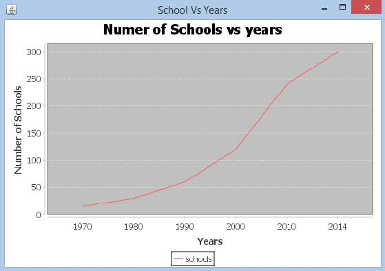

# JFreeChart线型图 - JFreeChart教程

线图或折线图来显示信息为一系列由直线段连接的数据点(标记)。线图显示数据在相同的时间频率如何变化。本章从一个给定的业务数据演示如何使用JFreeChart创建线型图。

## 业务数据

下面的示例绘制折线图显示从1970年开始学校在不同年份开通数量。

给定的数据如下：

| 年份 | 学校数量 |
| --- | --- |
| 1970 | 15 |
| 1980 | 30 |
| 1990 | 60 |
| 2000 | 120 |
| 2013 | 240 |
| 2014 | 300 |

## 基于AWT的应用

以下是对从上述给定的信息创建线型图的代码。此代码可以帮助在AWT的应用程序嵌入一个折线图。

```
import org.jfree.chart.ChartPanel;
import org.jfree.chart.ChartFactory;
import org.jfree.chart.JFreeChart;
import org.jfree.ui.ApplicationFrame;
import org.jfree.ui.RefineryUtilities;
import org.jfree.chart.plot.PlotOrientation;
import org.jfree.data.category.DefaultCategoryDataset;

public class LineChart_AWT extends ApplicationFrame
{
   public LineChart_AWT( String applicationTitle , String chartTitle )
   {
      super(applicationTitle);
      JFreeChart lineChart = ChartFactory.createLineChart(
         chartTitle,
         "Years","Number of Schools",
         createDataset(),
         PlotOrientation.VERTICAL,
         true,true,false);

      ChartPanel chartPanel = new ChartPanel( lineChart );
      chartPanel.setPreferredSize( new java.awt.Dimension( 560 , 367 ) );
      setContentPane( chartPanel );
   }

   private DefaultCategoryDataset createDataset( )
   {
      DefaultCategoryDataset dataset = new DefaultCategoryDataset( );
      dataset.addValue( 15 , "schools" , "1970" );
      dataset.addValue( 30 , "schools" , "1980" );
      dataset.addValue( 60 , "schools" ,  "1990" );
      dataset.addValue( 120 , "schools" , "2000" );
      dataset.addValue( 240 , "schools" , "2010" );
      dataset.addValue( 300 , "schools" , "2014" );
      return dataset;
   }
   public static void main( String[ ] args ) 
   {
      LineChart_AWT chart = new LineChart_AWT(
      "School Vs Years" ,
      "Numer of Schools vs years");

      chart.pack( );
      RefineryUtilities.centerFrameOnScreen( chart );
      chart.setVisible( true );
   }
}
```

保存LineChart_AWT.java文件如上面的Java代码，然后从命令提示符下编译并运行它，如下所示：

```
$javac LineChart_AWT.java 
$java LineChart_AWT 

```

如果一切顺利，它会编译并运行生成以下线图：



## 创建JPEG图像

让我们重新编写上面的例子，在命令行执行生成JPEG图像。

```
import java.io.*;
import org.jfree.chart.JFreeChart; 
import org.jfree.chart.ChartFactory; 
import org.jfree.chart.ChartUtilities; 
import org.jfree.chart.plot.PlotOrientation;
import org.jfree.data.category.DefaultCategoryDataset;

public class LineChart
{
   public static void main( String[ ] args ) throws Exception
   {
      DefaultCategoryDataset line_chart_dataset = new DefaultCategoryDataset();
      line_chart_dataset.addValue( 15 , "schools" , "1970" );
      line_chart_dataset.addValue( 30 , "schools" , "1980" );
      line_chart_dataset.addValue( 60 , "schools" , "1990" );
      line_chart_dataset.addValue( 120 , "schools" , "2000" );
      line_chart_dataset.addValue( 240 , "schools" , "2010" ); 
      line_chart_dataset.addValue( 300 , "schools" , "2014" );

      JFreeChart lineChartObject = ChartFactory.createLineChart(
         "Schools Vs Years","Year",
         "Schools Count",
         line_chart_dataset,PlotOrientation.VERTICAL,
         true,true,false);

      int width = 640; /* Width of the image */
      int height = 480; /* Height of the image */ 
      File lineChart = new File( "LineChart.jpeg" ); 
      ChartUtilities.saveChartAsJPEG(lineChart ,lineChartObject, width ,height);
   }
}
```

让我们保存LineChart.java文件如上面的Java代码，然后从命令提示符下编译并运行它，如下所示：

```
$javac LineChart.java 
$java LineChart 

```

如果一切顺利，它将编译和执行在当前的目录中创建JPEG图像文件namedLineChart.jpeg。

