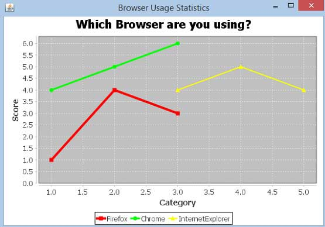

# JFreeChart XY图 - JFreeChart教程

在xy图(散点图)是根据一个数据系列组成的x和y值的列表。每个值对(x，y)是坐标系中的一个点。这里1值确定水平(X)位置，而另一个确定垂直(Y)位置。本章演示了如何使用JFreeChart从一个给定的业务数据创建XY图表。

## 业务数据

考虑这种情况，我们要创建一个XY图表所有主要浏览器的一个例子。在这里，不同的性能分数是从不同类型的人们聚集，如下所示：

| Firefox | Category(X) | Score(Y) |
| --- | --- | --- |
| 1.0 | 1.0 |
| 2.0 | 4.0 |
| 3.0 | 3.0 |

| Chrome | Category(X) | Score(Y) |
| --- | --- | --- |
| 1.0 | 4.0 |
| 2.0 | 5.0 |
| 3.0 | 6.0 |

| IE | Category(X) | Score(Y) |
| --- | --- | --- |
| 3.0 | 4.0 |
| 4.0 | 5.0 |
| 5.0 | 4.0 |

## 基于AWT的应用

以下是对从上述给定的信息创建XY图表的代码。此代码可以在AWT应用程序嵌入一个XY图表。

```
import java.awt.Color; 
import java.awt.BasicStroke; 
import org.jfree.chart.ChartPanel; 
import org.jfree.chart.JFreeChart; 
import org.jfree.data.xy.XYDataset; 
import org.jfree.data.xy.XYSeries; 
import org.jfree.ui.ApplicationFrame; 
import org.jfree.ui.RefineryUtilities; 
import org.jfree.chart.plot.XYPlot; 
import org.jfree.chart.ChartFactory; 
import org.jfree.chart.plot.PlotOrientation; 
import org.jfree.data.xy.XYSeriesCollection; 
import org.jfree.chart.renderer.xy.XYLineAndShapeRenderer;

public class XYLineChart_AWT extends ApplicationFrame 
{
   public XYLineChart_AWT( String applicationTitle, String chartTitle )
   {
      super(applicationTitle);
      JFreeChart xylineChart = ChartFactory.createXYLineChart(
         chartTitle ,
         "Category" ,
         "Score" ,
         createDataset() ,
         PlotOrientation.VERTICAL ,
         true , true , false);

      ChartPanel chartPanel = new ChartPanel( xylineChart );
      chartPanel.setPreferredSize( new java.awt.Dimension( 560 , 367 ) );
      final XYPlot plot = xylineChart.getXYPlot( );
      XYLineAndShapeRenderer renderer = new XYLineAndShapeRenderer( );
      renderer.setSeriesPaint( 0 , Color.RED );
      renderer.setSeriesPaint( 1 , Color.GREEN );
      renderer.setSeriesPaint( 2 , Color.YELLOW );
      renderer.setSeriesStroke( 0 , new BasicStroke( 4.0f ) );
      renderer.setSeriesStroke( 1 , new BasicStroke( 3.0f ) );
      renderer.setSeriesStroke( 2 , new BasicStroke( 2.0f ) );
      plot.setRenderer( renderer ); 
      setContentPane( chartPanel ); 
   }

   private XYDataset createDataset( )
   {
      final XYSeries firefox = new XYSeries( "Firefox" );          
      firefox.add( 1.0 , 1.0 );          
      firefox.add( 2.0 , 4.0 );          
      firefox.add( 3.0 , 3.0 );          
      final XYSeries chrome = new XYSeries( "Chrome" );          
      chrome.add( 1.0 , 4.0 );          
      chrome.add( 2.0 , 5.0 );          
      chrome.add( 3.0 , 6.0 );          
      final XYSeries iexplorer = new XYSeries( "InternetExplorer" );          
      iexplorer.add( 3.0 , 4.0 );          
      iexplorer.add( 4.0 , 5.0 );          
      iexplorer.add( 5.0 , 4.0 );          
      final XYSeriesCollection dataset = new XYSeriesCollection( );          
      dataset.addSeries( firefox );          
      dataset.addSeries( chrome );          
      dataset.addSeries( iexplorer );
      return dataset;
   }

   public static void main( String[ ] args ) 
   {
      XYLineChart_AWT chart = new XYLineChart_AWT("Browser Usage Statistics", "Which Browser are you using?");
      chart.pack( );          
      RefineryUtilities.centerFrameOnScreen( chart );          
      chart.setVisible( true ); 
   }
}
```

让我们保存XYLineChart_AWT.java文件如上面的Java代码，然后从命令提示符下编译并运行它，如下所示：

```
$javac XYLineChart_AWT.java 
$java XYLineChart_AWT 

```

如果一切顺利，它会编译并运行生成以下XY图：



## 创建JPEG图像

让我们重新编写上面的例子，在命令行生成JPEG图像。

```
import java.io.*;
import org.jfree.chart.ChartFactory;
import org.jfree.chart.JFreeChart;
import org.jfree.data.xy.XYSeries;
import org.jfree.chart.plot.PlotOrientation;
import org.jfree.data.xy.XYSeriesCollection;
import org.jfree.chart.ChartUtilities; 

public class XYLineChart_image
{
   public static void main( String[ ] args )throws Exception
   {
      final XYSeries firefox = new XYSeries( "Firefox" );
      firefox.add( 1.0 , 1.0 );
      firefox.add( 2.0 , 4.0 );
      firefox.add( 3.0 , 3.0 );
      final XYSeries chrome = new XYSeries( "Chrome" );
      chrome.add( 1.0 , 4.0 );
      chrome.add( 2.0 , 5.0 );
      chrome.add( 3.0 , 6.0 );
      final XYSeries iexplorer = new XYSeries( "InternetExplorer" );
      iexplorer.add( 3.0 , 4.0 );
      iexplorer.add( 4.0 , 5.0 );
      iexplorer.add( 5.0 , 4.0 );
      final XYSeriesCollection dataset = new XYSeriesCollection( );
      dataset.addSeries( firefox );
      dataset.addSeries( chrome );
      dataset.addSeries( iexplorer );

      JFreeChart xylineChart = ChartFactory.createXYLineChart(
         "Browser usage statastics", 
         "Category",
         "Score", 
         dataset,
         PlotOrientation.VERTICAL, 
         true, true, false);

      int width = 640; /* Width of the image */
      int height = 480; /* Height of the image */ 
      File XYChart = new File( "XYLineChart.jpeg" ); 
      ChartUtilities.saveChartAsJPEG( XYChart, xylineChart, width, height);
   }
}
```

让我们保存在XYLineChart_image.java文件如上面的Java代码，然后从命令提示符下编译并运行它，如下所示：

```
$javac XYLineChart_image.java 
$java XYLineChart_image 

```

如果一切顺利，它会编译并运行在当前的目录中创建JPEG图像文件namedXYLineChart.jpeg。

