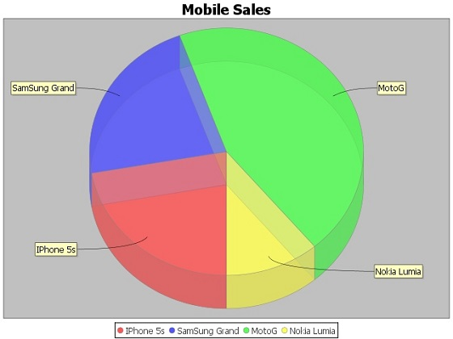
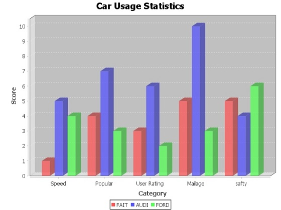

# JFreeChart 3D饼图/条形图 - JFreeChart教程

三维/3D图表是那些显示在一个三维格式。可以使用这些图表来提供更好的显示效果和清晰的信息。三维/3D饼图是饼图另外一个不错的3D效果。 3D效果可以通过添加一些额外的代码来实现，它会创建一个饼图3D效果。

## 3D饼图

请看下面的例子来描述移动销售三维饼图。以下是不同移动品牌和销售(每天)名单。

| S.N. | 手机品牌 | 销量 (天) |
| --- | --- | --- |
| 1 | Iphone 5S | 20 |
| 2 | Samsung Grand | 20 |
| 3 | MOTO G | 40 |
| 4 | Nokia Lumia | 10 |

以下是对从上述给定的信息创建3D饼图的代码。此代码可以帮助嵌入一个饼图在AWT应用程序中。

```
import java.io.*; 
import org.jfree.chart.ChartFactory; 
import org.jfree.chart.JFreeChart; 
import org.jfree.chart.plot.PiePlot3D; 
import org.jfree.data.general.DefaultPieDataset; 
import org.jfree.chart.ChartUtilities;

public class PieChart3D 
{
   public static void main( String[ ] args )throws Exception 
   {
      DefaultPieDataset dataset = new DefaultPieDataset( );             
      dataset.setValue( "IPhone 5s" , new Double( 20 ) );             
      dataset.setValue( "SamSung Grand" , new Double( 20 ) );             
      dataset.setValue( "MotoG" , new Double( 40 ) );             
      dataset.setValue( "Nokia Lumia" , new Double( 10 ) ); 

      JFreeChart chart = ChartFactory.createPieChart3D( 
         "Mobile Sales" ,  // chart title                   
         dataset ,         // data 
         true ,            // include legend                   
         true, 
         false);

      final PiePlot3D plot = ( PiePlot3D ) chart.getPlot( );             
      plot.setStartAngle( 270 );             
      plot.setForegroundAlpha( 0.60f );             
      plot.setInteriorGap( 0.02 );             
      int width = 640; /* Width of the image */             
      int height = 480; /* Height of the image */                             
      File pieChart3D = new File( "pie_Chart3D.jpeg" );                           
      ChartUtilities.saveChartAsJPEG( pieChart3D , chart , width , height );   
   }
}

```

让我们保存在PieChart3D.java文件如上面的Java代码，然后从命令提示符下编译并运行它，如下所示：

```
$javac PieChart3D.java 
$java PieChart3D 

```

如果一切顺利，它会编译并运行，以创建一个名为PieChart3D.jpeg 如以下3D饼图JPEG图像文件：



## 3D条形图

三维条形图是一样的条形图另外一个不错的3D效果。 3D效果可以通过添加一些额外的代码来实现，它会创建一个柱形图3D效果。看看下面的例子，描绘各种汽车的统计数据3D条形图。以下是汽车品牌以及它们的不同特点，我们将展示使用一个条形图的列表：

| Car | Speed | User Rating | Millage | Safety |
| --- | --- | --- | --- | --- |
| FIAT | 1.0 | 3.0 | 5.0 | 5.o |
| --- | --- | --- | --- | --- |
| AUDI | 5.0 | 6.0 | 10.0 | 4.0 |
| --- | --- | --- | --- | --- |
| FORD | 4.0 | 2.0 | 3.0 | 6.0 |
| --- | --- | --- | --- | --- |

下面的代码从上面给出的信息来创建3D条形图。此代码可以帮助嵌入一个条形图在AWT应用程序中。

```
import java.io.*; 
import org.jfree.chart.ChartFactory; 
import org.jfree.chart.JFreeChart; 
import org.jfree.chart.plot.PlotOrientation; 
import org.jfree.data.category.DefaultCategoryDataset; 
import org.jfree.chart.ChartUtilities; 

public class BarChart3D
{
   public static void main( String[ ] args )throws Exception 
   {
      final String fait = "FAIT";              
      final String audi = "AUDI";              
      final String ford = "FORD";              
      final String speed = "Speed";              
      final String popular = "Popular";              
      final String mailage = "Mailage";              
      final String userrating = "User Rating";              
      final String safty = "safty";        
      final DefaultCategoryDataset dataset = new DefaultCategoryDataset( ); 

      dataset.addValue( 1.0 , fait , speed );              
      dataset.addValue( 4.0 , fait , popular );              
      dataset.addValue( 3.0 , fait , userrating );              
      dataset.addValue( 5.0 , fait , mailage );              
      dataset.addValue( 5.0 , fait , safty );              
      dataset.addValue( 5.0 , audi , speed );              
      dataset.addValue( 7.0 , audi , popular );              
      dataset.addValue( 6.0 , audi , userrating );              
      dataset.addValue( 10.0 , audi , mailage );              
      dataset.addValue( 4.0 , audi , safty ); 
      dataset.addValue( 4.0 , ford , speed );              
      dataset.addValue( 3.0 , ford , popular );              
      dataset.addValue( 2.0 , ford , userrating );              
      dataset.addValue( 3.0 , ford , mailage );              
      dataset.addValue( 6.0 , ford , safty );                 
      JFreeChart barChart = ChartFactory.createBarChart3D(
         "Car Usage Statistics",             
         "Category",             
         "Score",             
         dataset,            
         PlotOrientation.VERTICAL,             
         true, true, false);

      int width = 640; /* Width of the image */              
      int height = 480; /* Height of the image */                              
      File barChart3D = new File( "barChart3D.jpeg" );                            
      ChartUtilities.saveChartAsJPEG( barChart3D, barChart, width, height);
   }
}

```

让我们保存在BarChart3D.java文件如上面的Java代码，然后从命令提示符下编译并运行它，如下所示：

```
$javac BarChart3D.java 
$java BarChart3

```

如果一切正常，它会编译并运行创建的JPEG图像fileBarChart3D.jpeg，具有下列3D条形图：



