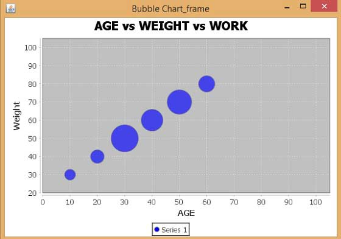

# JFreeChart气泡图表 - JFreeChart教程

本章演示如何使用JFreeChart从一个给定的业务数据创建气泡图表。使用气泡图显示在三维方式的信息。气泡绘制在其中(x，y)坐标相交的地方。气泡的大小被认为是范围或X和Y轴的数量。

## 业务数据

考虑不同的人的年龄，体重和工作能力可能不太相同。能力可以视为对该被绘制为图表中的气泡的小时数。


| AGE | 30 | 40 | 50 | 60 | 70 | 80 |
| --- | --- | --- | --- | --- | --- | --- | --- | --- |
| 10 | 4 | WORK |
| 20 | 5 |
| 30 | 10 |
| 40 | 8 |
| 50 | 9 |
| 60 | 6 |

## 基于AWT的应用

以下是对从上述给定的信息创建气泡图表的代码。此代码可以帮助嵌入一个气泡图在AWT应用程序。

```
import java.awt.Color;
import java.awt.Dimension;
import javax.swing.JPanel;
import org.jfree.chart.*;
import org.jfree.chart.axis.NumberAxis;
import org.jfree.chart.plot.PlotOrientation;
import org.jfree.chart.plot.XYPlot;
import org.jfree.chart.renderer.xy.XYItemRenderer;
import org.jfree.data.xy.DefaultXYZDataset;
import org.jfree.data.xy.XYZDataset;
import org.jfree.ui.ApplicationFrame;
import org.jfree.ui.RefineryUtilities;

public class BubbleChart_AWT extends ApplicationFrame
{
   public BubbleChart_AWT( String s )
   {
      super( s );                 
      JPanel jpanel = createDemoPanel( );                 
      jpanel.setPreferredSize(new Dimension( 560 , 370 ) );                 
      setContentPane( jpanel );
   }

   private static JFreeChart createChart( XYZDataset xyzdataset )
   {
      JFreeChart jfreechart = ChartFactory.createBubbleChart(
         "AGE vs WEIGHT vs WORK",                    
         "Weight",                    
         "AGE",                    
         xyzdataset,                    
         PlotOrientation.HORIZONTAL,                    
         true, true, false);

      XYPlot xyplot = ( XYPlot )jfreechart.getPlot( );                 
      xyplot.setForegroundAlpha( 0.65F );                 
      XYItemRenderer xyitemrenderer = xyplot.getRenderer( );
      xyitemrenderer.setSeriesPaint( 0 , Color.blue );                 
      NumberAxis numberaxis = ( NumberAxis )xyplot.getDomainAxis( );                 
      numberaxis.setLowerMargin( 0.2 );                 
      numberaxis.setUpperMargin( 0.5 );                 
      NumberAxis numberaxis1 = ( NumberAxis )xyplot.getRangeAxis( );                 
      numberaxis1.setLowerMargin( 0.8 );                 
      numberaxis1.setUpperMargin( 0.9 );

      return jfreechart;
   }

   public static XYZDataset createDataset( )
   {
      DefaultXYZDataset defaultxyzdataset = new DefaultXYZDataset();

      double ad[ ] = { 30 , 40 , 50 , 60 , 70 , 80 };                 
      double ad1[ ] = { 10 , 20 , 30 , 40 , 50 , 60 };                 
      double ad2[ ] = { 4 , 5 , 10 , 8 , 9 , 6 };                 
      double ad3[][] = { ad , ad1 , ad2 };                 
      defaultxyzdataset.addSeries( "Series 1" , ad3 );

      return defaultxyzdataset;
   }

   public static JPanel createDemoPanel( )
   {
      JFreeChart jfreechart = createChart( createDataset( ) );                 
      ChartPanel chartpanel = new ChartPanel( jfreechart );

      chartpanel.setDomainZoomable( true );                 
      chartpanel.setRangeZoomable( true );

      return chartpanel;
   }

   public static void main( String args[ ] )
   {
      BubbleChart_AWT bubblechart = new BubbleChart_AWT( "Bubble Chart_frame" );   

      bubblechart.pack( );                 
      RefineryUtilities.centerFrameOnScreen( bubblechart );                 
      bubblechart.setVisible( true );
   }
}
```

让我们保存上面的Java代码在BubbleChart_AWT.java文件，然后从命令提示符下编译并运行它，如下所示：

```
$javac BubbleChart_AWT.java
$java BubbleChart_AW

```

如果一切顺利，它会编译并运行生成以下气泡图：



## 创建JPEG图像

让我们重新编写上面的例子，在命令行生成JPEG图像。

```
import java.io.*;
import java.awt.Color;
import org.jfree.chart.*;
import org.jfree.chart.axis.NumberAxis;
import org.jfree.chart.plot.PlotOrientation;
import org.jfree.chart.plot.XYPlot;
import org.jfree.chart.renderer.xy.XYItemRenderer;
import org.jfree.data.xy.DefaultXYZDataset;
import org.jfree.chart.ChartUtilities;

public class BubbleChart_image
{
   public static void main( String args[ ] )throws Exception
   {
      DefaultXYZDataset defaultxyzdataset = new DefaultXYZDataset( );
      double ad[ ] = { 30 , 40 , 50 , 60 , 70 , 80 };
      double ad1[ ] = { 10 , 20 , 30 , 40 , 50 , 60 };
      double ad2[ ] = { 4 , 5 , 10 , 8 , 9 , 6 };
      double ad3[ ][ ] = { ad , ad1 , ad2 };
      defaultxyzdataset.addSeries( "Series 1" , ad3 );

      JFreeChart jfreechart = ChartFactory.createBubbleChart(
         "AGE vs WEIGHT vs WORK",
         "Weight",
         "AGE",
         defaultxyzdataset,
         PlotOrientation.HORIZONTAL,
         true, true, false);

      XYPlot xyplot = ( XYPlot )jfreechart.getPlot( );
      xyplot.setForegroundAlpha( 0.65F );
      XYItemRenderer xyitemrenderer = xyplot.getRenderer( );
      xyitemrenderer.setSeriesPaint( 0 , Color.blue );
      NumberAxis numberaxis = ( NumberAxis )xyplot.getDomainAxis( );
      numberaxis.setLowerMargin( 0.2 );
      numberaxis.setUpperMargin( 0.5 );
      NumberAxis numberaxis1 = ( NumberAxis )xyplot.getRangeAxis( );
      numberaxis1.setLowerMargin( 0.8 );
      numberaxis1.setUpperMargin( 0.9 );

      int width = 560; /* Width of the image */
      int height = 370; /* Height of the image */
      File bubbleChart = new File("BubbleChart.jpeg");
      ChartUtilities.saveChartAsJPEG(bubbleChart,jfreechart,width,height);
   }
}
```

让我们保存上面的Java代码在BubbleChart_image.java文件，然后从命令提示符下编译并运行它，如下所示：

```
$javac BubbleChart_image.java
$java BubbleChart_image

```

如果一切顺利，它会编译并运行在当前的目录中创建的JPEG图像文件namedBubbleChart.jpeg。
