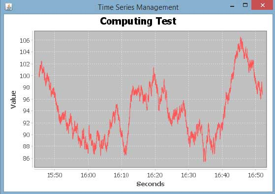

# JFreeChart时序图 - JFreeChart教程

时序图表显示的数据点在相等的时间间隔序列变化。本章演示了如何从一个给定的业务数据使用JFreeChart，建立时序图。

## 业务数据

让我们考虑通过使用标准 Java API 的 Math.random()产生的各种随机数。我们使用这些数字产生一个时间序列图。可以生成用于发生错误的总数在自己的网站给定的时间间隔类似的图表。

## 基于AWT的应用

下面是创建由Math.random()产生的数字时间的代码在给定时间内的序列图。

```
import org.jfree.chart.ChartFactory; 
import org.jfree.chart.ChartPanel; 
import org.jfree.chart.JFreeChart; 
import org.jfree.data.general.SeriesException; 
import org.jfree.data.time.Second; 
import org.jfree.data.time.TimeSeries; 
import org.jfree.data.time.TimeSeriesCollection; 
import org.jfree.data.xy.XYDataset; 
import org.jfree.ui.ApplicationFrame; 
import org.jfree.ui.RefineryUtilities;

public class TimeSeries_AWT extends ApplicationFrame 
{
   public TimeSeries_AWT( final String title )
   {
      super( title );         
      final XYDataset dataset = createDataset( );         
      final JFreeChart chart = createChart( dataset );         
      final ChartPanel chartPanel = new ChartPanel( chart );         
      chartPanel.setPreferredSize( new java.awt.Dimension( 560 , 370 ) );         
      chartPanel.setMouseZoomable( true , false );         
      setContentPane( chartPanel );
   }

   private XYDataset createDataset( ) 
   {
      final TimeSeries series = new TimeSeries( "Random Data" );         
      Second current = new Second( );         
      double value = 100.0;         
      for (int i = 0; i < 4000; i++)    
      {
         try 
         {
            value = value + Math.random( ) - 0.5;                 
            series.add(current, new Double( value ) );                 
            current = ( Second ) current.next( ); 
         }
         catch ( SeriesException e ) 
         {
            System.err.println("Error adding to series");
         }
      }

      return new TimeSeriesCollection(series);
   }     

   private JFreeChart createChart( final XYDataset dataset ) 
   {
      return ChartFactory.createTimeSeriesChart(             
      "Computing Test", 
      "Seconds",              
      "Value",              
      dataset,             
      false,              
      false,              
      false);
   }

   public static void main( final String[ ] args )
   {
      final String title = "Time Series Management";         
      final TimeSeries_AWT demo = new TimeSeries_AWT( title );         
      demo.pack( );         
      RefineryUtilities.positionFrameRandomly( demo );         
      demo.setVisible( true );
   }
}   
```

保存上面的Java代码在TimeSeries_AWT.java文件，然后从命令提示符下编译并运行它，如下所示：

```
$javac TimeSeries_AWT.java 
$java TImeSeries_AWT 

```

如果一切顺利，它会编译并运行生成以下时序图：



## 创建JPEG图像

让我们重新编写上面的例子，在命令行生成JPEG图像。

```
import java.io.*;
import org.jfree.chart.ChartFactory;
import org.jfree.chart.JFreeChart;
import org.jfree.data.general.SeriesException;
import org.jfree.data.time.Second;
import org.jfree.data.time.TimeSeries;
import org.jfree.data.time.TimeSeriesCollection;
import org.jfree.data.xy.XYDataset;
import org.jfree.chart.ChartUtilities;

public class TimeSeriesChart
{
   public static void main( final String[ ] args )throws Exception
   {
      final TimeSeries series = new TimeSeries( "Random Data" );
      Second current = new Second();
      double value = 100.0;
      for ( int i = 0 ; i < 4000 ; i++ )
      {
         try
         {
            value = value + Math.random( ) - 0.5;
            series.add( current , new Double( value ) );
            current = ( Second ) current.next( );
         }
         catch ( SeriesException e ) 
         {
            System.err.println( "Error adding to series" );
         }
      }
      final XYDataset dataset=( XYDataset )new TimeSeriesCollection(series);
      JFreeChart timechart = ChartFactory.createTimeSeriesChart(
         "Computing Test", 
         "Seconds", 
         "Value", 
         dataset,
         false, 
         false, 
         false);

      int width = 560; /* Width of the image */
      int height = 370; /* Height of the image */ 
      File timeChart = new File( "TimeChart.jpeg" ); 
      ChartUtilities.saveChartAsJPEG( timeChart, timechart, width, height );
   }
}
```

继续上面的Java代码保存在TimeSeriesChart.java文件中，然后从命令提示符下编译并运行它，如下所示：

```
$javac TimeSeriesChart.java 
$java TimeSeriesChart 

```

如果一切正常，它会编译并运行在当前的目录中创建JPEG图像文件TimeChart.jpeg文件。

