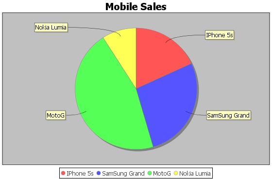

# JFreeChart文件接口 - JFreeChart教程

到目前为止，我们学习了如何使用静态数据的创建不同类型的JFreeChart API图表。但在生产环境中，数据被设置在文本文件的形式与一个预定义的格式，或者其直接来自数据库。

本章将解释如何我们可以看到从一个给定的位置给定的文本文件，一个简单的数据，然后使用JFreeChart创建图表。

## 业务数据

假设我们有一个文件名为mobile.txt，含有一个简单的逗号分隔不同的移动品牌和销售(每天单位)(，)：

```
Iphone 5S, 20  
Samsung Grand, 20  
MOTO G, 40  Nokia 
Lumia, 10 

```

## 基于文件图表生成

下面是基于文件 mobile.txt 提供的信息来创建一个饼图的代码：

```
import java.io.*; 
import java.util.StringTokenizer; 
import org.jfree.chart.ChartUtilities; 
import org.jfree.chart.ChartFactory; 
import org.jfree.chart.JFreeChart; 
import org.jfree.data.general.DefaultPieDataset;

public class PieChart_File 
{
   public static void main( String[ ] args )throws Exception
   {
      String mobilebrands[ ] = {    
        "IPhone 5s" ,   
        "SamSung Grand" ,   
        "MotoG" ,    
        "Nokia Lumia" 
      };

      InputStream in = new FileInputStream( new File( "C:/temp/test.txt" ) );          
      BufferedReader reader = new BufferedReader(new InputStreamReader(in ) );          
      StringBuilder out = new StringBuilder();          
      String line;          
      DefaultPieDataset dataset = new DefaultPieDataset();          

      while (( line = reader.readLine() ) != null ) 
      {
         out.append( line );
      }
      StringTokenizer s = new StringTokenizer( out.toString(), "," );
      int i=0;      
      while( s.hasMoreTokens( ) && ( mobilebrands [i] != null ) )
      {
         dataset.setValue(mobilebrands[i], Double.parseDouble( s.nextToken( ) ));
         i++;
      }
      JFreeChart chart = ChartFactory.createPieChart( 
         "Mobile Sales",  // chart title           
         dataset,         // data           
         true,            // include legend           
         true,           
         false);

      int width = 560; /* Width of the image */          
      int height = 370; /* Height of the image */                          
      File pieChart = new File( "pie_Chart.jpeg" );                        
      ChartUtilities.saveChartAsJPEG( pieChart, chart, width, height); 
   }
}
```

让我们保存上面的Java代码在PieChart_File.java文件，然后从命令提示符下编译并运行它，如下所示：

```
$javac PieChart_File.java 
$java PieChart_File 

```

如果一切顺利，它会编译并运行以创建包含下面的图表名为PieChart.jpegthat JPEG图像文件。



