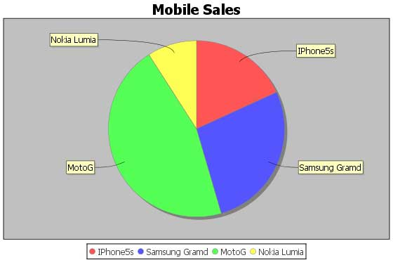

# JFreeChart数据库接口 - JFreeChart教程

本章介绍如何从数据库表中读取简单的数据，然后 JFreeChart 使用这些数据来创建图表。

## 业务数据

考虑到我们有如下的 [MySQL](http://www.yiibai.com/mysql/) 表 mobile_tbl(mobile_brand VARCHAR(100)NOT NULL，unit_sale INT NO NULL);

考虑这个表含有以下记录：

| 手机品牌 | 销售单位 |
| --- | --- |
| IPhone5S | 20 |
| Samsung Grand | 20 |
| MotoG | 40 |
| Nokia Lumia | 10 |

## 使用数据库数据生成图表

下面是创建一个基于MySQL数据库 mobile_tbl表 在数据库实例 TEST_DB 中提供的信息饼图的代码。根据需要，可以使用任何其他数据库。

```
import java.io.*; 
import java.sql.*; 
import org.jfree.chart.ChartUtilities;
import org.jfree.chart.ChartFactory; 
import org.jfree.chart.JFreeChart; 
import org.jfree.data.general.DefaultPieDataset;

public class PieChart_DB
{
   public static void main( String[ ] args )throws Exception
   {
      String mobilebrands[] = {
      "IPhone 5s",   
      "SamSung Grand",   
      "MotoG",            
      "Nokia Lumia" 
      };

      /* Create MySQL Database Connection */
      Class.forName( "com.mysql.jdbc.Driver" );
      Connection connect = DriverManager.getConnection( 
      "jdbc:mysql://localhost:3306/jf_testdb" ,     
      "root",     
      "root123");

      Statement statement = connect.createStatement( );
      ResultSet resultSet = statement.executeQuery("select * from dataset_tb" );
      DefaultPieDataset dataset = new DefaultPieDataset( );
      while( resultSet.next( ) ) 
      {
         dataset.setValue( 
         resultSet.getString( "brandname" ) ,
         Double.parseDouble( resultSet.getString( "datavalue" )));
      }
      JFreeChart chart = ChartFactory.createPieChart(
         "Mobile Sales",  // chart title           
         dataset,         // data           
         true,            // include legend          
         true,           
         false );

      int width = 560; /* Width of the image */
      int height = 370; /* Height of the image */ 
      File pieChart = new File( "Pie_Chart.jpeg" );
      ChartUtilities.saveChartAsJPEG( pieChart , chart , width , height );
   }
}
```

让我们保存上面的Java代码在PieChart_DB.java文件，然后从命令提示符下编译并运行它，如下所示：

```
$javac PieChart_DB.java 
$java PieChart_DB 

```

如果一切顺利，它会编译并运行并创建一个名为Pie_Chart.jpeghavingJPEG图像文件，如下图。



