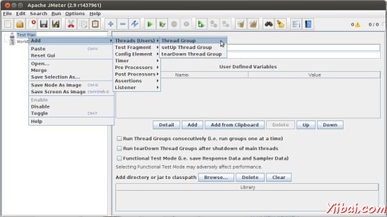
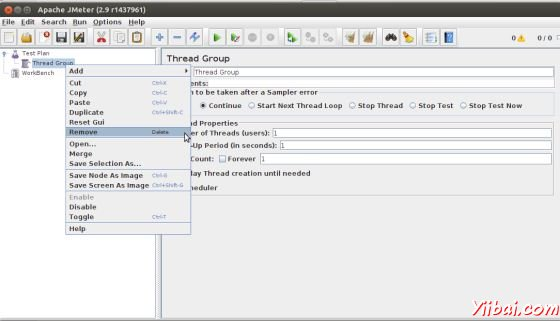
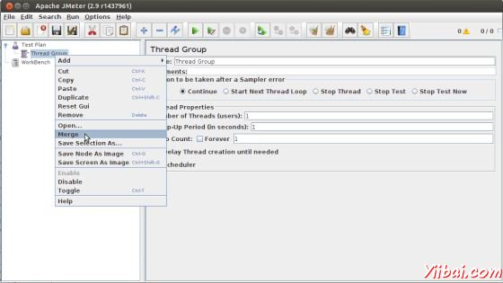
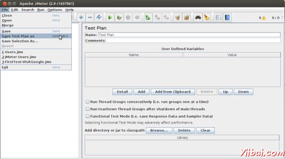
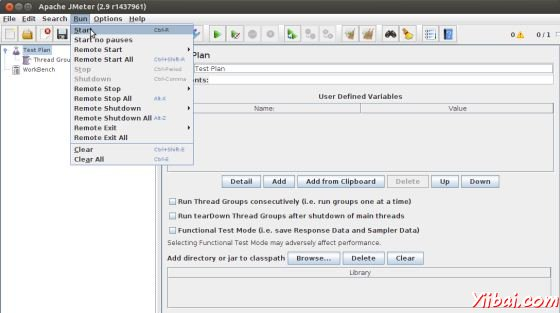

# JMeter创建测试计划 - JMeter教程

## 测试计划是什么？

测试计划定义如何和测试，并提供了一个布局。例如，Web应用程序以及客户端服务器应用程序。它可以被看作作为容器运行测试。一个完整的测试计划将包括一个或多个元素，如线程组，逻辑控制器，样品产生控制器，监听器，定时器，断言和配置元素。测试计划必须至少有一个线程组。在下一章中，我们将讨论这些元素的细节 [测试计划元素](http://www.yiibai.com/jmeter/jmeter_test_plan_elements.html).

按照下面的步骤来写一个测试计划：

### 启动JMeter窗口

打开JMeter窗口通过点击 /home/manisha/apache-jmeter-2.9/bin/jmeter.sh。 JMeter窗口会出现如下图：

这个JMeter窗口什么都还没有添加。上述窗口的详细信息如下：

*   保持真正的测试计划，测试计划节点。

*   工作台节点只是提供了一个地方暂时存放在不使用时，测试元素复制/粘贴的目的。当您保存测试计划，工作台项目将不保存它。

### 添加/删除元素

通过右键点击测试计划节点，并从“add”列表中选择一个新的元素，元素（将在下一章测试计划要素讨论），可以添加一个测试计划。

另外，元素可以从文件中加载，并通过选择“merge”或“open”选项添加。

例如，让我们添加一个线程组元件测试计划如下所示：

要删除一个元素，确保元素被选中，右键单击该元素，然后选择“remove”选项。 

### 加载和保存元素

从文件加载一个元素，右键单击您要添加的加载元件对现有树元素，并选择“merge”选项。选择文件保存元素。 JMeter会合并的元素，放到树上。

为了保存树元素，元素上点击右键并选择选择另存为...选项。 JMeter会保存选定的元素，再加上它下面的所有子元素。默认情况下，不保存JMeter 的元素，需要明确地保存它，如前面提到的。

### 配置树元素

目前在JMeter 右手帧的控制，可配置的测试计划中的任何元素。这些控件允许配置特定的测试元件的行为。例如线程组可配置的用户数量上升期等如下：

### 保存测试计划

您可以保存整个测试计划，可以通过使用“Save ”或“Save Test Plan As ....”从“文件”菜单。

### 运行一个测试计划

您可以运行您的测试计划从Run菜单项中选择“Start ”（控制+ R）。当运行JMeter是，它显示了一个绿色的小盒子，右手端的部分，只是在菜单栏下。

左侧的绿色方块的数字是活动线程/线程总数的数量。这些只适用于本地运行的测试，他们不包括任何远程系统上使用客户 - 服务器模式时启动的线程。

### 停止测试

停止测试方法有两种：

*   使用stop（Control + '.'）。这立即停止线程如果可能的话。

*   使用shutdown（Control + ','）。这就要求线程停止在任何当前工作的结束。

