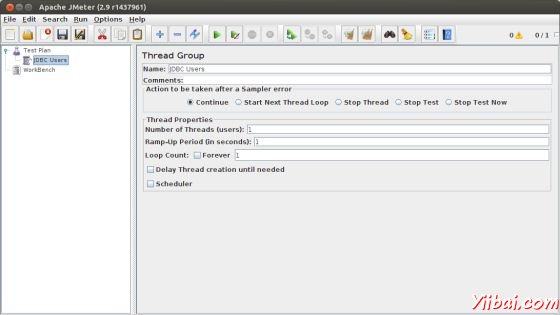
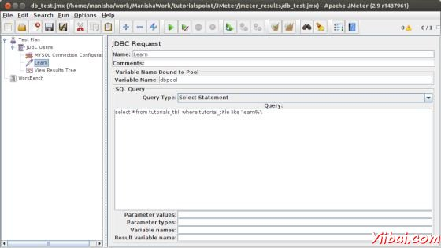
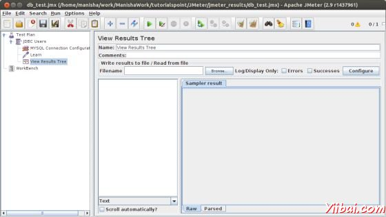
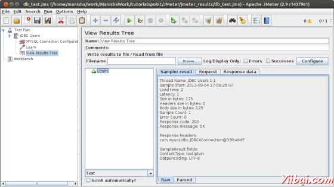
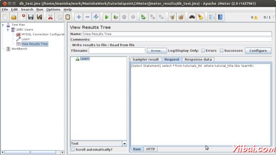
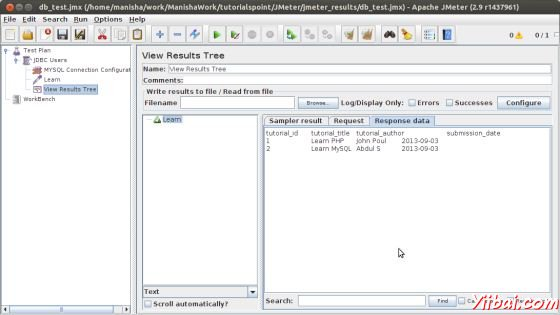

# JMeter数据库测试计划 - JMeter教程

在本章中，我们将看到如何创建一个简单的测试计划，测试数据库服务器。对于我们的测试目的，我们使用MySQL数据库服务器。您可以使用任何其他数据库进行测试。MYSQ的安装和创建表，请参阅 [MYSQL教程](http://www.yiibai.com/mysql/index.html)。

安装MySQL以后，请按照以下步骤设置数据库：

*   创建一个数据库名称 "tutorial".

*   创建一个表 tutorials_tbl.

*   插入记录到 tutorials_tbl :

    ```
    mysql&gt; use TUTORIALS;
    Database changed
    mysql&gt; INSERT INTO tutorials_tbl 
         -&gt;(tutorial_title, tutorial_author, submission_date)
         -&gt;VALUES
         -&gt;("Learn PHP", "John Poul", NOW());
    Query OK, 1 row affected (0.01 sec)
    mysql&gt; INSERT INTO tutorials_tbl
         -&gt;(tutorial_title, tutorial_author, submission_date)
         -&gt;VALUES
         -&gt;("Learn MySQL", "Abdul S", NOW());
    Query OK, 1 row affected (0.01 sec)
    mysql&gt; INSERT INTO tutorials_tbl
         -&gt;(tutorial_title, tutorial_author, submission_date)
         -&gt;VALUES
         -&gt;("JAVA Tutorial", "Sanjay", '2007-05-06');
    Query OK, 1 row affected (0.01 sec)
    mysql&gt;
    ```

*   复制JDBC驱动程序到 /home/manisha/apache-jmeter-2.9/lib.

## 创建JMeter测试计划

首先，让我们启动JMeter  /home/manisha/apache-jmeter-2.9/bin/jmeter.sh.

### 添加用户

现在，创建一个线程组，右键点击 Test Plan &gt; Add&gt; Threads(Users)&gt; Thread Group. 根据测试计划节点将添加线程组。重命名此线程为JDBC用户。



我们不会改变线程组的默认属性。

### 添加JDBC请求

现在，我们已经定义了我们的用户，它是时间来定义，他们将要执行的任务。在本节中将指定JDBC请求执行。 JDBC Users元件上右击，选择 Add > Config Element > JDBC Connection Configuration.

设置以下字段（我们使用的是MySQL数据库教程）：

*   变量名绑定到池。这需要唯一地标识该配置。它是用来由JDBC采样器，以确定要使用的配置。作为测试，我们把它命名为 test

*   Database URL: jdbc:mysql://localhost:3306/tutorial

*   JDBC Driver class: com.mysql.jdbc.Driver

*   用户名: root

*   密码: root的密码

在屏幕上的其他领域，可以留为默认值，如下所示：


添加一个JDBC请求是指上面定义的JDBC配置池。选择JDBC Users元件，单击鼠标右键得到添加菜单，然后选择 Add &gt; Sampler &gt; JDBC Request. 然后，选择这个新的元素，以查看它的控制面板。编辑属性如下：

*   变量名绑定到池。这需要唯一地标识该配置。它是用来由JDBC采样器，以确定要使用的配置。我们将其命名为 test

*   Name: Learn

*   Enter the Pool Name: test (same as in the configuration element)

*   Query Type: Select statement

*   Enter the SQL Query String field.



### 创建侦听器

现在添加Listener元素。此元素负责存储所有JDBC请求的结果，在一个文件中，并呈现出可视化的数据模型。

选择JDBC Users元件，并添加一个查看结果树监听器(Add &gt; Listener &gt; View Results Tree).



### 保存并执行测试计划

现在保存的以上测试计划db_test.jmx。执行本测试计划使用 Run &gt; Start 选项.

### 校验输出



在最后图像，可以看到，2条记录被选择。

