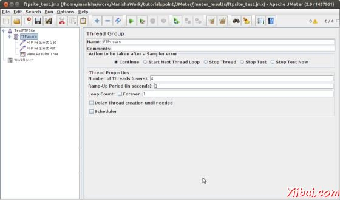
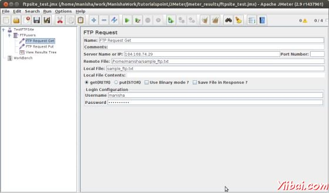
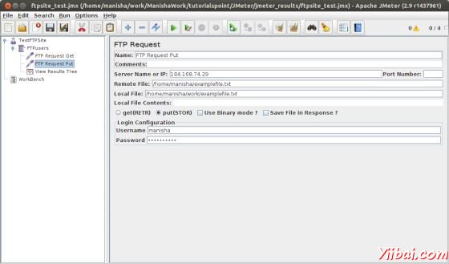
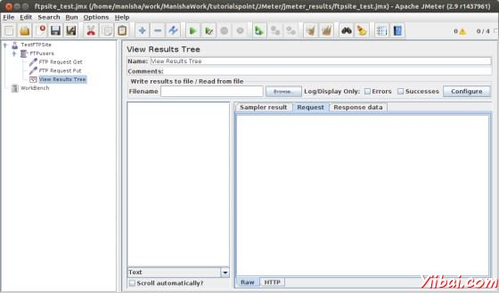
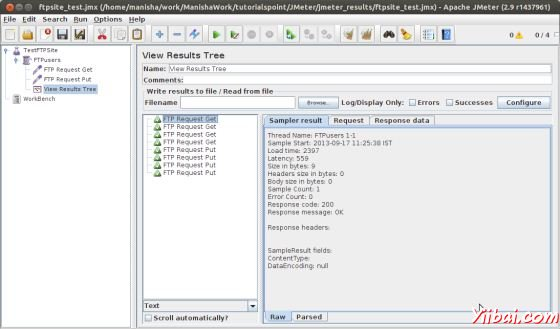
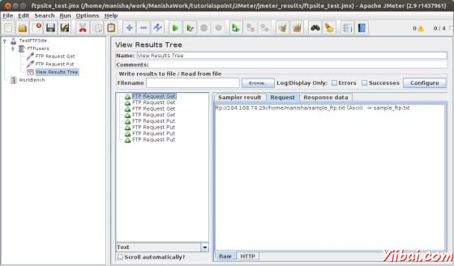
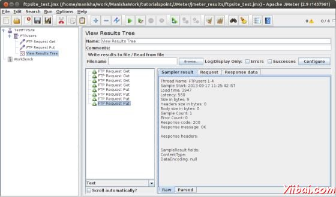

# jMeter FTP测试计划 - JMeter教程

在本章中，我们将看到如何使用[JMeter](http://www.yiibai.com/jmeter) 测试FTP站点。让我们创建一个测试计划，测试FTP站点。

### 重命名测试计划

通过点击启动 JMeter 窗口 **/home/manisha/apache-jmeter-2.9/bin/jmeter.sh.** 点击测试计划节点上。重命名此测试计划节点 **TestFTPSite**.

### 添加线程组

添加一个线程组，这是所有其他元素，如取样器，控制器，监听的占位符。右键单击 **TestFTPSite(our Test Plan) &gt; Add &gt; Threads(Users) &gt; Thread Group.** 线程组将添加根据测试计划（**TestFTPSite**）的节点。

接下来，让我们修改线程组的默认属性，以满足我们的测试。改变以下属性：

Name: FTPusers

线程数（用户）: 4

Ramp-Up Period: 离开默认值0秒。

Loop Count:1

### 添加采样器的FTP请求

现在，我们已经定义了我们的用户，它是时间来定义，他们将要执行的任务。我们将添加FTP请求元素。我们将添加两个FTP请求元素，将检索一个文件，将FTP站点上的文件。开始由选择FTPUSERS元素。点击鼠标右键得到添加菜单，然后选择** Add &gt; Sampler &gt; FTP Request.** 然后，选择FTP请求树中的元素，并在下面的图片编辑下列属性：

这个元素中输入下列详细信息：

Name: FTP Request Get

Server Name or IP: 184.118.14.9

Remote File: /home/manisha/sample_ftp.txt

Local File:sample_ftp.txt

Select get(RETR)

Username:manisha

Password:manispass32

现在添加另一个FTP请求，并在下面的图片编辑的属性：

这个元素中输入下列详细信息：

Name: FTP Request Put

Server Name or IP: 184.168.74.29

Remote File: /home/manisha/examplefile.txt

Local File: /home/manisha/work/examplefile.txt

Select put(STOR)

Username:manisha

Password:manisha123

### 添加监听器

需要添加到测试计划中的最后一个元素是一个监听器。此元素是负责为FTP请求的所有结果存储在一个文件中，呈现出可视化的数据模型。

选择 FTPusers 元素，并添加一个查看结果树监听器  (**Add &gt; Listener &gt; View Results Tree**).

### 运行此测试计划

现在保存的以上测试计划 ftpsite_test.jmx。执行本测试计划使用 **Run &gt; Start **选项。

### 查看输出

下面的输出，在监听器中。

可以看到，四点要求的每个FTP请求测试成功。 GET请求检索文件存储在bin文件夹中。在我们的例子中，这将是 /home/manisha/apache-jmeter-2.9/bin/. PUT请求，上传文件的路径为 /home/manisha/.

