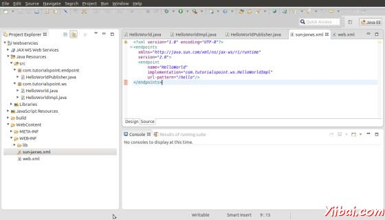
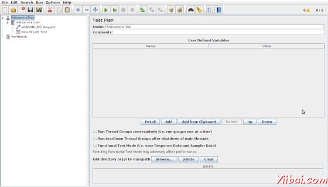
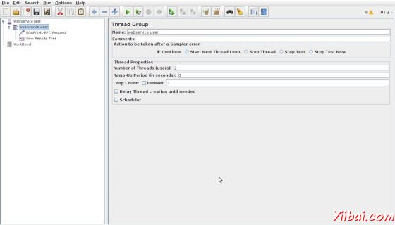
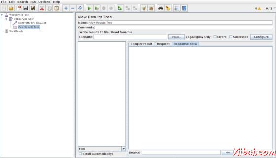
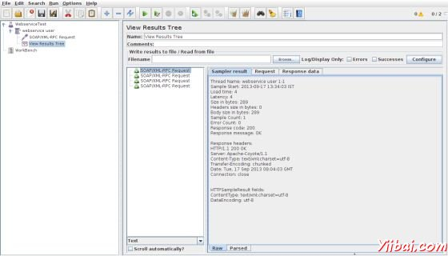
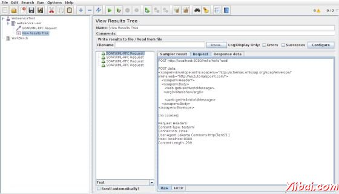
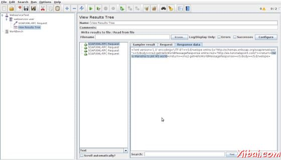

# jMeter Webservice测试计划 - JMeter教程

在本章中，我们将学习如何创建一个测试计划，测试一个[WebService](http://www.yiibai.com/webservice)。对于我们的测试目的，我们已经创建了一个简单的 Web 服务项目，并将其部署在 Tomcat 服务器上本地。

## 创建WebService项目

要创建一个 [Web](http://www.yiibai.com/web) 服务项目中，我们使用了Eclipse IDE。首先编写服务端接口 HelloWorld 包下com.yiibai.ws。 HelloWorld.java 的内容如下：

```
package com.yiibai.ws;

import javax.jws.WebMethod;
import javax.jws.WebService;
import javax.jws.soap.SOAPBinding;
import javax.jws.soap.SOAPBinding.Style;

//Service Endpoint Interface
@WebService
@SOAPBinding(style = Style.RPC)
public interface HelloWorld{

@WebMethod String getHelloWorldMessage(String string);

}
```

这个服务有一个的方法 getHelloWorldMessage 需要字符串 参数。

下一步创建实现类 HelloWorldImpl.java 在包 com.yiibai.ws 下。

```
package com.yiibai.ws;

import javax.jws.WebService;

@WebService(endpointInterface="com.yiibai.ws.HelloWorld")
public class HelloWorldImpl  implements HelloWorld  {
    @Override
    public String getHelloWorldMessage(String myName){
        return("Hello "+myName+" to JAX WS world");
    }

}
```

作为下一个步骤，让本地发布此Web服务通过创建端点出版商和公开此服务的服务器上。

publish方法有两个参数：

*   端点URL字符串。

*   实现程序对象 HelloWorld 实现类，在这种情况下，这是作为一个Web服务公开在以上参数中提到的由URL标识的端点。

HelloWorldPublisher.java 内容如下所示：

```
package com.yiibai.endpoint;

import javax.xml.ws.Endpoint;

import com.yiibai.ws.HelloWorldImpl;

public class HelloWorldPublisher {

    public static void main(String[] args){
        Endpoint.publish("http://localhost:9000/ws/hello", new HelloWorldImpl());
    }
}
```

接下来修改web.xml如下：

```
<?xml version="1.0" encoding="UTF-8"?>
<!DOCTYPE web-app PUBLIC "-//Sun Microsystems, 
Inc.//DTD Web Application 2.3//EN"
"http://java.sun.com/j2ee/dtds/web-app_2_3.dtd">
<web-app>
    <listener>
        <listener-class>
                com.sun.xml.ws.transport.http.servlet.WSServletContextListener
        </listener-class>
    </listener>
    <servlet>
        <servlet-name>hello</servlet-name>
        <servlet-class>
            com.sun.xml.ws.transport.http.servlet.WSServlet
        </servlet-class>
        <load-on-startup>1</load-on-startup>
    </servlet>
    <servlet-mapping>
        <servlet-name>hello</servlet-name>
        <url-pattern>/hello</url-pattern>
    </servlet-mapping>
    <session-config>
        <session-timeout>120</session-timeout>
    </session-config>
</web-app>
```

要部署的 web 服务应用程序，我们需要 sun-jaxws.xml 配置文件，这个文件的内容如下：

```
<?xml version="1.0" encoding="UTF-8"?>
<endpoints
  xmlns="http://java.sun.com/xml/ns/jax-ws/ri/runtime"
  version="2.0">
  <endpoint
      name="HelloWorld"
      implementation="com.yiibai.ws.HelloWorldImpl"
      url-pattern="/hello"/>
</endpoints>
```

现在，所有文件都准备好目录结构看起来会像下面的图片：



现在，这个应用程序创建一个WAR文件。选择 **project &gt; right click &gt; Export &gt; WAR**文件。hello.war 文件保存Tomcat 服务器 webapps文件夹下。现在启动Tomcat服务器。在服务器启动后，你应该能够访问web服务可以通过以下网址：  

http://localhost:8080/hello/hello

## 创建JMeter测试计划

现在，让我们创建一个测试计划，测试上面的 web服务。

### 重命名测试计划

通过点击启动JMeter的窗口 /home/manisha/apache-jmeter-2.9/bin/jmeter.sh. 点击测试计划节点上。重命名此测试计划节点 WebserviceTest.



### 添加线程组

添加一个线程组，这是所有其他元素，如取样器，控制器，监听的占位符。右键单击我们的测试计划 **WebserviceTest(our Test Plan) &gt; Add &gt; Threads(Users) &gt; Thread Group**。线程组将添加根据测试计划（**WebserviceTest**）的节点。 

接下来，让我们修改线程组的默认属性，以满足我们的测试。改变以下属性：

Name: webservice user

Number of Threads (Users): 2

Ramp-Up Period: leave the the default value of 0 seconds.

Loop Count:2



### 添加SAMPLER-SOAP/XML RPC请求

现在，我们已经定义了用户，它是时间定义，他们将要执行的任务。我们将添加 SOAP/ XML-RPC 请求元素。点击鼠标右键得到添加菜单，然后选择 Add &gt; Sampler &gt; SOAP/XML-RPC Request，选择元素树中的SOAP/ XML-RPC请求，并在下面的图片编辑下列属性：

这个元素中输入下列详细信息：

Name: SOAP/XML-RPC Request

URL: http://localhost:8080/hello/hello?wsdl

Soap/XML-RPC Data: Enter the below contents

```
<soapenv:Envelope xmlns:soapenv="http://schemas.xmlsoap.org/soap/envelope/" xmlns:web="http://ws.yiibai.com/">
   <soapenv:Header/>
   <soapenv:Body>
      <web:getHelloWorldMessage>
     <arg0>Manisha</arg0>

      </web:getHelloWorldMessage>
   </soapenv:Body>
</soapenv:Envelope>
```


### 添加监听器

需要添加到测试计划中的最后一个元素是一个监听器。此元素是负责所有的 HTTP 请求的结果存储在一个文件中，并呈现出可视化的数据模型。

选择 webservice 用户元素，并添加一个查看结果树监听器(**Add &gt; Listener &gt; View Results Tree**).



### 运行此测试计划

现在保存的以上测试计划 test_webservice.jmx。执行本测试计划使用 **Run &gt; Start  **选项。

### 查看输出

下面的输出，可以看到在监听器中。



可以看到在过去的图像响应消息 "Hello Manisha to JAX WS world".

