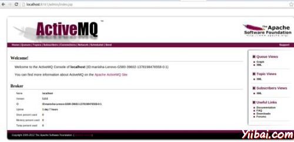

# jMeter JMS测试计划 - JMeter教程

在本章中，我们将学习如何写一个简单的测试计划，测试JMS（Java消息服务）。谁不知道JMS请阅读本章之前，让自己熟悉的JMS。 JMS支持两种类型的消息：

*   **点到点消息:** 一般用于交易发件人期望的响应队列消息。邮件系统是完全不同于普通的HTTP请求。在HTTP中，单个用户发送一个请求并得到响应。

*   **主题消息 :** 发布/订阅消息被俗称为主题的消息。主题消息一般使用情况下，消息发布由生产者和消费由多个用户。

让我们来看看这些为每个测试的例子。测试JMS的先决条件是：



*   我们将在我们的例子中使用的是Apache ActiveMQ。虽然也有其他JMS服务器，如IBM的WebSphere MQ（以前称为MQSeries），TIBCO等下载 [Apache网站的](http://activemq.apache.org/download.htmll)[ActiveMQ](http://activemq.apache.org/download.htmll)[二进制文件.](http://activemq.apache.org/download.htmll)

*   解压缩归档文件，请解压目录，运行以下命令从命令控制台启动 ActiveMQ 服务器：

    ```
    .inactivemq  start
    ```

    可以验证，如果 ActiveMQ 服务器已经开始在以下地址 http://localhost:8161/admin/ 访问管理界面。如果要求进行身份验证输入用户ID和密码为admin。屏幕将类似于如下：

*   现在复制activemq-all-x.x.x.jar（XXX的版本而定）从ActiveMQ的解压目录   /home/manisha/apache-jmeter-2.9/lib.

通过上述的设置，让我们构建的测试计划：

*   [JMS点到点对点测试计划](http://www.yiibai.com/jmeter/jmeter_jms_pointtopoint_test_plan.html)

*   [JMS主题测试计划](http://www.yiibai.com/jmeter/jmeter_jms_topic_test_plan.html)

